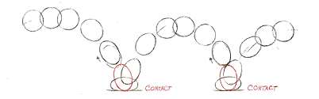
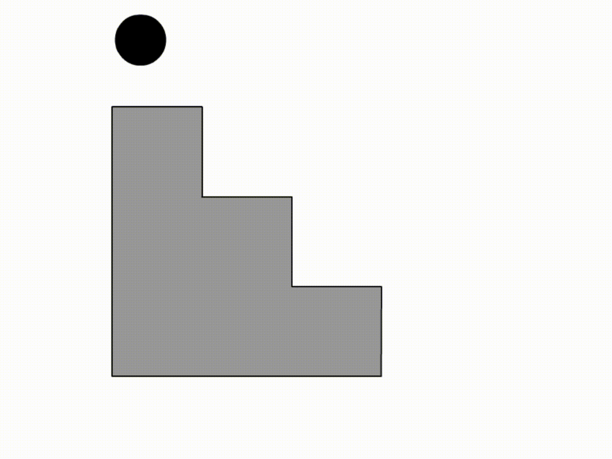

# To create a bouncing ball animation in Macromedia Flash

## Objectives
- To create a bouncing ball animation in Macromedia Flash
- To understand the basic concepts of animation in Macromedia Flash

## Introduction
Animation in Macromedia Flash combines graphics and timeline-based movements to create dynamic scenes. 
Computer based animations are created by changing the position of objects over time. 
This process involves creating keyframes at different intervals on the timeline.

Key frames are crucial in creating animations. They are the frames where the content changes.
The timeline is where you can see the keyframes and the content of the animation.
The timeline is divided into frames, and each frame represents a specific point in time. 
By moving objects between keyframes, you can create smooth transitions in your animations.

  
  

## Materials
- Software: Macromedia Flash 8

## Procedure
1. Open Macromedia Flash 8 and create a new document.
2. Select the line tool and draw a staircase with multiple steps.
3. Select the oval tool and draw a ball on the top step of the staircase.
4. Select the desired color for the ball and staircase.
5. Select the ball and insert keyframes at different intervals on the timeline.
6. Move the ball to different positions on the staircase at each keyframe.
7. Repeat the process to create a bouncing ball animation.
8. Test the animation by pressing the play button under the Control menu.
9. Save the animation as a .swf file.

## Output

  

## Shortcut Keys
- F5: Insert frame
- F6: Insert keyframe
- F8: Convert to symbol
- Ctrl + Enter : Test the animation
- Ctrl + G: Group objects
- Ctrl + Shift + G: Ungroup objects

## Tools Used
- Line tool : To draw lines and shapes
- Oval tool : To draw circles and ovals
- Selection tool : To select and move objects
- Paint bucket tool : To fill shapes with color
- Text tool : To add text to the animation
- Timeline : To control the frame timing.

## Discussion
Macromedia Flash is a powerful tool for creating animations and interactive content. By understanding the basic concepts of animation and using the tools effectively, you can create engaging and dynamic animations. While offering control over movement and helping to understand core animation principles, this method can be time-consuming and challenging to make smooth transitions. Advantages include creative flexibility, but it requires careful attention to detail and can be difficult to manage smoothly.

## Conclusion
Creating a bouncing ball animation in Macromedia Flash involves a step-by-step process using keyframes and timeline movements. By following the steps outlined above, you can create a simple yet effective animation that demonstrates the principles of animation in Macromedia Flash.

## References
- User Manual of Macromedia Flash 8
- Youtube Tutorials
- Notes from Animation Class
