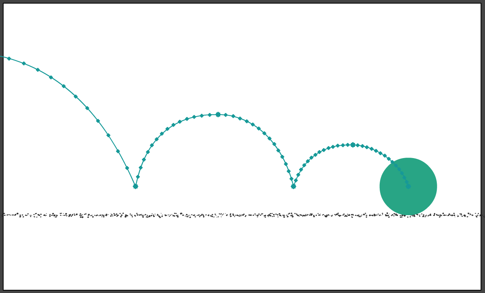

# To create bouncing ball animation in Macromedia Director

## Objective
- To create a bouncing ball animation in Macromedia Director.
- To understand the basic principles of animation and motion in digital media.

## Introduction
Computer-based animations are created by altering the properties of objects over time. A fundamental concept in animation is tweening, which refers to defining the starting and ending positions of an object and allowing the software to automatically generate the intermediate frames.

Interpolation is a key process in this workflow, ensuring that the motion between keyframes is smooth and continuous. Interpolation adjusts the object's position, rotation, size, and other properties to create fluid transitions.

Steps of computer-based animation:
- Input Process – Drawings are digitized via scanning, tracing, or digital tools. Post-processing removes errors for cleaner input.

- Composition Stage – Foreground and background elements are combined. A pencil test previews animation using pan-zoom features at low resolution.

- Inbetween Process – Intermediate frames are generated through interpolation (linear or spline) to create smooth motion. Skeleton-based interpolation is used in 2D, while 3D interpolation is more complex.

- Changing Colors – Color Look-Up Tables (CLUT) enable fast color changes without redrawing frames, improving efficiency with double buffering.

  

## Materials
- Software: Macromedia Director

## Procedure
1. Open Macromedia Director and create a new project.
2. Create a new sprite.
3. Use the paint tools to draw a ball on the stage.
4. Set the initial position and size of the ball.
5. Create a new cast member for the ball.
6. Add a script to the ball sprite to control its movement.
7. Use the Lingo scripting language to define the ball's behavior, including its speed, direction, and bounce.

## Output

  

## Shortcut Keys
- F5: Insert frame
- Shift + F5: Remove frame
- F6: Insert keyframe
- F8: Convert to symbol

