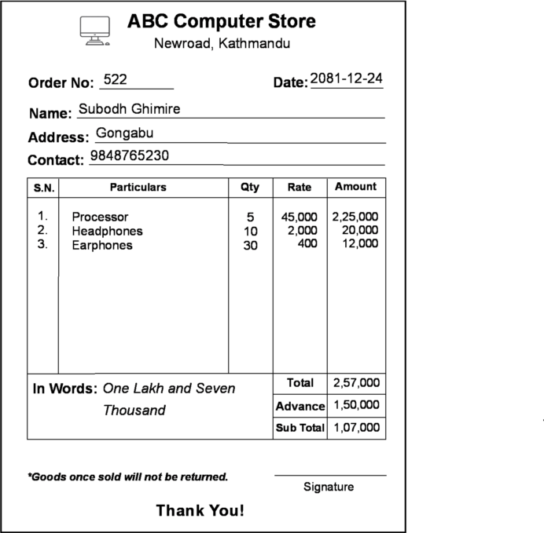

# To create a simple bill in Macromedia Freehand

## Objective
- To design a simple bill using Macromedia Freehand.
- To understand the basic principles of graphic design and layout in digital media.
- To apply formatting techniques to enhance the visual appeal of the bill.

## Introduction
Vector graphics and raster graphics are two fundamental types of digital images used in graphic design and multimedia.

### Vector Graphics
Vector graphics are created using mathematical equations to define shapes, lines, and curves. They are resolution-independent, meaning they can be scaled to any size without losing quality. Common formats include SVG, AI, and EPS. They are ideal for logos, icons, and illustrations where scalability is important.

### Raster Graphics
Raster graphics, also known as bitmap images, are composed of a grid of pixels, where each pixel represents a specific color. They are resolution-dependent, meaning scaling them can result in a loss of quality. Common formats include JPEG, PNG, and BMP. They are best suited for photographs and detailed images where color depth and detail are crucial.

### Differences Between Raster and Vector

| **Vector Graphics**              | **Raster Graphics**              |
|----------------------------------|----------------------------------|
| Constructed using mathematical equations | Constructed using pixels      |
| Can be scaled infinitely without quality loss | Quality degrades when scaled       |
| Generally smaller file sizes     | Larger file sizes for high resolutions |
| Ideal for logos, icons, and illustrations | Best suited for photos and detailed images |
| File formats: SVG, AI, EPS | File formats: JPEG, PNG, BMP    |

### Bitmap and Pixmap
- **Bitmap**: A bitmap is a type of raster image where each bit corresponds to a pixel on the screen, often used in monochrome images. It is a grid of pixels, where each pixel can be either black or white.
- **Pixmap**: A pixmap is similar to a bitmap but supports multiple colors, making it suitable for more complex images. It is a grid of pixels where each pixel can represent a color value, allowing for a wider range of colors and details.

Understanding these concepts is essential for creating visually appealing and technically sound designs in tools like Macromedia Freehand.

## Materials
- Software: Macromedia Freehand

## Procedure
1. Open Macromedia Freehand and create a new document.
2. Use the rectangle tool to draw a rectangle for the bill's background and fill it with a light color.
3. Use the text tool to add the bill's title, such as company name at the top of the rectangle.
4. Optionally, include a logo or graphic element to enhance the bill's branding.
5. Add details like date, bill number, and customer information.
6. Use the line tool to create a table layout for itemized charges, including columns for items description, quantity, unit price, and total price.
7. Add a total amount at the bottom of the bill in bold and larger font.
8. Include any notes, terms, or signature lines at the bottom of the bill.
9. Save the document in Freehand format and export it as a PDF or image file for printing or sharing.

## Output

  

## Shortcut Keys
- Ctrl + Alt + A: Align the chosen object.
- Ctrl + Shift + Y: Attach the text to path.
- Ctrl + Shift + F: Fill the color in the chosen object.
- Ctrl + Shift + <: Decrease the font size.
- Ctrl + Shift + >: Increase the font size.

## Tools Used
- Rectangle tool: To create the bill's background
- Text tool: To add text elements like title and details
- Line tool: To create table lines and borders
- Color palette: To choose colors for the bill's background and text
- Selection tool: To select and manipulate objects on the canvas

## Discussion
Macromedia Freehand is a versatile vector-based design tool, ideal for creating professional documents like bills and invoices. With its precise layout and text handling features, users can design clean and organized bills. One challenge in designing a bill is maintaining proper alignment and clarity while presenting detailed information. 

## Conclusion
Creating a bill in Macromedia Freehand involves using shape and text tools to layout information such as company name, customer details, and itemized charges. Users can produce professional-looking bills ready for printing or digital sharing. Mastery of these tools enhances the efficiency and quality of document design.

## References
- Macromedia Freehand User Guide
- Youtube
- Graphic Design Basics

