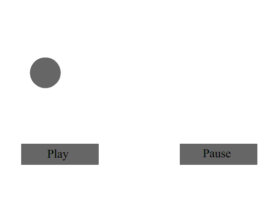

# Action Script to play and pause an animation in flash

## Objective
- To create a simple animation using ActionScript in Adobe Flash.
- To understand the basic principles of animation and interactivity in digital media.

## Introduction
Computer based animation is an animation technique that uses computer software to create animated images.
Macromedia Flash uses ActionScript, a programming language that allows developers to create interactive animations and applications. 

ActionScript is an object-oriented language that is similar to JavaScript and is used to control the behavior of objects in Flash animations.

### BMO's (Basic Multimedia Objects)
- BMO's refers to the basic multimedia objects that can be used in Flash animations, such as shapes, text, and images. 
- These objects can be manipulated using ActionScript to create interactive animations.

### CMO's (Complex Multimedia Objects)
- CMO's are more complex multimedia objects that can be created using ActionScript, such as buttons, movie clips, and sound.
- These objects can be used to create more advanced animations and interactive applications.

---

## Materials
- Software: Macromedia Flash 8

## Procedure
1. Open Macromedia Flash and create a new document.
2. Use the drawing tools to create a simple shape, such as a circle or square.
3. Create a simple animation using keyframes and apply a motion tween to the shape.
4. Add two buttons to the stage: one for play and one for pause.
5. Convert the buttons to symbols and give them instance names (e.g., "playButton" and "pauseButton").
6. Right click on the first frame of the timeline and select "Actions" to open the ActionScript editor.
7. Write the following ActionScript code to control the animation:

```actionscript
on(release){
	play();
}

on(release){
	stop();
}
```

8. Test the animation by clicking the play and pause buttons to see if they control the animation as expected.

## Output

<div align="center">
  
</div>

## Shortcut Keys
- F6: Insert a keyframe
- F8: Convert to symbol
- Ctrl + D : Duplicate the selected object
- Ctrl + Enter: Test the movie

## Tools Used
- Oval Tool: Used to create circular shapes.
- Rectangle Tool: Used to create rectangular shapes.
- ActionScript Editor: Used to write and edit ActionScript code for interactivity.
- Motion Tween: Used to create smooth animations between keyframes.

## Discussion
In this lab, we explored how ActionScript can be used in Macromedia Flash to add interactivity to animations. By assigning actions to buttons, we enabled users to control the playback of an animation. A key challenge was ensuring that the correct instance names were assigned to the buttons and that the ActionScript code was placed on the appropriate frames for proper functionality.

## Conclusion
Using ActionScript in Flash allows for the creation of interactive and engaging animations. By implementing play and pause controls, we gained practical experience with scripting and object manipulation in Flash. This foundational knowledge is essential for developing more complex multimedia projects that require user interaction.

## References
- Macromedia Flash 8 User Guide
- Adobe ActionScript 2.0 Documentation
- Online tutorials on Flash animation and ActionScript basics


