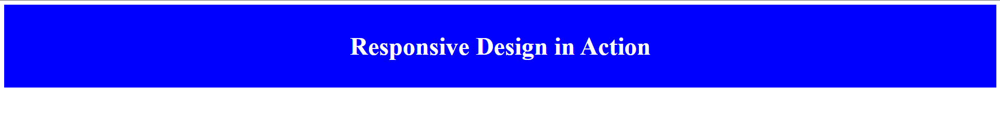
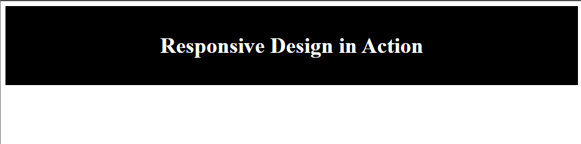
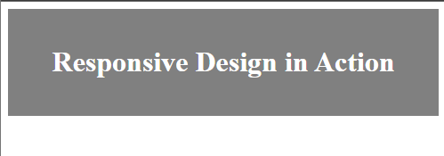
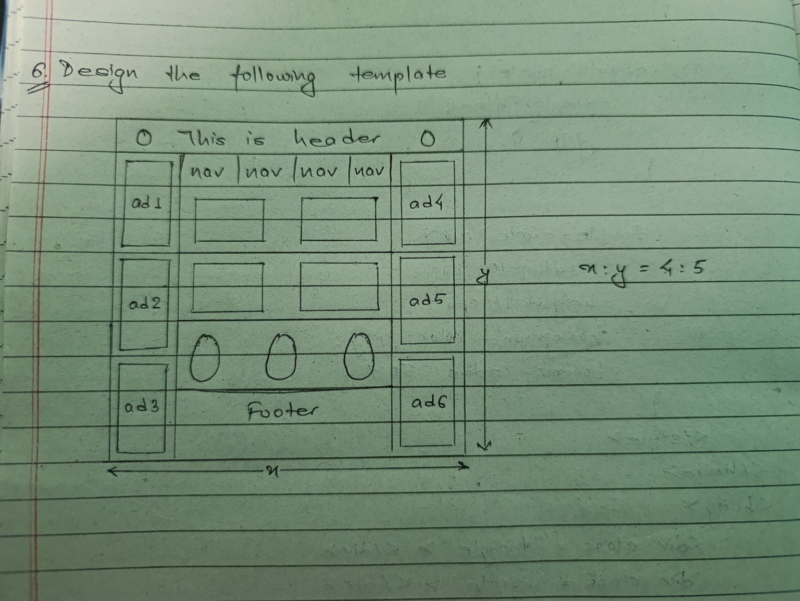

# *1. What is CSS Media Query? Show the use of max-width and min-width properties.*

## CSS MEDIA QUERY
- CSS Media Queries help make websites responsive, meaning they adjust their layout and style depending on the device's screen size (like phones, tablets, or desktops).
- This ensures a great user experience, whether you're on a small mobile screen or a large desktop monitor.
- They check the screen size and apply specific CSS rules only if the condition matches.

Syntax:
```css 
@media (condition) {
  /* CSS rules here */
}
```


### Key properties:
- min-width: Styles apply if width ≥ value
- max-width: Styles apply if width ≤ value

Example:
```html
<html>
<head>
  <title>Responsive Example</title>
  <style>
    .box {
      padding: 20px;
      text-align: center;
      font-size: 20px;
      color:white;
    }

    @media (max-width: 599px) {
      .box {
        background-color: gray;
        font-size: 16px;
      }
    }

    @media (min-width: 600px) and (max-width: 1023px) {
      .box {
        background-color: black;
        font-size: 18px;
      }
    }

    @media (min-width: 1024px) {
      .box {
        background-color: blue;
        font-size: 24px;
      }
    }
  </style>

</head>
<body>
  <div class="box">
    <h1>Responsive Design in Action</h1>
  </div>
</body>
</html>
```

`Output:`
<div align="center">
  
  
  
</div>

----

# *2. List the properties associated with 2d effects and transformations. Show examples.*

## 2D TRANSFORMATIONS
- 2D transformations are used to manipulate elements in 2D space.
- They include translation, rotation, scaling, and skewing.
- These transformations can be applied to any HTML element using CSS.

### Key properties:
- transform: Applies a 2D or 3D transformation to an element.
- transform-origin: Sets the origin for an element's transformations.
- translate(): Moves an element from its current position.
- rotate(): Rotates an element clockwise or counterclockwise.
- scale(): Increases or decreases the size of an element.
- skew(): Skews an element along the X and Y-axis.
- matrix(): Combines all the 2D transformations into one.

## 2D EFFECTS
- CSS 2D Effects enhance the visual appearance of elements by adding shadows, gradients, and transitions.
- They can be used to create depth, texture, and movement in web design.

### Key properties:
- box-shadow: Adds a shadow to an element.
- text-shadow: Adds a shadow to text.
- linear-gradient(): Creates a gradient background.
- radial-gradient(): Creates a radial gradient background.
- transition: Adds a smooth transition effect to an element.
- border-radius: Rounds the corners of an element.

Example:
```html
<html>
<head>
  <title>2D Transformations Example</title>
  <style>
    .box {
      width: 150px;
      height: 150px;
      background: gray;
      color: white;
      margin: 20px;
      text-align: center;
      line-height: 150px;
      border-radius: 15px;
      box-shadow: 5px 5px 15px rgb(0, 0, 0, 0.3);
      transition: all 0.5s ease;
    }

    .translate:hover {
      transform: translate(40px, 30px);
    }

    .rotate:hover {
      transform: rotate(90deg);
    }

    .scale:hover {
      transform: scale(1.3, 1.3);
    }

    .skew:hover {
      transform: skew(15deg, -10deg);
    }

    .matrix:hover {
      transform: matrix(1, 0.5, -0.5, 1, 30, 30);
    }
  </style>
</head>
<body>
  <div class="box translate">Translate</div>
  <div class="box rotate">Rotate</div>
  <div class="box scale">Scale</div>
  <div class="box skew">Skew</div>
  <div class="box matrix">Matrix</div>
</body>
</html>
```
----

# *3. What is CSS 3 animation? Demonstrate it by dragging a box in any one direction.*

## CSS 3 ANIMATION
- CSS 3 Animation allows you to create animated effects on web pages without using JavaScript.
- Animations are created using the `@keyframes` rule along with the animation property.

### Key properties:
- @keyframes: Defines the animation sequence.
- animation-name: Specifies the name of the @keyframes rule.
- animation-duration: Specifies the duration of the animation.
- animation-timing-function: Specifies the speed curve of the animation.
- animation-delay: Specifies when the animation will start.
- animation-iteration-count: Specifies the number of times an animation should run.
- animation-direction: Specifies whether the animation should play in reverse.

Example:
```html
<html>
<head>
  <title>CSS 3 Animation</title>
  <style>
    .box {
      width: 100px;
      height: 100px;
      background-color: gray;
      position: absolute;
      border-radius: 20px;
      animation: slide 4s infinite alternate;
    }

    @keyframes slide {
      from {
        left: 0px;
      }
      to {
        left: 50%;
      }
    }
  </style>
</head>
<body>
  <div class="box"></div>
</body>
</html>
```
----

# *4. Show the use of active, focus and hover effects.*

## ACTIVE, FOCUS, HOVER EFFECTS
- CSS pseudo-classes like :active, :focus, and :hover allow you to style elements based on user interaction.
- They help create interactive and engaging web pages by changing the appearance of elements when they are clicked, focused, or hovered over.

### Key properties:
- `:active`: Applies styles when an element is being activated (clicked).
- `:focus`: Applies styles when an element is focused (selected).
- `:hover`: Applies styles when an element is hovered over.

Example:
```html
<html>
<head>
  <title>Interactive Effects</title>
  <style>
    .button {
      padding: 10px 20px;
      background-color: rgb(0, 0, 0);
      color: white;
      text-align: center;
      display: inline-block;
      text-decoration: none;
      border-radius: 15px;
      margin: 10px;
    }

    .button:hover {
      background-color: gray;
      color: black;
    }

    .button:active {
      background-color: blue;
    }

    .input {
      padding: 10px;
      border: 1px solid gray;
      border-radius: 5px;
      margin: 10px;
    }

    .input:focus {
      background-color: black;
    }
  </style>
</head>
<body>
  <a href="#" class="button">Button</a>
  <input type="text" class="input" placeholder="Focus Me">
</body>
</html>
```
---

# *5. Using CSS, draw the following objects:*
  - *Triangle*
  - *Circle*
  - *Oval*
  - *Triangle upon rectangle*
  - *Two circles joint together*


```html
<html>
  <head>
    <title>>Shapes</title>
    <style>
      body{
        display: flex;
        flex-wrap: wrap;
        justify-content: center;
        align-items: center;
        height: 100vh;
        margin: 10px;
        gap: 50px;
      }

      .triangle{
        width: 0;
        height: 0;
        border-left: 50px solid transparent;
        border-right: 50px solid transparent;
        border-bottom: 100px solid gray;
      }

      .circle{
        width: 100px;
        height: 100px;
        background-color: gray;
        border-radius: 50%;
      }

      .oval{
        width: 150px;
        height: 80px;
        background-color: gray;
        border-radius: 50%;
      }

      .triangle-rectangle .triangle{
        left: 0;
        width: 0;
        height: 0;
        border-left: 50px solid transparent;
        border-right: 50px solid transparent;
        border-bottom: 100px solid black;
      }

      .triangle-rectangle .rectangle{
        width: 100px;
        height: 100px;
        background-color: gray;
      }

      .double-circle{
        display: flex;
        gap:0;
      }

      .double-circle div{
        width: 100px;
        height: 100px;
        background-color: gray;
        border-radius: 50%;
      }
    </style>
</head>
<body>
    <div class="triangle"></div>
    <div class="circle"></div>
    <div class="oval"></div>
    <div class="triangle-rectangle">
      <div class = "triangle"></div>
      <div class = "rectangle"></div>
    </div>
    <div class="double-circle">
      <div></div>
      <div></div>
    </div>
</body>
</html>
```
----

# *6. Design the following template.*
<div align="center">
  
</div>


```html
<html>
<head>
    <title>Template Design</title>
    <style>
        body {
            display: flex;
            text-align: center;
            justify-content: center;
            align-items: center;
            height: 100vh;
        }

        .container {
            display: grid;
            grid-template-columns: auto 1fr auto;
            grid-template-rows: auto 1fr 1fr 1fr auto;
            gap: 5px;
            padding: 10px;
            width: 400px;
            height:500px;
            border: 2px solid gray;
            border-radius: 20px;
        }

        .circle {
            width: 30px;
            height: 30px;
            background-color: black;
            border-radius: 50%;
        }

        header {
            grid-column: 1 / 4;
            background-color: skyblue;
            padding: 15px;
        }

        nav {
            grid-column: 2 / 3;
            display: grid;
            grid-template-columns: repeat(4, 1fr);
            gap: 5px;
        }

        nav div {
            background-color: red;
            padding: 10px;
        }

        .content1, .content2 {
            grid-column: span 2;
            background-color: yellow;
        }

        .ad {
            background-color: gray;
            text-align: center;
            padding: 10px;
            height: 120px;
        }

        .content {
            grid-column: 2 / 3;
            display: grid;
            grid-template-columns: 1fr 1fr;
            gap: 5px;
        }

        .content div {
            background-color: yellow;
            padding: 10px;
            height: 80px;
        }

        .images {
            display: flex;
            justify-content: center;
            gap : 10px;
            padding: 5px;
            flex-wrap: wrap;
        }
        
        .images .circle {
            width: 70px;
            height: 70px;
            background-color: green;
            border-radius: 50%;
            align-self: flex-start;
            margin-top: -30px; 
        }
        
        .footer {
            grid-column: span 4;
            background-color: lightblue;
            padding: 10px;
            margin-top: -10px;
            width: 100%;
        }
    </style>
</head>
<body>
<div class="container">
    <header>
        <div style="display: flex; 
        justify-content: space-between; 
        align-items: center;">
            <div class="circle"></div>
            <div>This is header</div>
            <div class="circle"></div>
        </div>
    </header>

    <div class="ad">ad1</div>
    <nav>
        <div>nav</div>
        <div>nav</div>
        <div>nav</div>
        <div>nav</div>
        <div class="content1">Content 1</div>
        <div class="content2">Content 2</div>
    </nav>
    <div class="ad">ad4</div>

    <div class="ad">ad2</div>
    <div class="content">
        <div>Content 3</div>
        <div>Content 4</div>
    </div>
    <div class="ad">ad5</div>

    <div class="ad">ad3</div>
    <div class="images">
        <div class = "circle"></div>
        <div class = "circle"></div>
        <div class = "circle"></div>
        <div class="footer">Footer</div>
    </div>
    <div class="ad">ad6</div>
</div>
</body>
</html>
```