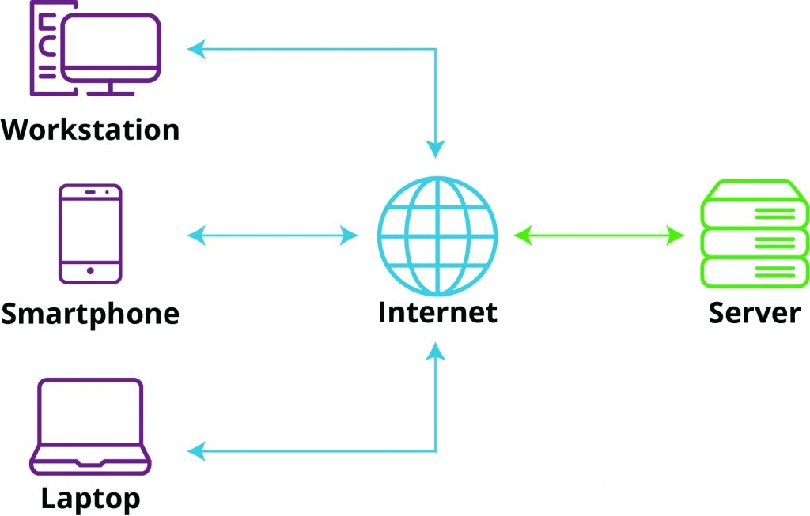
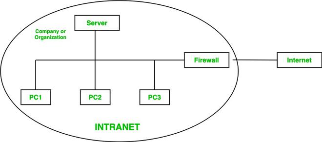
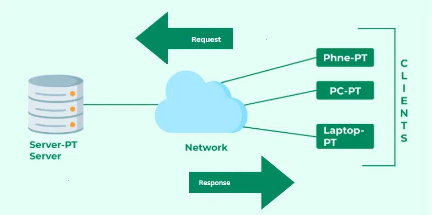
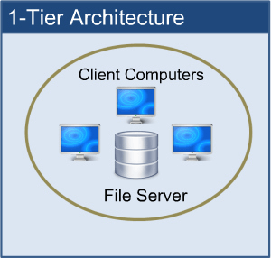
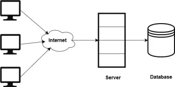
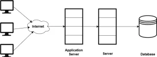
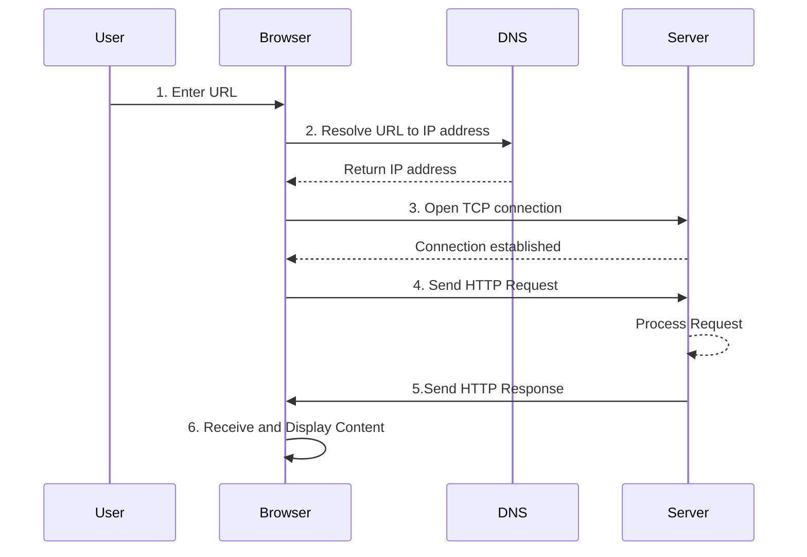

> # Web Basics
- **Web Technology**: Tools, methods and protocols used to create websites and web apps to deliver the content and functionality over internet. It includes coding, design, and managing servers to make websites work.
- **Web Development**: Building websites and apps, combining front-end (what users see) and back-end (how it works behind the scenes). Also includes design, UI, and server management.
- **Web Design**: Focuses on Making websites look good and easy to use. It focuses on layout, colors, fonts, overall style and aesthetic appeal of the website.

### Key Aspects of Website Design:
1. **Content**: The information and media on the site.
2. **Usability**: How easy it is to use the site.
3. **Appearance**: The visual style and layout.
4. **Structure**: How the content is organized.

---

> # Internet
- The internet is a global network of interconnected computers that communicate using the Internet Protocol Suite (TCP/IP).
- It connects private, public, academic, business, and government networks worldwide.
- The internet enables sharing information, communication, and various online activities.
- It operates on a decentralized system with no single controlling entity.
- Key components include hardware (servers, routers), software (protocols, applications), and infrastructure (cables, satellites).
- It follows a client-server model, where users request services from providers over the network.
- Standards and protocols ensure seamless communication between devices and networks.

  

### Uses of Internet
- *Information*: Access vast resources on news, education, research, and more.
- *Communication*: Enables email, messaging, video calls, and social media.
- *E-commerce*: Revolutionizes shopping, payments, and global trade.
- *Education*: Offers online courses, tutorials, and resources.
- *Entertainment*: Provides streaming, gaming, and social platforms.
- *Social Networking*: Connects people worldwide for sharing and interaction.
- *Banking*: Facilitates online banking, payments, and investments.
- *Research*: Supports innovation and collaboration across fields.

---

> # Intranet
- An intranet is a private network for sharing information and resources within an organization.
- It enhances communication, collaboration, and efficiency among employees or teams.
- Accessible only to authorized users, so it ensures secure sharing of sensitive data.
- Features may include document management, communication tools, and project tracking.
- Intranets can be customized to suit an organization's needs, including branding and design.
- They can be integrated with systems like ERP or CRM to boost efficiency and productivity.

  

### Uses of Intranet
- *Internal Communication*: Facilitates announcements, news, and updates within the organization.
- *Document Management*: Centralizes storage, sharing, and collaboration on documents and files.
- *Collaboration Tools*: Provides platforms for team collaboration, project management, and task tracking.
- *Knowledge Sharing*: Enables sharing of best practices, policies, and procedures among employees.
- *Training and Development*: Offers resources for employee training, onboarding, and skill development.
- *Employee Directory*: Maintains a directory of employees, departments, and contact information.

## Internet vs Intranet

| Feature              | Internet                                      | Intranet                                      |
|----------------------|----------------------------------------------|----------------------------------------------|
| **Definition**       | A global network connecting people worldwide. | A private network for an organization.       |
| **Access**           | Open to everyone with internet access.        | Limited to authorized users.                 |
| **Purpose**          | For global communication and information.     | For internal communication and sharing.      |
| **Security**         | Less secure; needs extra protection.          | More secure; restricted to internal users.   |
| **Content**          | Public websites, social media, etc.           | Internal tools, documents, and resources.    |
| **Infrastructure**   | Uses global servers and networks.             | Uses the organization's own network.         |
| **Examples**         | Google, Facebook, Amazon.                     | HR portals, project tools, internal sites.   |
| **Ownership**        | Owned and maintained by multiple entities.    | Owned and managed by a single organization.  |
| **Scalability**      | Highly scalable to connect millions globally. | Limited to the size of the organization.     |
| **Bandwidth**        | Shared among global users.                    | Dedicated to internal users.                 |
| **Cost**             | Costs include ISP charges and hosting fees.   | Costs include setup, maintenance, and hardware. |
| **User Base**        | General public and global users.              | Employees or members of the organization.    |
| **Customization**    | Limited customization for public use.         | Fully customizable to meet organizational needs. |

---

> # WWW (World Wide Web)
- The World Wide Web (WWW) is a system of linked documents and media accessed via the internet.
- It is a service that operates on the internet.
- It uses web browsers, HTTP, and URLs to share and navigate information.
- The web enables websites, web apps, and interactive services like e-commerce and social media.
- It has evolved from static pages to dynamic, user-friendly platforms for sharing and interaction.
- The WWW operates on a client-server model, where browsers (clients) request resources from web servers.
- It supports various media types, including text, images, videos, and interactive content.

### Key Components of WWW
- **Web Pages**: Documents displayed in a web browser, containing text, images, and multimedia.
- **Web Browsers**: Software applications (like Chrome, Firefox) that allow users to access and view web pages.
- **Web Servers**: Computers that store and serve web pages to users upon request. They responds to requests by delivering the requested content.
- **HTML (Hypertext Markup Language)**: The standard language for creating web pages, defining structure and content. It uses tags to format text, images, and links.
- **Hyperlinks**: Clickable links that connect web pages, allowing users to navigate between them.
- **URLs (Uniform Resource Locators)**: Addresses used to access web pages, specifying the location of resources on the internet. It consists of the protocol (HTTP/HTTPS), domain name, and path to the resource.

---

> # Web Page
- A web page is a document on the World Wide Web, displayed in a web browser.
- It can contain text, images, videos, and interactive elements.
- Web pages are created using HTML (Hypertext Markup Language) and can be styled with CSS (Cascading Style Sheets).
- Web pages are linked together through hyperlinks, allowing users to navigate between them easily.
- They can be part of a larger website or stand-alone pages.
- Web pages can be accessed using a URL (Uniform Resource Locator), which specifies the address of the page on the internet.
- They can be optimized for different devices (desktop, mobile) to ensure a good user experience.
- Web pages can be 
    - Static Web Page
    - Dynamic Web Page

### Static Web Page vs Dynamic Web Page

| Feature              | Static Web Pages                          | Dynamic Web Pages                          |
|----------------------|-------------------------------------------|-------------------------------------------|
| **Content**          | Same for all users.                      | Changes based on user or data.            |
| **Technology**       | Uses only HTML and CSS.                  | Uses server-side code and databases.      |
| **Speed**            | Fast and simple.                         | Slower due to processing.                 |
| **User Interaction** | No interaction or updates.               | Allows interaction and updates.           |
| **Development**      | Easy to create and maintain.             | More complex to build and manage.         |
| **Security**         | Safer, no server-side risks.             | Needs protection for server and data.     |
| **Traffic**          | Good for low-traffic sites.              | Handles high traffic well.                |
| **Performance**      | Loads quickly with caching.              | Needs optimization for speed.             |
| **Use Cases**        | Portfolios, info pages, blogs.           | E-commerce, social media, apps.           |
| **Examples**         | Personal blogs, landing pages.           | Facebook, Amazon, Twitter.                |

---

> # Web Client
- Web clients are tools like browsers (Chrome, Firefox) that let users access websites.
- They request content from servers and show it to users.
- They use HTTP/HTTPS to communicate with servers.
- Web clients display content and allow user interaction.
- They can save data like bookmarks and history for convenience.
- Web clients can be software (like browsers) or apps (like mobile apps).
- Web clients work on devices like PCs, phones, and tablets.
- Common examples include web browsers, mobile apps, and email clients.

### Key Characteristics of Web Clients
- **User Interface**: Provides a graphical interface for users to interact with web content.
- **Request Handling**: Sends requests to web servers for resources (HTML, images, etc.) and displays the response.
- **Protocol Support**: Uses HTTP/HTTPS protocols to communicate with servers securely.
- **Caching**: Stores frequently accessed data locally to improve performance and reduce load times.
- **Security Features**: Implements security measures like SSL/TLS for secure data transmission and protection against threats.

---

# Web Server
- A web server is a system that stores and delivers web content to users over the internet.
- It handles requests from browsers using HTTP/HTTPS protocols.
- Web servers host websites and apps, serving both static and dynamic content.
- They can manage multiple user requests at the same time.
- Web servers can be physical machines or cloud-based virtual servers.
- They support various applications, databases, and programming languages.
- Security features include SSL/TLS encryption, firewalls, and access controls.
- Popular web servers include Apache, Nginx, Microsoft IIS, and LiteSpeed.
- They can work with tools like CDNs to improve speed and scalability.

### Functions of Web Server
- **Request Handling**: Receives and processes requests from web clients (browsers) for resources.
- **Content Delivery**: Serves static files (HTML, images) and dynamic content (generated by server-side scripts) to clients.
- **Protocol Support**: Uses HTTP/HTTPS protocols to communicate with clients securely.
- **Logging**: Records access logs and error logs for monitoring and troubleshooting.
- **Security**: Implements security measures like SSL/TLS encryption, firewalls, and access controls to protect data and resources.
- **Load Balancing**: Distributes incoming traffic across multiple servers to ensure optimal performance and reliability.

---

> # Client Server Architecture
- Client-server architecture divides tasks between clients (requesters) and servers (providers).
- Clients ask for resources and servers handle these requests by providing the required information or services.
- It supports scalability, centralized data, and easier maintenance.
- Common in web apps, cloud computing, and enterprise systems.
- Clients can be **thin** (rely heavily on servers) or **thick** (perform more tasks independently).
- Servers can be **dedicated** (serve a specific purpose) or **shared** (handle multiple tasks).
- Types: single-tier, two-tier, and multi-tier.

  

### Single-Tier Architecture
- In single-tier architecture, client, server, and database are on the same machine.
- Simple to set up, ideal for small apps or beginners.
- Limited scalability and slower performance for large data or users.
- Used for personal projects, testing, or offline apps.
- Minimal security and easy maintenance.
- Example: Local web server for website development.

  

---

### Two-Tier Architecture
- In two-tier architecture, the client and server are separate, with the database typically residing on the server.
- Provides better scalability and performance compared to single-tier architecture.
- Suitable for medium-sized applications with moderate data and user loads.
- Enhances security by separating the client from direct database access.
- Easier to maintain and update as the client and server are independent.
- Example: A desktop application connecting to a remote database server.

  

---

### Multi-Tier Architecture
- In multi-tier architecture, the application is divided into multiple layers, typically including presentation, application, and database layers.
- Enhances scalability and performance by distributing tasks across different tiers.
- Suitable for large-scale applications with high data and user loads.
- Improves security by isolating each layer, reducing the risk of unauthorized access.
- Easier to maintain and update as changes in one layer do not directly affect others.
- Commonly used in enterprise applications, web apps, and cloud-based systems.
- Example: A web application with a front-end client, a middle-tier application server, and a back-end database server.

    

---

> # Domain Names, DNS and URLs
#### Domain Names
- A domain name is a human-readable address for a website (e.g., `example.com`).
- It replaces the need to remember IP addresses.
- Domains are organized hierarchically (e.g., `www` is a subdomain of `example.com`).
- They are registered through domain registrars and must be unique.

#### DNS (Domain Name System)
- DNS translates domain names into IP addresses so browsers can load websites.
- It acts as the internet's phonebook.
- DNS servers handle this translation process.
- Example: `example.com` → `192.168.1.1`.

#### URLs (Uniform Resource Locators)
- A URL is the complete address used to access a specific resource on the web.
- It consists of:
    - **Protocol**: `http://` or `https://`.
    - **Domain Name**: `example.com`.
    - **Path**: `/about` (optional).
- Example: `https://example.com/about`.
- URLs are used to locate web pages, files, or services online.

---

> # HTTP
- HTTP (Hypertext Transfer Protocol) is how data is shared on the web.
- It works on a request-response system: clients (browsers) ask for data, and servers send it back.
- HTTP is stateless, meaning it doesn't remember past requests.
- Common methods: GET (fetch), POST (send), PUT (update), DELETE (remove).
- It usually uses port 80 for HTTP and port 443 for HTTPS.
- HTTPS (HTTP Secure) adds encryption for safer data transfer.

#### Working of HTTP:
1. User enters a URL in the browser.
2. Browser uses DNS to find the server's IP address.
3. Browser opens TCP connection to the server.
4. Browser sends an HTTP request (GET, POST, etc.) to the server.
5. Server processes the request and sends back an HTTP response.
6. Browser receives the response and displays the content.

---

> # Client-Side Scripting
- Client-side scripting runs in the user's browser to make web pages dynamic and interactive.
- It reduces server load and speeds up performance.
- Used for tasks like form validation, animations, and updating content without reloading the page.
- Requires a browser that supports JavaScript.
- Examples: AJAX updates, validating forms, and interactive elements like sliders.

### Advantages of Client-Side Scripting
- **Faster Response**: Reduces server requests, improving speed.
- **Interactive UI**: Enhances user experience with dynamic content.
- **Reduced Server Load**: Offloads processing to the client device.
- **Offline Functionality**: Some scripts can work without an internet connection.

### Disadvantages of Client-Side Scripting
- **Browser Dependency**: Requires a compatible browser.
- **Security Risks**: Vulnerable to malicious code injection.
- **Limited Access**: Cannot interact directly with server-side resources like databases.

---

> # Server-Side Scripting
- Server-side scripting runs on the web server to create dynamic content before sending it to the browser.
- It handles tasks like database access, user login, and generating personalized pages.
- Common languages include PHP, Python, Ruby, Node.js, and ASP.NET.
- Examples: processing forms, managing sessions, and serving custom content.

### Advantages of Server-Side Scripting
- **Secure Data Handling**: Sensitive operations are performed on the server.
- **Dynamic Content**: Generates customized content for users.
- **Database Integration**: Easily interacts with databases to fetch or store data.
- **Cross-Browser Compatibility**: Works independently of the user's browser.

### Disadvantages of Server-Side Scripting
- **Increased Server Load**: All processing happens on the server.
- **Slower Response**: Requires communication between client and server.
- **Dependency on Internet**: Requires a network connection to function.

---
### Client-Side vs Server-Side Scripting

| Feature       | Client-Side Scripting            | Server-Side Scripting            |
|---------------|----------------------------------|----------------------------------|
| **Execution** | Runs in browser.                | Runs on server.                 |
| **Languages** | JavaScript, HTML, CSS.          | PHP, Python, Node.js, etc.      |
| **Performance** | Faster, reduces server load.   | Slower, server processes data.  |
| **Security**  | Less secure, visible to users.  | More secure, hidden from users. |
| **Use Cases** | UI updates, form validation.    | Database access, authentication.|
| **Dependency**| Needs compatible browser.       | Needs web server.               |
| **Examples**  | AJAX, animations.               | Login systems, dynamic pages.   |

---

> # Web 1.0, Web 2.0, and Web 3.0

### Web 1.0
- Web 1.0 was the first version of the web, featuring static, read-only websites.
- It focused on sharing information with minimal user interaction or content creation.
- Websites were simple, built with basic HTML, and lacked multimedia or advanced design.
- Examples include early websites like Geocities and personal homepages.

#### Features of Web 1.0
1. **Static Pages**: Same content for all users.
2. **Read-Only**: Users could only view, not interact.
3. **Simple Design**: Basic layout with few graphics.
4. **Hyperlinks**: Used for navigation between pages.
5. **Central Hosting**: Websites hosted on central servers.
6. **Basic Search**: Early search engines with limited features.
7. **No Social Media**: No platforms for interaction or sharing.

#### Advantages of Web 1.0
- **Simple Navigation**: Easy to use and understand.
- **Low Cost**: Cheaper to build and maintain.
- **Fast Loading**: Lightweight pages loaded quickly.
- **Consistent Content**: Reliable and unchanging information.
- **Foundation**: Set the stage for future web advancements.

---

### Web 2.0
- Web 2.0 is the second phase of the web, focusing on user interaction and content creation.
- It introduced dynamic websites, social media, and tools for collaboration.
- Examples include social media platforms (Facebook, Twitter), blogs, and wikis.

#### Features of Web 2.0
1. **Dynamic Content**: Pages update based on user actions.
2. **User Content**: Users create and share blogs, videos, etc.
3. **Multimedia**: Includes images, videos, and animations.
4. **Social Media**: Platforms for connecting and sharing.
5. **Collaboration**: Tools for teamwork and shared projects.
6. **Tagging**: Users organize content with tags.
7. **APIs**: Combine data from different services.

#### Advantages of Web 2.0
- **Interactive**: Engages users with dynamic features.
- **Community**: Builds social connections.
- **Easy Sharing**: Simplifies content creation and sharing.
- **Modern Design**: Supports visually appealing layouts.
- **Real-Time**: Instant updates and communication.
- **Scalable**: Handles growing users and content.
- **Innovative**: Enabled advanced web apps and tools.

---

> [!NOTE]
> Our course focuses only on Web 1.0 and Web 2.0
> 
### Web 3.0
- Web 3.0 is the third phase of the web, emphasizing decentralization, artificial intelligence, and user control over data.
- It aims to create a more intelligent, secure, and personalized web experience.
- Examples include blockchain-based platforms, decentralized apps (dApps), and AI-driven services.

#### Features of Web 3.0
1. **Decentralization**: Data is distributed across networks, reducing reliance on central servers.
2. **Semantic Web**: Uses AI to understand and interpret user data for better search and interaction.
3. **Blockchain Technology**: Ensures secure, transparent, and tamper-proof transactions.
4. **Personalization**: Delivers tailored content and experiences based on user preferences.
5. **Interoperability**: Enables seamless interaction between different platforms and devices.
6. **Smart Contracts**: Automates agreements and transactions without intermediaries.
7. **Ownership of Data**: Empowers users to control and monetize their own data.

#### Advantages of Web 3.0
- **Decentralized**: Reduces dependency on centralized entities, enhancing security and privacy.
- **Intelligent**: Leverages AI to provide smarter and more relevant services.
- **Transparent**: Blockchain ensures trust and accountability in transactions.
- **User-Centric**: Gives users control over their data and digital identity.
- **Efficient**: Automates processes with smart contracts, reducing costs and delays.
- **Innovative**: Drives advancements in AI, blockchain, and decentralized technologies.
- **Inclusive**: Promotes global access and participation without barriers.

---

### Comparison of Web 1.0, Web 2.0, and Web 3.0

| Feature              | Web 1.0                     | Web 2.0                     | Web 3.0                     |
|----------------------|-----------------------------|-----------------------------|-----------------------------|
| **Content**          | Static, read-only          | Dynamic, user-generated     | Intelligent, AI-driven      |
| **Interaction**      | Minimal                    | Social and collaborative    | Personalized and decentralized |
| **Technology**       | Basic HTML                 | AJAX, APIs                  | Blockchain, AI, Semantic Web |
| **Data Ownership**   | Centralized                | Shared                      | User-controlled             |
| **Examples**         | Early websites             | Social media, blogs         | dApps, blockchain platforms |
| **Security**         | Basic                      | Improved                    | Highly secure with blockchain |
| **Focus**            | Information sharing        | User interaction            | Decentralization and AI     |