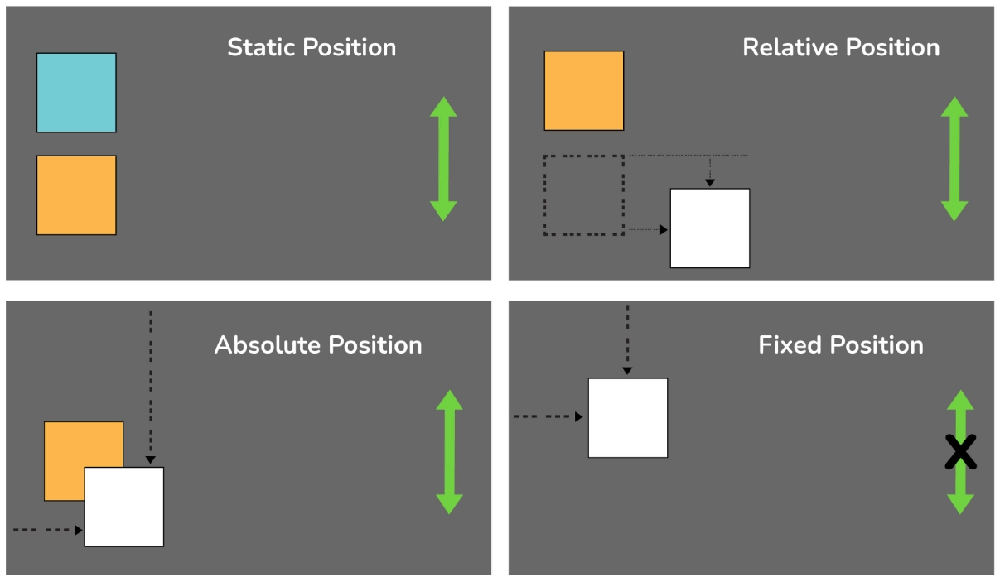

> # CSS
- CSS stands for Cascading Style Sheets.
- It is used to style and format HTML or XML documents.
- CSS controls how elements look on screens, paper, or other media.
- It can style multiple web pages at the same time.

### Importance of CSS
- It separates content from design for easier updates.
- Makes websites look good on all devices.
- Improves readability and accessibility.
- Helps create attractive layouts.
- Adds animations and interactivity.
- Speeds up work with tools like Bootstrap.

### CSS Syntax
- CSS rules consist of selectors and declarations.
- Selectors target HTML elements, and declarations define styles.
- Declarations have properties and values.
Properties are the aspects of the element to style, and values are the settings for those properties.
- Example:
    ```css
    h1 {
    color: blue; /* Property: color, Value: blue */
    font-size: 24px; /* Property: font-size, Value: 24px */
    }
    ```
- In this example, the selector is `h1`, and the properties are `color` and `font-size` with their respective values.
- CSS rules are enclosed in curly braces `{}`.


> # Types of CSS

### Inline CSS
- Inline CSS is used to apply a unique style to a single HTML element.
- Inline CSS is defined within the HTML tag using the `style` attribute.

```html
    <h1 style="color: red;">This is a heading</h1>
    <p style="color: blue;">This is a paragraph.</p>
```

---

### Internal CSS
- Internal CSS is placed directly with in HTML document.
- They are used to define a unique style for a single HTML page without affecting other pages.
- Internal CSS is defined in the `<head>` section of an HTML page, by using the `<style>` element.

```html
<html>
<head>
    <title> Internal CSS </title>
    <style>
        body {
            background-color: linen;
        }
        h1 {
            color: blue;
        }
    </style>
</head>
<body>
    <h1> This is a heading </h1>
    <p> This is a paragraph. </p>
</body>
</html>
```

---

### External CSS
- External CSS is written in a separate file with a .css extension.
- They can change the look of an entire website by changing just one file.
- Each page must be linked to the CSS file using the `<link>` tag. The `<link>` tag is placed inside the `<head>` section of the HTML document.

```html
<!-- HTML Page -->
<html>
<head>
    <title> External CSS </title>
    <link rel="stylesheet" href="styles.css">
</head>
<body>
    <h1> This is a heading </h1>
    <p> This is a paragraph. </p>
</body>
</html>
```
- The `href` attribute specifies the path to the CSS file.
- The `rel` attribute specifies the relationship between the HTML document and the linked file. In this case, it is a stylesheet.

```css
/* styles.css */
body {
    background-color: linen;
}
h1 {
    color: blue;
}
```
---

> # CSS Selectors
- CSS selectors are used to "find" (or select) the HTML elements you want to style.

### Type Selector
- The type selector selects all elements of a given type (tag name).
- It is written as the name of the HTML element.
- Example:
    ```css
    h1 {
    color: blue; /* Selects all <h1> elements and sets their text color to blue */
    }
    ```
    - This will select all `<h1>` elements in the document and apply the specified styles.

---

### Class Selector
- The class selector selects elements with a specific class attribute.
- It is written with a period (.) followed by the class name to apply styles to all elements with that class.
- Example:
    ```css
    .myClass {
    color: red; 
    }
    ```
    - This will select all elements with the class "myClass" and apply the specified styles.

---

### ID Selector
- The ID selector selects a single element with a specific id attribute.
- It is written with a hash (#) followed by the id name.
- Example:
    ```css
    #myId {
       color: green; 
    }
    ```
    - This will select the element with the id "myId" and apply the specified styles.
  
---

### Universal Selector
- The universal selector selects all elements in the document.
- It is written with an asterisk (*).
- Example:
    ```css
    * {
        color: black;
    }
    ```
    - This will select all elements in the document and apply the specified styles.

---

### Grouping Selector
- The grouping selector allows you to apply the same styles to multiple elements.
- It is written by separating the selectors with commas.
- Example:
    ```css
    p, .myClass, #myId {
        color: purple;
    }
    ```
    - This will select all `<p>` elements, elements with the class `myClass`, and the element with the id `myId` and apply the specified styles.


Example:
```html
<html>
<head>
    <title> CSS Selectors </title>
    <style>
        h1 {
            color: blue; /* Type Selector */
        }
        .myClass {
            color: red; /* Class Selector */
        }
        #myId {
            color: green; /* ID Selector */
        }
        * {
            color: black; /* Universal Selector */
        }
        p, .myClass, #myId {
            color: purple; /* Grouping Selector */
        }
    </style>
</head>
<body>
    <h1> This is a heading </h1>
    <p class="myClass"> This is a paragraph with class. </p>
    <p id="myId"> This is a paragraph with ID. </p>
    <p> This is a normal paragraph. </p>
</body>
</html>
```

> [!NOTE]
> Our course focuses only on ID and Class selectors. 

---

> # Comments in CSS
- Comments in CSS are used to explain the code and make it more readable.
- They are ignored by the browser and do not affect the rendering of the page.
- CSS comments are written between `/*` and `*/`.
- Example:
    ```css
    /* This is a comment in CSS */
    h1 {
        color: blue; /* This is a comment */
    }
    ```
  - Comments can be placed anywhere in the CSS code, and they can span multiple lines.

---

> # CSS Colors
- CSS colors are used to set the color of text, backgrounds, borders, and other elements.
- CSS supports various color formats, including:
    - Named colors (e.g., `red`, `blue`, `green`).
    - Hexadecimal colors (e.g., `#FF0000` for red).
    - RGB colors (e.g., `rgb(255, 0, 0)` for red).
    - RGBA colors (e.g., `rgba(255, 0, 0, 0.5)` for semi-transparent red).
    - HSL colors (e.g., `hsl(0, 100%, 50%)` for red).
    - HSLA colors (e.g., `hsla(0, 100%, 50%, 0.5)` for semi-transparent red).

#### Named Colors
- CSS provides a list of built-in color names that can be used directly in styles.
- Some common color names include:
    - `red`: Represents the color red.
    - `green`: Represents the color green.
    - `blue`: Represents the color blue.
- Example:
    ```css
    h1 {
        color: red; /* Sets the text color to red using a built-in color name */
    }
    ```
- The above code sets the text color of all `<h1>` elements to red using a built-in color name.

---

#### Hexadecimal Color Format
- The hexadecimal color format uses a six-digit code to represent colors.
- The first two digits represent the red component, the next two represent the green component, and the last two represent the blue component.
- Each component can take a value from 00 to FF (0-255 in decimal).
- Example:
    ```css
    h1 {
        color: #FF0000; /* Sets the text color to red using hexadecimal format */
    }
    ```
- The above code sets the text color of all `<h1>` elements to red using the hexadecimal color format.
- Hexadecimal colors can also be written in shorthand format using three digits.
- Example:
    ```css
    h1 {
        color: #F00; /* Sets the text color to red using shorthand hexadecimal format */
    }
    ```
- The above code sets the text color of all `<h1>` elements to red using the shorthand hexadecimal color format.

---

#### RGB Color Format
- The RGB color format uses the `rgb()` function to define colors based on their red, green, and blue components.
- Each component can take a value from 0 to 255.
- Example:
    ```css
    h1 {
        color: rgb(255, 0, 0); /* Sets the text color to red using RGB format */
    }
    ```
- The above code sets the text color of all `<h1>` elements to red using the RGB color format.

---

#### RGBA Color Format
- The RGBA color format is an extension of the RGB format that includes an alpha (opacity) value.
- The alpha value can range from 0 (completely transparent) to 1 (completely opaque).
- Example:
    ```css
    h1 {
        color: rgba(255, 0, 0, 0.5); /* Sets the text color to semi-transparent red using RGBA format */
    }
    ```
- The above code sets the text color of all `<h1>` elements to semi-transparent red using the RGBA color format.
---

#### HSL Color Format
- The HSL color format uses the `hsl()` function to define colors based on their hue, saturation, and lightness.
- Hue is represented as an angle (0-360 degrees), saturation is a percentage (0%-100%), and lightness is also a percentage (0%-100%).
- Example:
    ```css
    h1 {
        color: hsl(0, 100%, 50%); /* Sets the text color to red using HSL format */
    }
    ```

- The above code sets the text color of all `<h1>` elements to red using the HSL color format.

---

#### HSLA Color Format
- The HSLA color format is an extension of the HSL format that includes an alpha (opacity) value.
- The alpha value can range from 0 (completely transparent) to 1 (completely opaque).
- Example:
    ```css
    h1 {
        color: hsla(0, 100%, 50%, 0.5); /* Sets the text color to semi-transparent red using HSLA format */
    }
    ```
- The above code sets the text color of all `<h1>` elements to semi-transparent red using the HSLA color format.

---

> # CSS Backgrounds
- CSS backgrounds are used to set the background color or image of an element.
- The `background` property is a shorthand property for setting all background properties in one declaration.
- The background properties include `background-color`, `background-image`, `background-repeat`, `background-position`, and `background-size`.
- Example:
    ```css
    h1 {
        background-color: lightblue; /* Sets the background color to light blue */
        background-image: url('image.jpg'); /* Sets the background image */
        background-repeat: no-repeat; /* Prevents the image from repeating */
        background-position: center; /* Centers the image */
        background-size: cover; /* Scales the image to cover the entire element */
    }
    ```
- The `background` property can also be used as a shorthand for all background properties.
    ```css
    h1 {
        background: lightblue url('image.jpg') no-repeat center/cover; /* Shorthand for all background properties */
    }
    ```
    - This sets the background color to light blue, the background image to 'image.jpg', prevents the image from repeating, centers the image, and scales it to cover the entire element.

---

> # CSS Borders
- CSS borders are used to create a border around an element.
- The `border` property is a shorthand property for setting all border properties in one declaration.
- The border properties include `border-width`, `border-style`, and `border-color`.
- Example:
    ```css
    h1 {
        border: 2px solid black; /* Sets a solid black border with a width of 2 pixels */
    }
    ```

#### Border Width
- The `border-width` property sets the width of the border.
- It can take values in pixels (px), ems (em), or percentages (%).
- Example:
    ```css
    h1 {
        border-width: 2px; /* Sets the border width to 2 pixels */
    }
    ```
- The `border-width` property can also take values for each side of the element (top, right, bottom, left).
- Example:
    ```css
    h1 {
        border-width: 2px 4px 6px 8px; /* Sets the border width for top, right, bottom, and left sides */
    }
    ```
    - This sets the top border width to 2 pixels, right border width to 4 pixels, bottom border width to 6 pixels, and left border width to 8 pixels.

---

#### Border Style
- The `border-style` property sets the style of the border.
- It can take values such as `none`, `solid`, `dashed`, `dotted`, `double`, `groove`, `ridge`, `inset`, and `outset`.
- Example:
    ```css
    h1 {
        border-style: solid; /* Sets a solid border */
    }
    ```
- The `border-style` property can also take values for each side of the element (top, right, bottom, left).
- Example:
    ```css
    h1 {
        border-style: solid dashed dotted double; /* Sets the border style for top, right, bottom, and left sides */
    }
    ```
    - This sets the top border style to solid, right border style to dashed, bottom border style to dotted, and left border style to double.

---

#### Border Color
- The `border-color` property sets the color of the border.
- It can take color names, hex values, RGB values, or HSL values.
- Example:
    ```css
    h1 {
        border-color: red; /* Sets the border color to red */
    }
    ```
- The `border-color` property can also take values for each side of the element (top, right, bottom, left).
- Example:
    ```css
    h1 {
        border-color: red green blue yellow; /* Sets the border color for top, right, bottom, and left sides */
    }
    ```
    - This sets the top border color to red, right border color to green, bottom border color to blue, and left border color to yellow.

---

#### Border Radius
- The `border-radius` property is used to create rounded corners for an element's border.
- It can take values in pixels (px), ems (em), or percentages (%).
- Example:
    ```css
    h1 {
        border-radius: 10px; /* Sets the border radius to 10 pixels */
    }
    ```
- The `border-radius` property can also take values for each corner of the element (top-left, top-right, bottom-right, bottom-left).
- Example:
    ```css
    h1 {
        border-radius: 10px 20px 30px 40px; /* Sets the border radius for top-left, top-right, bottom-right, and bottom-left corners */
    }
    ```
    - This sets the top-left corner radius to 10 pixels, top-right corner radius to 20 pixels, bottom-right corner radius to 30 pixels, and bottom-left corner radius to 40 pixels.

---

> # CSS Text
- CSS text properties are used to style the text in an HTML document.
- Example:
    ```css
    h1 {
        color: blue; /* Sets the text color to blue */
        font-family: Arial, sans-serif; /* Sets the font family to Arial */
        font-size: 24px; /* Sets the font size to 24 pixels */
        font-style: italic; /* Sets the font style to italic */
        font-weight: bold; /* Sets the font weight to bold */
        text-align: center; /* Centers the text */
        text-decoration: underline; /* Underlines the text */
        text-transform: uppercase; /* Transforms the text to uppercase */
    }
    ```
- This will apply the specified styles to all `<h1>` elements in the document.

### CSS Text Properties 
- CSS text properties are used to style and format text.
- It allows developers to control its appearance, alignment, spacing, and more. 

#### `color`
- **Purpose**: Sets the color of the text.
- **Details**: You can use named colors (e.g., `blue`), hexadecimal values (e.g., `#0000FF`), RGB values (e.g., `rgb(0, 0, 255)`), or HSL values (e.g., `hsl(240, 100%, 50%)`).
- **Use Case**: To make text visually distinct or match a design theme.
- **Example**:
    ```css
    p {
        color: #ff5733; /* Sets the text color to a shade of orange */
    }
    ```

---

#### `text-align`
- **Purpose**: Aligns the text horizontally.
- **Details**: Common values are:
  - `left`: Aligns text to the left.
  - `right`: Aligns text to the right.
  - `center`: Centers the text.
  - `justify`: Stretches text to align both left and right edges.
- **Use Case**: To control text alignment in paragraphs or headings.
- **Example**:
    ```css
    p {
        text-align: justify; /* Justifies the text */
    }
    ```

---

#### `text-decoration`
- **Purpose**: Adds decoration to the text.
- **Details**: Common values are:
  - `none`: Removes decoration.
  - `underline`: Underlines the text.
  - `overline`: Adds a line above the text.
  - `line-through`: Strikes through the text.
- **Use Case**: To style links or emphasize text.
- **Example**:
    ```css
    p {
        text-decoration: line-through; /* Strikes through the text */
    }
    ```

---

#### `text-transform`
- **Purpose**: Controls the capitalization of text.
- **Details**: Common values are:
  - `none`: Default case.
  - `uppercase`: Converts text to uppercase.
  - `lowercase`: Converts text to lowercase.
  - `capitalize`: Capitalizes the first letter of each word.
- **Use Case**: To enforce consistent text casing.
- **Example**:
    ```css
    p {
        text-transform: capitalize; /* Capitalizes the first letter of each word */
    }
    ```

---

#### `letter-spacing`
- **Purpose**: Sets the space between characters.
- **Details**: Can be specified in units like `px`, `em`, etc.
- **Use Case**: To improve readability or achieve a specific design effect.
- **Example**:
    ```css
    p {
        letter-spacing: 0.1em; /* Adds spacing between characters */
    }
    ```

---

#### `line-height`
- **Purpose**: Sets the space between lines of text.
- **Details**: Can be specified as a unit (e.g., `px`) or a multiplier (e.g., `1.5`).
- **Use Case**: To improve readability, especially for long paragraphs.
- **Example**:
    ```css
    p {
        line-height: 2; /* Sets the line height to 2 times the font size */
    }
    ```

---

#### `word-spacing`
- **Purpose**: Sets the space between words.
- **Details**: Can be specified in units like `px`, `em`, etc.
- **Use Case**: To adjust word spacing for readability or design.
- **Example**:
    ```css
    p {
        word-spacing: 10px; /* Adds 10px space between words */
    }
    ```

---

#### `white-space`
- **Purpose**: Controls how whitespace is handled.
- **Details**: Common values are:
  - `normal`: Collapses whitespace (default).
  - `nowrap`: Prevents text wrapping.
  - `pre`: Preserves whitespace and line breaks.
  - `pre-wrap`: Preserves whitespace and wraps text.
- **Use Case**: To control text formatting in preformatted content.
- **Example**:
    ```css
    p {
        white-space: nowrap; /* Prevents text from wrapping */
    }
    ```

---

#### `direction`
- **Purpose**: Sets the text direction.
- **Details**: Common values are:
  - `ltr`: Left-to-right (default).
  - `rtl`: Right-to-left.
- **Use Case**: To support languages like Arabic or Hebrew.
- **Example**:
    ```css
    p {
        direction: rtl; /* Sets the text direction to right-to-left */
    }
    ```

---

#### `text-indent`
- **Purpose**: Indents the first line of text.
- **Details**: Can be specified in units like `px`, `em`, etc.
- **Use Case**: To format paragraphs or follow typographic conventions.
- **Example**:
    ```css
    p {
        text-indent: 30px; /* Indents the first line by 30px */
    }
    ```

---

#### `text-shadow`
- **Purpose**: Adds shadow to text.
- **Details**: Syntax: `offset-x offset-y blur-radius color`.
- **Use Case**: To create a 3D effect or emphasize text.
- **Example**:
    ```css
    p {
        text-shadow: 3px 3px 6px rgba(0, 0, 0, 0.5); /* Adds a semi-transparent shadow */
    }
    ```

---

#### `text-overflow`
- **Purpose**: Specifies how overflowed content is signaled.
- **Details**: Common values are:
  - `clip`: Clips the text.
  - `ellipsis`: Adds an ellipsis (`...`).
- **Use Case**: To handle overflowing text in constrained spaces.
- **Example**:
    ```css
    p {
        text-overflow: ellipsis; /* Adds an ellipsis for overflowed text */
    }
    ```

---

> # CSS Fonts
- CSS fonts are used to control the appearance of text in an HTML document.
- CSS fonts can be applied to any HTML element that contains text, including headings, paragraphs, and links.

- Example:
    ```css
    h1 {
        font-family: Arial, sans-serif; /* Sets the font family to Arial */
        font-size: 24px; /* Sets the font size to 24 pixels */
        font-weight: bold; /* Sets the font weight to bold */
        font-style: italic; /* Sets the font style to italic */
    }
    ```

- This will apply the specified font styles to all `<h1>` elements in the document.

### CSS Font Properties

#### `font-family`
- **Purpose**: Specifies the font of the text.
- **Details**: You can list multiple fonts as a fallback mechanism. If the first font is unavailable, the browser tries the next one.
- **Use Case**: To ensure consistent typography across different devices.
- **Example**:
    ```css
    p {
        font-family: "Times New Roman", Georgia, serif; /* Uses Times New Roman, falls back to Georgia or any serif font */
    }
    ```

---

#### `font-size`
- **Purpose**: Sets the size of the text.
- **Details**: Can be specified in:
  - **Absolute units**: `px`, `pt`, etc. They are fixed sizes.
  - **Relative units**: `em`, `rem`, `%`, etc. They are relative to the parent element's font size.
- **Use Case**: To adjust text size for readability or responsiveness.
- **Example**:
    ```css
    p {
        font-size: 1.2em; /* Sets the font size to 1.2 times the parent element's font size */
    }
    ```

---

#### `font-weight`
- **Purpose**: Sets the weight (thickness) of the font.
- **Details**: Can be specified as:
  - Keywords: `normal`, `bold`, `lighter`, `bolder`.
  - Numeric values: `100` (thin) to `900` (extra bold).
- **Use Case**: To create visual hierarchy or emphasize headings.
- **Example**:
    ```css
    p {
        font-weight: 300; /* Sets the font weight to light */
    }
    ```

---

#### `font-style`
- **Purpose**: Specifies the style of the font.
- **Details**: Common values are:
  - `normal`: Default style.
  - `italic`: Italicized text.
  - `oblique`: Slanted text.
- **Use Case**: To emphasize certain text (e.g., quotes or citations).
- **Example**:
    ```css
    p {
        font-style: oblique; /* Makes the text slanted */
    }
    ```

---

#### `font-variant`
- **Purpose**: Specifies whether the text should be displayed in small-caps.
- **Details**: Common values are:
  - `normal`: Default style.
  - `small-caps`: Displays text in small capital letters.
- **Use Case**: To create a distinctive typographic effect.
- **Example**:
    ```css
    p {
        font-variant: small-caps; /* Displays text in small capital letters */
    }
    ```

---

> # CSS Lists
- CSS lists are used to style HTML lists, including ordered lists (`<ol>`), unordered lists (`<ul>`), and definition lists (`<dl>`).
- CSS provides properties to control the appearance of list items, including bullet styles, numbering styles, and spacing.
- Example:
    ```css
    ul {
        list-style-type: square; /* Sets the bullet style to square */
        margin: 20px; /* Sets the margin around the list */
        padding: 10px; /* Sets the padding inside the list */
    }
    li {
        color: blue; /* Sets the text color of list items to blue */
    }
    ```
- This will apply the specified styles to all unordered lists (`<ul>`) and list items (`<li>`) in the document.

### CSS List Properties

#### `list-style-type`
- **Purpose**: Specifies the type of bullet or numbering for list items.
- **Details**: 
    - Common values for unordered lists (`<ul>`) are:
        - `disc`: Default solid circle.
        - `circle`: Hollow circle.
        - `square`: Solid square.
    - Common values for ordered lists (`<ol>`) are:
        - `decimal`: Default numbering (1, 2, 3...).
        - `lower-alpha`: Lowercase letters (a, b, c...).
        - `upper-alpha`: Uppercase letters (A, B, C...).
- **Use Case**: To customize the appearance of list items.
- **Example**:
    ```css
    ul {
        list-style-type: square; /* Sets the bullet style to square */
    }
    ol {
        list-style-type: upper-alpha; /* Sets the numbering style to uppercase letters */
    }
    ```

---

#### `list-style-position`
- **Purpose**: Specifies the position of the bullet or numbering relative to the list item.
- **Details**: Common values are:
  - `inside`: Bullet or numbering is inside the list item box.
  - `outside`: Bullet or numbering is outside the list item box (default).
- **Use Case**: To control the alignment of list items.
- **Example**:
    ```css
    ul {
        list-style-position: inside; /* Positions the bullet inside the list item box */
    }
    ```

---

#### `list-style-image`
- **Purpose**: Specifies an image as the bullet for list items.
- **Details**: The image will replace the default bullet style.
- **Use Case**: To create custom bullet points using images.
- **Example**:
    ```css
    ul {
        list-style-image: url('bullet.png'); /* Sets a custom image as the bullet */
    }
    ```
- Note: The image should be a small graphic that works well as a bullet point.
- If the image is not available, the default bullet style will be used.
- You can also combine `list-style-type` and `list-style-image` to create a custom bullet style.
- Example:
    ```css
    ul {
        list-style-type: square; /* Sets the bullet style to square */
        list-style-image: url('bullet.png'); /* Sets a custom image as the bullet */
    }
    ```
- In this case, the image will replace the square bullet style.
- If the image is not available, the square bullet will be used.
- This allows you to provide a fallback bullet style in case the image fails to load.

---

#### `list-style`
- **Purpose**: A shorthand property for setting all list style properties in one declaration.
- **Details**: It can set `list-style-type`, `list-style-position`, and `list-style-image` in one line.
- **Use Case**: To simplify the CSS code for styling lists.
- **Example**:
    ```css
    ul {
        list-style: square inside url('bullet.png'); /* Sets the bullet style to square, positions it inside, and uses a custom image */
    }
    ```

---

> # CSS Tables
- CSS tables are used to style HTML tables, which are created using the `<table>` element.
- CSS provides properties to control the appearance of tables, including borders, spacing, alignment, and more.
- Example:
    ```css
    table {
        border-collapse: collapse; /* Collapses table borders into a single border */
        width: 100%; /* Sets the table width to 100% of the container */
    }
    th, td {
        border: 1px solid black; /* Sets a solid black border for table headers and cells */
        padding: 10px; /* Sets padding inside table headers and cells */
        text-align: left; /* Aligns text to the left in table headers and cells */
    }
    th {
        background-color: lightgray; /* Sets the background color of table headers to light gray */
    }
    ```
- This will apply the specified styles to all tables, table headers (`<th>`), and table cells (`<td>`) in the document.

### CSS Table Properties

#### `border-collapse`
- **Purpose**: Specifies whether table borders should be collapsed into a single border or separated.
- **Details**: Common values are:
  - `collapse`: Collapses table borders into a single border.
  - `separate`: Keeps table borders separate (default).
- **Use Case**: To control the appearance of table borders.
- **Example**:
    ```css
    table {
        border-collapse: collapse; /* Collapses table borders into a single border */
    }
    ```

---

#### `border-spacing`
- **Purpose**: Specifies the space between table cells when `border-collapse` is set to `separate`.
- **Details**: Can be specified in units like `px`, `em`, etc.
- **Use Case**: To control the spacing between table cells.
- **Example**:
    ```css
    table {
        border-collapse: separate; /* Keeps table borders separate */
        border-spacing: 10px; /* Sets the space between table cells to 10 pixels */
    }
    ```
- Note: This property has no effect when `border-collapse` is set to `collapse`.

---

#### `table-layout`
- **Purpose**: Specifies the algorithm used to lay out the table.
- **Details**: Common values are:
  - `auto`: Default layout algorithm (browser determines column widths).
  - `fixed`: Fixed layout algorithm (widths of columns are set by the table's width and the widths of the first row).
- **Use Case**: To control the layout of the table.
- **Example**:
    ```css
    table {
        table-layout: fixed; /* Uses fixed layout algorithm */
        width: 100%; /* Sets the table width to 100% of the container */
    }
    ```
- Note: When using `fixed` layout, you can set the width of individual columns using the `width` property on `<th>` or `<td>` elements.

---

> # CSS Box Model
- The CSS box model explains how elements are displayed as rectangular boxes on a web page.
- It has four parts: content, padding, border, and margin.
- Knowing the box model helps in managing spacing and layout in CSS.
- Each part affects how elements are spaced and interact with others.

<div align="center">
    
</div>

- The box model consists of the following components:
    - **Content**: The actual content of the box, such as text or images. It is the innermost part of the box model.
    - **Padding**: The space between the content and the border. It creates space inside the box, around the content.
    - **Border**: A line that surrounds the padding (if any) and content. It defines the outer edge of the box.
    - **Margin**: The space outside the border. It creates space between the element and other elements on the page.

- Example:
```css
h1 {
    margin: 20px; /* Sets the margin to 20 pixels */
    padding: 10px; /* Sets the padding to 10 pixels */
    border: 2px solid black; /* Sets a solid black border with a width of 2 pixels */
    width: 300px; /* Sets the width of the box to 300 pixels */
    height: 100px; /* Sets the height of the box to 100 pixels */
}
```
- The above code will create a box with the following properties:
    - The content area will be 300 pixels wide and 100 pixels tall.
    - There will be 10 pixels of padding inside the box, creating space between the content and the border.
    - The border will be 2 pixels wide and solid black.
    - There will be 20 pixels of margin outside the box, creating space between this box and other elements on the page.
- The total width and height of the box can be calculated using the following formulas:
    - Total Width = Content Width + Left Padding + Right Padding + Left Border + Right Border + Left Margin + Right Margin
    - Total Height = Content Height + Top Padding + Bottom Padding + Top Border + Bottom Border + Top Margin + Bottom Margin

---

> # Box Layout Properties
- Box layout properties are used to control the size and spacing of elements in the CSS box model.
- These properties allow you to adjust the width, height, padding, border, and margin of elements.
- Box layout properties are essential for creating responsive and visually appealing web designs.
- Example:
```css
h1 {
    width: 300px; /* Sets the width of the box to 300 pixels */
    height: 100px; /* Sets the height of the box to 100 pixels */
    padding: 10px; /* Sets the padding to 10 pixels */
    border: 2px solid black; /* Sets a solid black border with a width of 2 pixels */
    margin: 20px; /* Sets the margin to 20 pixels */
}
```

> # CSS Display Property
- The CSS display property specifies how an element is displayed on the web page.
- It determines the layout behavior of an element and how it interacts with other elements.
- The display property can take various values, each affecting the element's rendering and layout.
- Example:
```css
h1 {
    display: block; /* Displays the element as a block-level element */
}
p {
    display: inline; /* Displays the element as an inline element */
}
div {
    display: flex; /* Displays the element as a flex container */
}
```
- The above code will apply the following display properties to the respective elements:
    - The `<h1>` element will be displayed as a block-level element, taking up the full width available and starting on a new line.
    - The `<p>` element will be displayed as an inline element, allowing it to flow within the text without breaking the line.
    - The `<div>` element will be displayed as a flex container, enabling flexible layout for its child elements.


### CSS Display Property Values
- The display property can take various values, including:
    - `block`: Displays the element as a block-level element. It starts on a new line and takes up the full width available.
    - `inline`: Displays the element as an inline element. It does not start on a new line and only takes up as much width as necessary.
    - `inline-block`: Displays the element as an inline-level block container. It allows setting width and height while still flowing with text.
    - `flex`: Displays the element as a flex container, enabling flexible layout for its child elements.
    - `grid`: Displays the element as a grid container, allowing for two-dimensional layout of child elements.
    - `none`: Hides the element and removes it from the document flow. It will not take up any space on the page.
    - `table`: Displays the element as a block-level table.

---

> # CSS Padding
- CSS padding is used to create space between the content of an element and its border.
- It is the space inside the element's box model, surrounding the content.
- Padding can be applied to all four sides of an element: top, right, bottom, and left.
- Padding is transparent and does not affect the background color or image of the element.
- Example:
```css
h1 {
    padding: 20px; /* Sets the padding to 20 pixels on all sides */
}
p {
    padding: 10px 15px; /* Sets the padding to 10 pixels on top and bottom, and 15 pixels on left and right */
}
div {
    padding: 5px 10px 15px 20px; /* Sets the padding to 5 pixels on top, 10 pixels on right, 15 pixels on bottom, and 20 pixels on left */
}
```
- The above code will apply the following padding properties to the respective elements:
    - The `<h1>` element will have 20 pixels of padding on all sides.
    - The `<p>` element will have 10 pixels of padding on the top and bottom, and 15 pixels of padding on the left and right.
    - The `<div>` element will have 5 pixels of padding on the top, 10 pixels on the right, 15 pixels on the bottom, and 20 pixels on the left.
- Single sided paddings can be set using the following properties:
    - `padding-top`: Sets the padding on the top side of the element.
    - `padding-right`: Sets the padding on the right side of the element.
    - `padding-bottom`: Sets the padding on the bottom side of the element.
    - `padding-left`: Sets the padding on the left side of the element.

---

> # CSS Margin
- CSS margin is used to create space outside the border of an element.
- It is the space between the element and other elements on the page.
- Margin can be applied to all four sides of an element: top, right, bottom, and left.
- Margin is transparent and does not affect the background color or image of the element.
- Example:
```css
h1 {
    margin: 20px; /* Sets the margin to 20 pixels on all sides */
}
p {
    margin: 10px 15px; /* Sets the margin to 10 pixels on top and bottom, and 15 pixels on left and right */
}
div {
    margin: 5px 10px 15px 20px; /* Sets the margin to 5 pixels on top, 10 pixels on right, 15 pixels on bottom, and 20 pixels on left */
}
```
- The above code will apply the following margin properties to the respective elements:
    - The `<h1>` element will have 20 pixels of margin on all sides.
    - The `<p>` element will have 10 pixels of margin on the top and bottom, and 15 pixels of margin on the left and right.
    - The `<div>` element will have 5 pixels of margin on the top, 10 pixels on the right, 15 pixels on the bottom, and 20 pixels on the left.
- The margin property can also take negative values, which can be used to pull elements closer together or overlap them.
- Single sided margins can be set using the following properties:
    - `margin-top`: Sets the margin on the top side of the element.
    - `margin-right`: Sets the margin on the right side of the element.
    - `margin-bottom`: Sets the margin on the bottom side of the element.
    - `margin-left`: Sets the margin on the left side of the element.

---

> # CSS Positioning
- CSS positioning is used to control the placement of elements on a web page.
- It allows you to specify how an element is positioned in relation to its normal position, its parent element, or the viewport.
- CSS provides several positioning schemes, including static, relative, absolute, fixed, and sticky.
- Each positioning scheme has its own behavior and use cases.

### CSS Positioning Schemes

#### Relative Positioning
- **Purpose**: Positions an element relative to its normal position in the document flow.
- **Details**: The element is moved from its original position, but it still occupies space in the document flow.
- **Use Case**: To create overlapping elements or adjust the position of an element without removing it from the document flow.
- **Example**:
    ```css
    h1 {
        position: relative; /* Sets the position to relative */
        top: 20px; /* Moves the element 20 pixels down from its original position */
        left: 10px; /* Moves the element 10 pixels to the right from its original position */
    }
    ```
- The above code will move the `<h1>` element 20 pixels down and 10 pixels to the right from its original position, while still occupying space in the document flow.
- The element will be positioned relative to its original position, and the space it originally occupied will still be reserved in the document flow.
- This means that other elements will not move to fill the space left by the relatively positioned element.

---

#### Absolute Positioning
- **Purpose**: Positions an element relative to its nearest positioned ancestor (an ancestor with a position other than static).
- **Details**: The element is taken out of the normal layout of the webpage and doesn’t take up any space where it was originally placed.
- **Use Case**: To create overlays, tooltips, or elements that need to be positioned precisely within a container.
- **Example**:
    ```css
    div {
        position: absolute; /* Sets the position to absolute */
        top: 50px; /* Moves the element 50 pixels down from the top of its positioned ancestor */
        left: 20px; /* Moves the element 20 pixels to the right from the left of its positioned ancestor */
    }
    ```
- The above code will position the `<div>` element 50 pixels down and 20 pixels to the right from the top-left corner of its nearest positioned ancestor.
- If there is no positioned ancestor, the element will be positioned relative to the initial containing block (usually the `<html>` or `<body>` element).

---

#### Fixed Positioning
- **Purpose**: Positions an element relative to the viewport, meaning it stays in the same position even when the page is scrolled.
- **Details**: The element is taken out of the normal layout of the webpage and doesn’t take up any space where it was originally placed.
- **Use Case**: To create sticky headers, footers, or elements that should always be visible on the screen.
- **Example**:
    ```css
    header {
        position: fixed; /* Sets the position to fixed */
        top: 0; /* Positions the element at the top of the viewport */
        left: 0; /* Positions the element at the left of the viewport */
        width: 100%; /* Sets the width to 100% of the viewport */
    }
    ```
- The above code will position the `<header>` element at the top-left corner of the viewport, and it will remain there even when the page is scrolled.
- The element will not occupy space in the document flow, meaning other elements will not move to fill the space left by the fixed element.
- This can lead to overlapping content if not managed properly.

---

#### Sticky Positioning
- **Purpose**: A hybrid of relative and fixed positioning. The element is treated as relative until it reaches a specified position, at which point it becomes fixed.
- **Details**: When the element becomes fixed, it’s taken out of the webpage’s normal layout and doesn’t take up space where it was originally placed.
- **Use Case**: To create elements that stick to the top of the viewport when scrolling, but only within their parent container.
- **Example**:
    ```css
    nav {
        position: sticky; /* Sets the position to sticky */
        top: 0; /* Positions the element at the top of its parent container when scrolled */
    }
    ```
- The above code will position the `<nav>` element at the top of its parent container when scrolled, and it will remain there until the parent container is out of view.
- The element will be treated as relative until it reaches the specified position (top: 0), at which point it becomes fixed.
- This allows for a sticky navigation bar that remains visible while scrolling within its parent container.
- The element will not occupy space in the document flow when it becomes fixed, meaning other elements will not move to fill the space left by the sticky element.

---

#### Static Positioning
- **Purpose**: The default positioning scheme for all elements. Elements are positioned according to the normal document flow.
- **Details**: The element is not affected by top, right, bottom, or left properties.
- **Use Case**: To maintain the default behavior of elements in the document flow.
- **Example**:
    ```css
    p {
        position: static; /* Sets the position to static */
    }
    ```
- The above code will maintain the default behavior of the `<p>` element, meaning it will be positioned according to the normal document flow.
- The element will not be affected by top, right, bottom, or left properties, and it will occupy space in the document flow as usual.
- This is the default value for the position property, and it is not necessary to specify it unless you want to override a previously set position value.

<div align="center">
    
</div>

---

> # CSS Box Shadow
- CSS box shadow is used to add shadow effects around an element's box.
- It creates a shadow that can be positioned, blurred, and colored to enhance the visual appearance of elements.
- Box shadows can be applied to any HTML element, including text, images, and containers.
- Example:
```css
h1 {
    box-shadow: 5px 5px 10px gray; /* Adds a shadow with offset (5px right, 5px down), blur radius (10px), and color (gray) */
}
p {
    box-shadow: 0 0 5px red; /* Adds a shadow with no offset, blur radius (5px), and color (red) */
}
```
- The above code will apply the following box shadow properties to the respective elements:
    - The `<h1>` element will have a shadow that is offset 5 pixels to the right and 5 pixels down, with a blur radius of 10 pixels and a gray color.
    - The `<p>` element will have a shadow that is centered (no offset), with a blur radius of 5 pixels and a red color.

---

> # CSS Text Effects
- CSS text effects are used to enhance the appearance of text in an HTML document.
- They can be used to create various visual effects, such as shadows, gradients, and transformations.
- CSS text effects can be applied to any HTML element that contains text, including headings, paragraphs, and links.

#### Text Shadow
- **Purpose**: Adds shadow effects to text.
- **Details**: Syntax: `text-shadow: offset-x offset-y blur-radius color;`
- **Use Case**: To create depth or emphasis on text.
- **Example**:
    ```css
    h1 {
        text-shadow: 2px 2px 5px gray; /* Adds a shadow with offset (2px right, 2px down), blur radius (5px), and color (gray) */
    }
    ```
- The above code will apply a shadow effect to the `<h1>` element, creating a 3D effect.
- The shadow will be offset 2 pixels to the right and 2 pixels down, with a blur radius of 5 pixels and a gray color.

---

#### Text Overflow
- **Purpose**: Specifies how overflowed content is signaled.
- **Details**: Common values are:
  - `clip`: Clips the text (default).
  - `ellipsis`: Adds an ellipsis (`...`) to indicate overflowed text.
- **Use Case**: To handle overflowing text in constrained spaces, such as in a navigation bar or card layout.
- **Example**:
    ```css
    p {
        text-overflow: ellipsis; /* Adds an ellipsis for overflowed text */
        overflow: hidden; /* Hides the overflowed content */
        white-space: nowrap; /* Prevents text wrapping */
    }
    ```
- The above code will apply the following text overflow properties to the `<p>` element:
    - The text will be clipped if it overflows the container, and an ellipsis will be added to indicate that there is more content.
    - The overflowed content will be hidden, and the text will not wrap to the next line.
- This is useful for creating clean and concise layouts where space is limited.

- Note: The `text-overflow` property only works when the `overflow` property is set to `hidden`, `scroll`, or `auto`, and the `white-space` property is set to `nowrap`.

---

#### Word Wrap
- **Purpose**: Specifies how words should be broken when they exceed the width of their container.
- **Details**: Common values are:
  - `normal`: Default behavior (words can break at any character).
  - `break-word`: Breaks long words to fit within the container.
- **Use Case**: To prevent overflow of long words in narrow containers, such as in responsive designs.
- **Example**:
    ```css
    p {
        word-wrap: break-word; /* Breaks long words to fit within the container */
    }
    ```
- The above code will apply the following word wrap properties to the `<p>` element:
    - Long words will be broken to fit within the container, preventing overflow and maintaining the layout.
- This is useful for creating responsive designs where the width of the container may change based on the screen size or layout.
- Note: The `word-wrap` property is now deprecated and replaced by the `overflow-wrap` property, which has similar functionality.
- The `overflow-wrap` property can be used as follows:
    ```css
    p {
        overflow-wrap: break-word; /* Breaks long words to fit within the container */
    }
    ```
- The above code will apply the same word wrap behavior as the `word-wrap` property.


---

#### Word Break
- **Purpose**: Specifies how words should be broken when they exceed the width of their container.
- **Details**: Common values are:
  - `normal`: Default behavior (words can break at any character).
  - `break-all`: Breaks words at any character to prevent overflow.
  - `keep-all`: Prevents word breaking (used for languages like Chinese, Japanese, and Korean).
- **Use Case**: To control word breaking behavior in narrow containers or specific languages.
- **Example**:
    ```css
    p {
        word-break: break-all; /* Breaks words at any character to prevent overflow */
    }
    ```
- The above code will apply the following word break properties to the `<p>` element:
    - Words will be broken at any character to prevent overflow, ensuring that the text fits within the container.

---

#### Writing Mode
- **Purpose**: Specifies the direction in which text is written and displayed.
- **Details**: Common values are:
  - `horizontal-tb`: Default horizontal writing mode (left to right, top to bottom).
  - `vertical-rl`: Vertical writing mode (right to left, top to bottom).
  - `vertical-lr`: Vertical writing mode (left to right, top to bottom).
- **Use Case**: To support different languages and writing systems, such as Arabic or Chinese.
- **Example**:
    ```css
    p {
        writing-mode: vertical-rl; /* Sets the writing mode to vertical, right to left */
    }
    ```
    - The above code will apply the following writing mode properties to the `<p>` element:
    - The text will be displayed in a vertical writing mode, flowing from right to left and top to bottom.

---


> # Responsive Web Design
- Responsive web design (RWD) ensures websites look good and work well on all devices, like desktops, tablets, and smartphones.
- It uses flexible layouts, images, and CSS media queries to adjust the design based on the screen size.
- The goal is to make websites easy to read and navigate without needing to zoom, scroll, or resize too much.
- RWD creates a smooth experience for users, no matter what device they use.

#### Viewport
- The viewport is the visible area of a web page on a device's screen.
- It is the area where the content of a web page is displayed, and it can vary in size depending on the device being used.
- The viewport is typically defined by the browser window or the screen size of the device.
- In responsive web design, the viewport is crucial for determining how content is displayed and how it adapts to different screen sizes.
- The viewport can be controlled using the `<meta>` tag in the HTML document's `<head>` section.
- Example:
    ```html
    <meta name="viewport" content="width=device-width, initial-scale=1.0">
    ```
- The above code sets the viewport width to the device's width and the initial zoom level to 1.0 (100%).

---

#### Media Queries
- Media queries are a key feature of CSS that allows you to apply different styles based on the characteristics of the device or viewport.
- They enable responsive design by allowing you to create styles that adapt to different screen sizes, orientations, and resolutions.
- Media queries can be used to apply styles conditionally based on the device's width, height, orientation, resolution, and more.
- Example:
    ```css
    @media (max-width: 600px) {
        body {
            background-color: lightblue; /* Changes the background color to light blue for screens smaller than 600px */
        }
    }
    ```
- The above code applies the specified styles only when the viewport width is 600 pixels or smaller.
- This allows you to create a responsive design that adapts to smaller screens, such as smartphones and tablets.
- Other media query features include:
    - `min-width`: Applies styles when the viewport width is greater than or equal to a specified value.
    - `max-height`: Applies styles when the viewport height is less than or equal to a specified value.
    - `orientation`: Applies styles based on the device's orientation (portrait or landscape).
- Example:
    ```css
    @media (min-width: 768px) and (orientation: landscape) {
        body {
            background-color: lightgreen; /* Changes the background color to light green for landscape orientation on screens larger than 768px */
        }
    }
    ```
- The above code applies the specified styles only when the viewport width is 768 pixels or larger and the device is in landscape orientation.

---

> # Introduction to Bootstrap
- Bootstrap is a free, open-source framework for building responsive, mobile-friendly websites.
- It includes a grid system for flexible layouts and pre-designed components like buttons, forms, and navigation bars.
- Bootstrap works on all modern browsers and integrates easily with libraries like jQuery, Angular, and React.
- It is customizable using Sass and has excellent documentation and community support.

#### Advantages of Bootstrap
- **Responsive Design**: Adapts layouts to different screen sizes.
- **Ready-to-use Components**: Includes pre-styled UI elements.
- **Cross-browser Support**: Works consistently on all modern browsers.
- **Customizable**: Easily tweak styles to match your design.
- **Community & Docs**: Large community and detailed guides.
- **Integration**: Works well with other frameworks and libraries.
