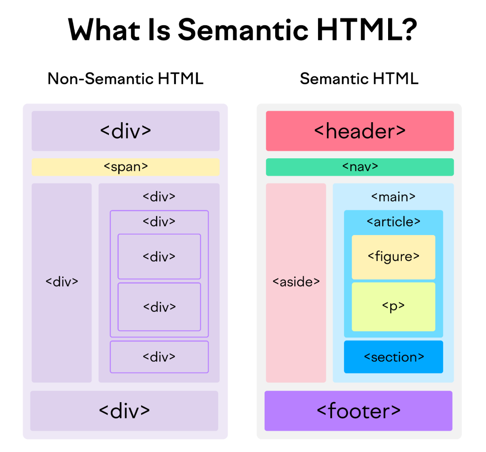

> # HTML
- HTML stands for Hyper Text Markup Language
- HTML is the standard markup language for creating Web pages
- HTML describes the structure of a Web page
- HTML uses markup tags to describe Web pages
- HTML tags are surrounded by angle brackets: `<tagname>`
- HTML tags normally come in pairs like `<p>` and `</p>`
- The first tag in a pair is the opening tag, the second tag is the closing tag.


### Structure of HTML Document
```html
<!DOCTYPE html>
<html>
    <head>
    <title>Page Title</title>
    </head>

    <body>
        <h1>This is a Heading</h1>
        <p>This is a paragraph.</p>
    </body>
</html>
```
- The `<!DOCTYPE html>` declaration defines this document to be HTML5
- The `<html>` element is the root element of an HTML page
- The `<head>` element contains meta information about the document
- The `<title>` element specifies a title for the document
- The `<body>` element contains the visible page content
- The `<h1>` element defines a large heading
- The `<p>` element defines a paragraph

---

> # HTML Elements
- An HTML element is defined by a start tag, some content, and an end tag:
    ```html
    <tagname>Content goes here...</tagname>
    ```
- An HTML element includes an opening tag, content (optional), and a closing tag.
- Some elements, like `<br>`, are empty and have no closing tag.
- HTML elements can contain other elements (nested).
- All HTML documents are made up of nested elements.

---

> # HTML Attributes
- HTML attributes provide additional information about HTML elements.
- Attributes are always specified in the start tag.
- Attributes are always specified in name/value pairs like this: `name="value"`

### Some Common Attributes

`href` 
- Specifies the URL of the page the link goes to.
- This attribute is used with the `<a>` tag.
- Example: `<a href="https://www.google.com">Google</a>`

`src`
- Specifies the path to the image.
- This attribute is used with the `` tag.
- Example: ``

`alt`
- Specifies an alternate text for the image, if the image for some reason cannot be displayed.
- This attribute is used with the `` tag.
- Example: ``

`width` and `height`
- Specifies the height and width of the image.
- This attribute is used with the `` tag.
- Example: ``

### Id and Class Attributes
- The `id` attribute specifies a unique id for an HTML element.
- The `id` attribute must be unique within the page.
- The `class` attribute is used to specify a class for an HTML
- The `class` attribute can be used on multiple elements.
- Example:
    ```html
    <p id="myId">This is a paragraph.</p>
    <p class="myClass">This is another paragraph.</p>
    ```
- The `id` is for one specific element, while `class` can be used for many elements.
- Each `id` must be unique on a page, but you can use the same `class` on multiple elements.
- Use `id` to style or control one element, and `class` to style or control a group of elements.
- `id` is for targeting one element, and `class` is for targeting multiple elements.
- `id` is used to link to one element, while `class` can apply to many elements.

---

> # HTML Headings
- HTML headings range from `<h1>` to `<h6>`, with `<h1>` being the most important and `<h6>` the least.
- They have opening and closing tags.
- Headings are block elements used to structure and organize content hierarchically.

``` html
<h1>This is a heading with h1 tag</h1>
<h2>This is a heading with h2 tag</h2>
<h3>This is a heading with h3 tag</h3>
<h4>This is a heading with h4 tag</h4>
<h5>This is a heading with h5 tag</h5>
<h6>This is a heading with h6 tag</h6>
```

---

> # HTML Paragraphs
- HTML paragraphs are created using the `<p>` tag.
- They are block elements with opening and closing tags.
- The `<p>` tag adds space before and after the text automatically.
```html
<p>This is a paragraph.</p>
<p>This is another paragraph.</p>
<p>This is a third paragraph.</p>
```

---

> # HTML Division and Span
- The `<div>` tag groups block elements and creates sections in a document.
- The `<span>` tag groups inline elements within text.
- Use `<div>` and `<span>` to apply CSS styles to multiple elements.
```html
<div style="background-color:lightblue;">
    <h1>This is a heading</h1>
    <p>This is a paragraph.</p>
</div>

<span style="color:blue;">This is a blue text.</span>
```

---
> # HTML Comments
- Comments are not displayed in the browser.
- You can use comments to explain your code, which can help you when you edit the source code at a later date.
- Comments are written with `<!--` and `-->`
- Comments can span multiple lines.
```html
<!-- This is a comment -->
<!-- This is a comment that spans multiple lines

This is the second line of the comment -->
```

---

> # HTML Line Breaks
- HTML line breaks are defined with the `<br>` tag.
- The `<br>` tag is an empty tag which means that it has no closing tag.
```html
<p>This is a paragraph.<br>This is another paragraph.</p>
<p>This is a paragraph.<br>This is another paragraph.</p>
```

---

> # HTML Formatting Tags
- HTML formatting tags are used to format the text for better readability.
- The `<b>` tag is used to bold the text.
- The `<i>` tag is used to italicize the text.
- The `<small>` tag is used to make the text smaller.
- The `<sub>` tag is used to make the text subscript.
- The `<sup>` tag is used to make the text superscript.
- The `<strong>` tag is used to highlight the important text. This makes the text bold.
- The `<em>` tag is used to emphasize the text. This makes the text italic.

---

> # Formatting Text Phrases
- HTML text phrases are used to format the text for better readability.
- The `<strong>` tag is used to highlight the important text. This makes the text bold.
- The `<em>` tag is used to emphasize the text. This makes the text italic.
- The `<mark>` tag is used to highlight the text.
- The `<span>` tag is used to group inline elements together.
- The `<tt>` tag is used to define teletype text.

---

> # HTML Spacing Tags
- HTML spacing tags are used to add space between the elements.
- The `<br>` tag is used to add a single line break.
- The `<hr>` tag is used to add a horizontal line.
- The `<pre>` tag is used to define preformatted text.
- The `&nbsp;` entity is used to add a single space.

---

> # Image Element
- The `` tag is used to embed an image in an HTML page.
- The `` tag has two required attributes:
    - `src` - Specifies the path to the image
    - `alt` - Specifies an alternate text for the image, if the image for some reason cannot be displayed
- The `width` and `height` attributes are used to specify the width and height of the image.
    ``` html
    
    ```

### Images in Another Folder
- If the image is in another folder, you need to specify the path to the image.
- The path can be relative or absolute.
- Example:
    ``` html
    
    ```

### Images in Another Website
- If the image is in another website, you need to specify the full URL of the image.
- Example:
    ``` html
    
    ```

---

> # HTML Links (Anchor Tags)
- HTML links are used to link to other web pages or resources.
- HTML links are defined with the `<a>` tag.
- This is also called anchor tag.
- The link text is the part that will be visible to the user.
- The `href` attribute specifies the URL of the page the link goes to.
- The `target` attribute specifies where to open the linked document.
- The `target` attribute can have the following values:
    - `_blank`: Opens the link in a new tab or window.
    - `_self`: Opens the link in the same frame as it was clicked (this is default).
    - `_parent`: Opens the link in the parent frame.
    - `_top`: Opens the link in the full body of the window.
    ``` html
    <a href="https://www.google.com" target="_blank">Visit Google</a>
    ```

---

> # HTML Lists
- HTML lists are used to specify lists of information.
- They are of three types:
    - `Unordered Lists`: Lists that begin with a bullet point.
    - `Ordered Lists`: Lists that begin with a number.
    - `Description Lists`: Lists that are used to describe terms.

    ### Unordered Lists
    - An unordered list is a list of items marked with bullets and not by numbers.
    - The `<ul>` tag is used to define an unordered list.
    - The `<li>` tag is used to define each list item.
    - The `start` attribute of the `<ul>` tag is used to specify the starting number of the list.
        ``` html
        <ul>
            <li>Item 1</li>
            <li>Item 2</li>
            <li>Item 3</li>
        </ul>
        ```
    - The `type` attribute of the `<ul>` tag is used to specify the type of bullet point.
    - The `type` attribute can have the following values:
        - disc: Default value. Filled circle.
        - circle: Hollow circle.
        - square: Filled square.
        ``` html
        <ul type="circle">
            <li>Item 1</li>
            <li>Item 2</li>
            <li>Item 3</li>
        </ul>
        ```

    ---

    ### Ordered Lists
    - An ordered list is a list of items marked with numbers.
    - The `<ol>` tag is used to define an ordered list.
        ``` html
        <ol>
            <li>Item 1</li>
            <li>Item 2</li>
            <li>Item 3</li>
        </ol>
        ```
    - The `start` attribute of the `<ol>` tag is used to specify the starting number of the list.
    - The `type` attribute of the `<ol>` tag is used to specify the type of numbering.
    - The `type` attribute can have the following values:
        - 1: Default value. Numbers.
        - A: Uppercase letters.
        - a: Lowercase letters.
        - I: Uppercase Roman numerals.
        - i: Lowercase Roman numerals.
        ``` html
        <ol type="A" start = "4">
            <li>Item 1</li>
            <li>Item 2</li>
            <li>Item 3</li>
        </ol>
        ```

    ---

    ### Description Lists
    - A description list is a list of terms, with a description of each term.
    - The `<dl>` tag is used to define a description list.
    - The `<dt>` tag is used to define the term.
    - The `<dd>` tag is used to define the description.
        ``` html
        <dl>
            <dt>Term 1</dt>
            <dd>Description 1</dd>

            <dt>Term 2</dt>
            <dd>Description 2</dd>
        </dl>
        ```  

---

> # HTML Frames
- HTML frames split the browser window into sections, each showing a different HTML document.
- Use `<frameset>` to define the layout of frames.
- Use `<frame>` to create each frame.
- The `src` attribute in `<frame>` sets the URL for the content in the frame.
    ```html
    <frameset cols="25%,50%,25%">
        <frame src="frame_a.htm">
        <frame src="frame_b.htm">
        <frame src="frame_c.htm">
    </frameset>
    ```

### HTML iframe
- An `<iframe>` is used to display a web page within a web page.
- The `src` attribute of the `<iframe>` tag is used to specify the URL of the page that should be loaded into the iframe.
- Iframes are often used to display advertisements on a web page.
    ```html
    <iframe src="https://www.w3schools.com"></iframe>
    <iframe src="https://www.w3schools.com" width="200" height="200"></iframe>
    ```

---


> # HTML Meta Tags
- HTML meta tags provide information about the web page (metadata).
- Metadata is not visible on the page but helps browsers, search engines, and other tools.
- The `<meta>` tag is used to define metadata and is placed inside the `<head>` section.
- Common attributes:
    - `name`: Defines the type of metadata (e.g., description, keywords).
    - `content`: Provides the metadata value.
    - `http-equiv`: Acts as an HTTP header for the metadata.
- Example:
    ```html
    <meta name="viewport" content="width=device-width, initial-scale=1.0">
    <meta name="description" content="This is a sample page.">
    <meta name="keywords" content="HTML, meta tags, example">
    <meta http-equiv="refresh" content="30">
    ```

---

> # HTML Audio
- The `<audio>` tag is used to add audio to a web page.
- Common attributes:
    - `controls`: Shows play, pause, and volume controls.
    - `autoplay`: Plays audio automatically when loaded.
    - `preload`: Decides how audio is loaded (e.g., auto, metadata, or none).
    - `type`: Specifies the audio file format.
    - `loop`: Repeats the audio when it ends.
    - `muted`: Mutes the audio by default.
- Example:
    ```html
    <audio controls autoplay preload="auto">
            <source src="audio.mp3" type="audio/mpeg">
            Your browser does not support the audio element.
    </audio>
    ```

---

> # HTML Video
- The `<video>` tag is used to add video to a web page.
- Common attributes:
    - `controls`: Shows play, pause, and volume controls.
    - `autoplay`: Plays video automatically when loaded.
    - `preload`: Decides how video is loaded (e.g., auto, metadata, or none).
    - `width` and `height`: Set the video dimensions.
    - `poster`: Displays an image before the video plays.
- Example:
    ```html
    <video width="320" height="240" controls autoplay poster="poster.jpg">
        <source src="movie.mp4" type="video/mp4">
        Your browser does not support the video tag.
    </video>
    ```

---

> # HTML Canvas
- `<canvas>` is used to draw graphics on a web page.
- It has `width` and `height` attributes to set its size.
- You can draw shapes, text, and images on it using JavaScript.
- The `<canvas>` element is used with JavaScript to draw graphics on the canvas.
- Example:
    ```html
    <canvas id="myCanvas" width="200" height="100"></canvas>
    <!-- Adding JavaScript -->
    <script>
        var c = document.getElementById("myCanvas");
        var ctx = c.getContext("2d");
        ctx.fillStyle = "#FF0000";
        ctx.fillRect(20, 20, 150, 50);
    </script>
    ```

---

> # HTML Semantic Elements
- HTML5 introduced semantic elements to give meaning to the content of a web page.
- Semantic elements help search engines and browsers understand the structure of a web page.

<div align="center">
    
</div>

### HTML Main and Section
- The `<main>` tag is used to define the main content of a document such as the main heading, main body, etc.
- The `<section>` tag is used to define a section in a document such as chapters, headers, footers, or any other sections of the document.
- The `<main>` and `<section>` tags can contain headings, paragraphs, links, images, and other HTML elements.
- Example:
    ```html
    <main>
        <h1>This is the main content</h1>
        <p>This is a paragraph in the main content.</p>
    </main>
    <section>
        <h1>This is a section</h1>
        <p>This is a paragraph in the section.</p>
    </section>
    ```

---

### HTML Article
- The `<article>` tag defines a standalone section of content, like a blog post or news article.
- It can include headings, text, links, images, and other elements.
- Use it for content that can be shared or reused independently.
- Example:
    ```html
    <article>
        <h1>This is an article</h1>
        <p>This is a paragraph in the article.</p>
    </article>
    ```

---

### HTML Header and Footer
- The `<header>` tag is used to define a header for a document or a section.
- The `<footer>` tag is used to define a footer for a document or a section.
- The `<header>` element typically contains introductory content or navigational links.
- The `<footer>` element is typically used to contain information about its containing element, such as the author of the document, copyright information, or links to related documents.
- Example:
    ```html
    <header>
        <h1>This is a header</h1>
        <h2>This is a sub-header</h2>
        <p>This is a paragraph in the header.</p>
    </header>
    <footer>
        <h1>This is a footer</h1>
        <p>This is a paragraph in the footer.</p>
    </footer>
    ```

---

### HTML Aside
- The `<aside>` tag shows content related to the main content but not part of it.
- It's often used for sidebars, quotes, or extra info.
- It can include text, links, images, and more.
- Example:
    ```html
    <aside>
        <h1>This is an aside</h1>
        <p>This is a paragraph in the aside.</p>
    </aside>
    ```

---

### HTML Navigation
- The `<nav>` tag defines a section for navigation links.
- It's used for menus, sidebars, or site navigation.
- It can include links, text, images, and more.
- Example:
    ```html
    <nav>
        <ul>
            <li><a href="#home">Home</a></li>
            <li><a href="#about">About</a></li>
            <li><a href="#contact">Contact</a></li>
        </ul>
    </nav>
    ```

---

### HTML Figure and Figcaption
- The `<figure>` tag holds content like images, diagrams, or code that's separate from the main text.
- The `<figcaption>` tag adds a caption to the figure.
- They can include text, images, links, and more.
- Example:
    ```html
    <figure>
        
        <figcaption>This is a caption for the image.</figcaption>
    </figure>
    ```

---

> # HTML Tables

### Structure
- HTML tables are used to display data in tabular form.
- They allow web developers to arrange data into rows and columns.
- The `<table>` tag is used to define a table.
- The `<tr>` tag is used to define a row in a table.
- The `<td>` tag is used to define a data cell in a table.

### Table Heading and Caption
- The `<th>` tag is used to define a header cell in a table. The text in `<th>` elements are bold and centered by default.
- The `<caption>` tag is used to add a caption to a table.

### Border, CellSpacing and CellPadding
- The `border` attribute of the `<table>` tag is used to specify the border of the table.
- The `border` attribute can have the following values:
        - 0: No border.
        - 1: Border.
- The `cellpadding` attribute of the `<table>` tag is used to specify the space between the cell wall and the cell content.
- The `cellspacing` attribute of the `<table>` tag is used to specify the space between the cells.

### Spanning Rows and Columns
- The `colspan` attribute of the `<td>` tag is used to specify the number of columns a cell should span.
- The `rowspan` attribute of the `<td>` tag is used to specify the number of rows a cell should span.

### Table Height, Width and Background Color
- The `width` attribute of the `<table>` tag is used to specify the width of the table.
- The `height` attribute of the `<table>` tag is used to specify the height of the table.
- The `bgcolor` attribute of the `<table>` tag is used to specify the background color of the table.
- The `width`, `height`, and `bgcolor` attributes can also be used with the `<td>`, `<th>`, and `<tr>` tags.

### Table Sections
- The table can be divided into sections using the `<thead>`, `<tbody>`, and `<tfoot>` tags.
- The `<thead>` tag is used to group the header content in a table.
- The `<tbody>` tag is used to group the body content in a table.
- The `<tfoot>` tag is used to group the footer content in a table.
  
### Table Captions
- The `<caption>` tag is used to add a caption to a table.
- The caption is displayed above the table by default.

```html
<table border="1" cellpadding="10" cellspacing="5" width ="400" height="200" bgcolor="yellow">
    <caption>Table Caption</caption>
    <thead>
        <tr>
            <th>Header 1</th>
            <th>Header 2</th>
        </tr>
    </thead>
    <tbody>
        <tr>
            <td>Row 1, Cell 1</td>
            <td>Row 1, Cell 2</td>
        </tr>
        <tr>
            <td>Row 2, Cell 1</td>
            <td>Row 2, Cell 2</td>
        </tr>
    </tbody>
    <tfoot>
        <tr>
            <td colspan = "2">Footer 1</td>
        </tr>
    </tfoot>
</table>
```

---

> # HTML Forms
- HTML forms collect user input.
- Use the `<form>` tag to create a form.
- The `action` attribute specifies where to send the form data.
- The `method` attribute defines how to send the data:
    - `get`: Adds data to the URL.
    - `post`: Sends data securely in the request body.

### Form Input
- The `<input>` tag is used to create an input field.
- Commonn attributes:
  - `<input>`: Creates a single-line input field.
  - `type`: Defines the type of input (e.g., text, password).
  - `name`: Sets the input's name for form submission.
  - `value`: Sets a default value for the input.
  - `maxlength`: Limits the number of characters.
  - `required`: Makes the field mandatory.
  - `placeholder`: Adds a hint inside the field.
  - `<textarea>`: Creates a multi-line input field.
- Example:
  ```html
  <form action="submit.php" method="post">
      First name: <input type="text" name="fname" maxlength="10"><br>
      Last name: <input type="text" name="lname"><br>
      Password: <input type="password" name="password" required><br>
      <input type="submit" value="Submit">
  </form>
  ```

### Input Types Table

| **Type**         | **Description**                                                                 |
|-------------------|---------------------------------------------------------------------------------|
| `text`           | A single-line text input field.                                                |
| `password`       | A single-line text input field that hides the entered characters.              |
| `email`          | A field for entering an email address.                                         |
| `number`         | A field for entering a numeric value.                                          |
| `tel`            | A field for entering a telephone number.                                       |
| `url`            | A field for entering a URL.                                                   |
| `search`         | A single-line text input field for search queries.                            |
| `date`           | A field for selecting a date.                                                 |
| `time`           | A field for selecting a time.                                                 |
| `datetime-local` | A field for selecting both date and time (local).                              |
| `month`          | A field for selecting a month and year.                                        |
| `week`           | A field for selecting a week and year.                                         |
| `color`          | A field for selecting a color.                                                |
| `range`          | A slider control for selecting a numeric value within a range.                |
| `checkbox`       | A box that can be checked or unchecked.                                        |
| `radio`          | A circular button for selecting one option from a group.                      |
| `file`           | A field for uploading files.                                                  |
| `hidden`         | A hidden input field (not visible to the user).                               |
| `submit`         | A button for submitting the form.                                             |
| `reset`          | A button for resetting the form fields to their initial values.               |
| `button`         | A clickable button.                                                           |
| `image`          | A graphical submit button.                                                    |
| `datetime`       | *(Deprecated)* A field for selecting both date and time.                      |

--- 

### Labels
- The `<label>` tag is used to define a label for an `<input>` element.
- The `for` attribute of the `<label>` tag is used to bind the label to the input element.
- The `id` attribute of the `<input>` tag is used to bind the label to the input element.
- Example:
    ```html
    <label for="fname">First name:</label>
    <input type="text" id="fname" name="fname"><br>
    <label for="lname">Last name:</label>
    <input type="text" id="lname" name="lname"><br>
    ```

---

### Textarea
- The `<textarea>` tag is used to create a multi-line text input field.
- The `rows` and `cols` attributes are used to specify the number of rows and columns in the textarea.
textarea.
- Example:
    ```html
    <textarea name = "textarea" rows="4" cols="50" placeholder="Enter text here..." maxlength="100"></textarea>
    ```

---

### Checkboxes
- If the `type` attribute is set to `checkbox`, the input field will be a checkbox.
- Checkboxes are used when you want to let the user select one or more options from a set of choices.
- The `checked` attribute is used to pre-select a checkbox.
- Example:
    ```html
    <input type="checkbox" name="vehicle1" value="Bike"> I have a bike<br>
    <input type="checkbox" name="vehicle2" value="Car"> I have a car<br>
    <input type="checkbox" name="vehicle3" value="Boat" checked> I have a boat<br>
    ```

---

### Radio Buttons
- If the `type` attribute is set to `radio`, the input field will be a radio button.
- Radio buttons are used when you want to let the user select one of a limited number of choices.
- The `name` attribute must be the same for all radio buttons in a group to ensure only one can be selected at a time.
- Example:
    ```html
    <input type = "radio" name = "gender" value = "Male"> I am a Male <br>
    <input type = "radio" name = "gender" value = "Female"> I am a Female <br>
    ```

---

### Select Box
- The `<select>` tag is used to create a drop-down list.
- The `<option>` tag is used to define the options in the drop-down list.
- The `value` attribute of the `<option>` tag is used to specify the value of the option.
- Example:
    ```html
    <select>
        <option value="volvo">Volvo</option>
        <option value="saab">Saab</option>
        <option value="mercedes">Mercedes</option>
        <option value="audi">Audi</option>
    </select>
    ```

---

### File Upload Box
- The `<input>` tag with `type="file"` is used to create a file upload box.
- The `accept` attribute is used to specify the types of files that can be uploaded.
- Example:
    ```html
    <input type="file" name="pic" accept="image/*">
    ```

---

### Button Controls
- The `<button>` tag is used to create a button.
- The `<input>` tag with `type="submit"` is used to create a submit button.
- The `<input>` tag with `type="reset"` is used to create a reset button.
- The `value` attribute is used to specify the text on the button.
- The `onclick` attribute is used to specify a JavaScript function to be executed when the button is clicked.
- Example:
    ```html
    <button type="button" onclick="alert('Button clicked!')">Click Me!</button>
    <input type="submit" value="Submit">
    <input type="reset" value="Reset">
    ```
---

### Form Attributes

| **Attribute**       | **What It Does**                                                                                     |
|---------------------|-----------------------------------------------------------------------------------------------------|
| `action`            | Tells the browser where to send the form data when the user submits it (a URL or file).             |
| `method`            | Decides how to send the form data: `get` (adds data to the URL) or `post` (sends data securely).     |
| `enctype`           | Sets the format for the form data when using `post`. Examples: `urlencoded`, `multipart`, `text`.   |
| `target`            | Decides where to show the result after submitting. Examples: same tab (`_self`), new tab (`_blank`).|
| `name`              | Gives the form a name so it can be identified in JavaScript or when sending data.                   |
| `novalidate`        | Turns off the browser's automatic form validation. Use this if you want to handle validation yourself.|
| `autocomplete`      | Lets the browser auto-fill form fields based on saved user info. Options: `on` or `off`.            |
| `accept-charset`    | Sets the text encoding (like UTF-8) for the form data.                                              |
| `rel`               | Describes the connection between the current page and the form's target. Often used with `_blank`.  |

---

> # HTML Events
- HTML events are actions that can be detected by JavaScript.
- They can be triggered by user actions like clicking a button, submitting a form, moving the mouse, etc.
- They can be used to execute JavaScript code when an event occurs.
- They can be used with HTML elements like `<button>`, `<input>`, `<form>`, `<a>`, etc.
- They can be used with JavaScript functions to execute code when an event occurs.

### Window Events
- They are used in the `<body>` tag to execute JavaScript code when the page is loaded, resized, or scrolled.

| **Event**   | **Description**                                                                 |
|-------------|---------------------------------------------------------------------------------|
| `onload`    | Occurs when the browser has finished loading the page.                         |
| `onresize`  | Occurs when the browser window is resized.                                     |
| `onscroll`  | Occurs when the user scrolls the page.                                         |
| `onunload`  | Occurs when the user leaves the page.                                          |

### HTML Form Events
- They are used in the `<form>` tag to execute JavaScript code when the form is submitted, reset, or when an input field changes.
  
| **Event**     | **Description**                                                                 |
|---------------|---------------------------------------------------------------------------------|
| `onsubmit`    | Occurs when the form is submitted.                                             |
| `onreset`     | Occurs when the form is reset.                                                 |
| `onchange`    | Occurs when the value of an input field changes.                               |
| `onfocus`     | Occurs when an input field gains focus.                                        |
| `onblur`      | Occurs when an input field loses focus.                                        |
| `oninput`     | Occurs when the value of an input field is changed.                            |
| `onselect`    | Occurs when the user selects some text in an input field.                     |

### Keyboard Events
- They are used in the `<input>` tag to execute JavaScript code when the user presses a key on the keyboard.

| **Event**      | **Description**                                                                 |
|-----------------|---------------------------------------------------------------------------------|
| `onkeydown`     | Occurs when the user presses a key on the keyboard.                            |
| `onkeyup`       | Occurs when the user releases a key on the keyboard.                          |
| `onkeypress`    | Occurs when the user presses a key on the keyboard and releases it. *(Deprecated)* |

## Mouse Events
- They are used in the `<button>`, `<input>`, and other elements to execute JavaScript code when the user interacts with the mouse.
  
| **Event**       | **Description**                                                                 |
|------------------|---------------------------------------------------------------------------------|
| `onclick`        | Occurs when the user clicks on an element.                                     |
| `ondblclick`     | Occurs when the user double-clicks on an element.                              |
| `onmousedown`    | Occurs when the user presses the mouse button down on an element.              |
| `onmouseup`      | Occurs when the user releases the mouse button on an element.                  |
| `onmouseover`    | Occurs when the user moves the mouse pointer over an element.                  |
| `onmouseout`     | Occurs when the user moves the mouse pointer out of an element.                |
| `onmousemove`    | Occurs when the user moves the mouse pointer over an element.                  |
| `onwheel`        | Occurs when the user scrolls the mouse wheel over an element.                  |

---