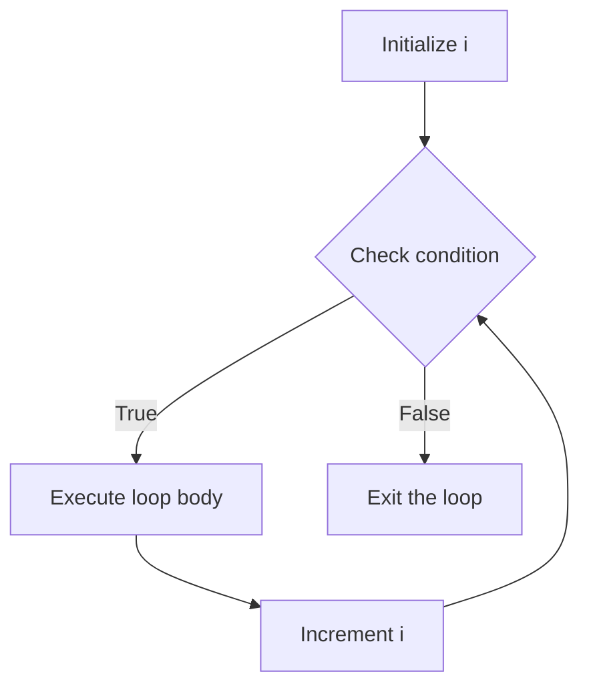
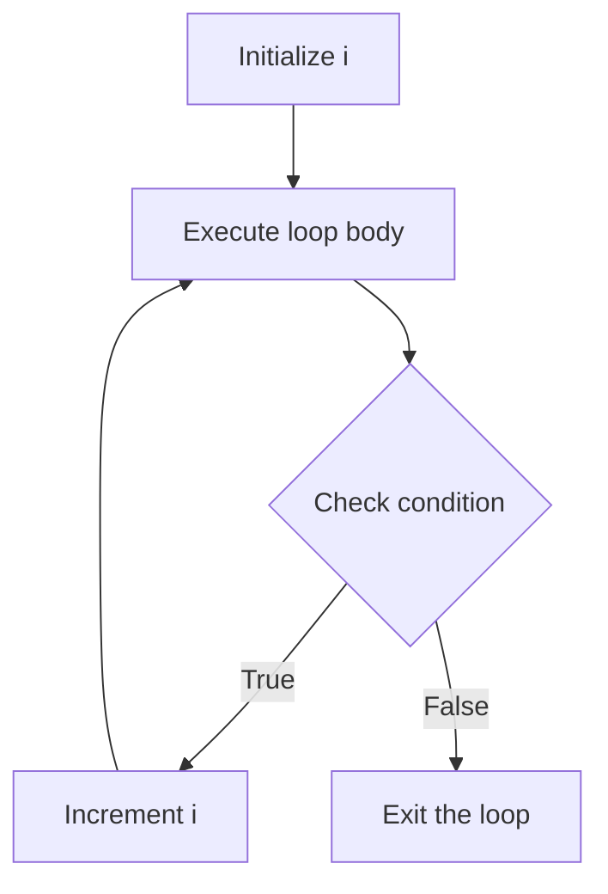
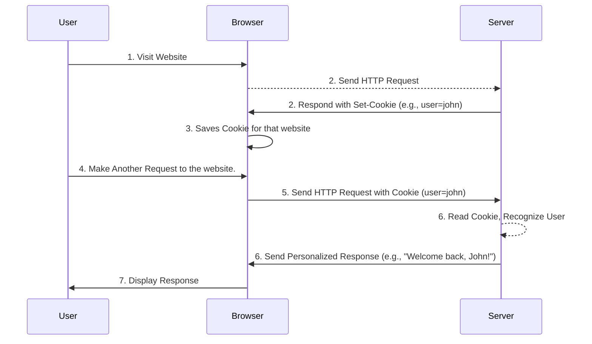

> # JavaScript
- JavaScript (JS) is a high-level, dynamic, and interpreted programming language.
- Supports object-oriented, imperative, and functional programming styles.
- Core technology of the web, alongside HTML and CSS.
- Enables interactive web pages and web applications.
- Used for client-side and server-side development (e.g., Node.js).

### Features
- **Dynamic Typing**: Variables can hold values of any type, and types are determined at runtime.
- **Prototype-based Object Orientation**: Objects can inherit properties and methods from other objects.
- **First-class Functions**: Functions can be treated as values, passed as arguments, and returned from other functions.
- **Event-driven**: Supports asynchronous programming and event handling.
- **Cross-platform**: Runs on various platforms and devices, including web browsers and servers.

### Structure 
- It is written in a C-like syntax, with curly braces `{}` for blocks and semicolons `;` to terminate statements.
- Uses variables, functions, and objects to structure code.
- Written inside `<script>` tags in HTML files or in separate `.js` files.
- The `<script>` tag can be placed in the `<head>` or at the bottom of `<body>` section of an HTML document.
- Example:
```html
<!DOCTYPE html>
<html lang="en">
<head>
    <meta charset="UTF-8">
    <meta name="viewport" content="width=device-width, initial-scale=1.0">
    <title>JavaScript Example</title>
    <script>
        // Inline JavaScript code
        console.log("Hello from inline script!");
    </script>
</head>
<body>
    <h1>Hello, World!</h1>
    <p>This is a paragraph.</p>

    <script src="script.js"></script> <!-- External JS file -->
</body>
</html>
```

---

> # JavaScript Variables
- Variables are used to store data values.
- They can hold different types of data, such as numbers, strings, arrays, and objects.
- Declared using `var`, `let`, or `const` keywords.

`var`:
- Declares a variable that can be re-assigned.
- Function-scoped or globally scoped.
- Example:
    ```javascript
    var age = 25; 
    var name = "John"; 
    var isStudent = true; 
    ```

`let`:
- Declares a block-scoped variable that can be re-assigned.
- Introduced in ES6 (ECMAScript 2015).
- Must be declared before use.
- Cannot be re-declared in the same scope.
- Example:
    ```javascript
    let age = 25; 
    let age = 30; // Error: 'age' has already been declared
    let name = "John"; 
    let isStudent = true; 
    ```

`const`:
- Declares a block-scoped variable that cannot be re-assigned.
- Must be initialized at the time of declaration.
- Cannot be re-declared in the same scope.
- Example:
    ```javascript
    const PI = 3.14;
    const PI = 3.14159; // Error: 'PI' has already been declared
    const name = "John"; 
    const isStudent = true; 
    ```
- Note: `const` does not make the object immutable; it only prevents re-assignment of the variable itself.

---

> # JavaScript Data Types
- JavaScript has dynamic typing, meaning variables can hold values of any type.
- The type of a variable can change at runtime.
- 7 primitive data types and 1 non-primitive data type.
- Primitive data types: `string`, `number`, `boolean`, `null`, `undefined`, `symbol`, `bigint`.
- Non-primitive data type: `object`.

`string`:
- Represents a sequence of characters.
- Enclosed in single quotes `'`, double quotes `"`, or backticks `` ` ``.
- Example:
    ```javascript
    let name = "John Doe"; // String
    let greeting = 'Hello, World!'; // String
    let templateString = `Hello, ${name}!`; // Template string
    ```

`number`:
- Represents numeric values (integers and floating-point numbers).
- Special values: `NaN` (Not a Number), `Infinity`, and `-Infinity`.
- Example:
    ```javascript
    let age = 25; // Integer
    let price = 19.99; // Floating-point number
    let notANumber = NaN; // Not a Number
    let positiveInfinity = Infinity; // Positive Infinity
    ```

`boolean`:
- Represents a logical value: `true` or `false`.
- Example:
    ```javascript
    let isStudent = true; // Boolean
    let isAdult = false; // Boolean
    ```

`null`:
- Represents the intentional absence of any object value.
- Example:
    ```javascript
    let emptyValue = null; // Null value
    ```

`undefined`:
- Represents a variable that has been declared but not assigned a value.
- Example:
    ```javascript
    let uninitializedVariable; // Undefined variable
    console.log(uninitializedVariable); // Output: undefined
    ```
- Note: `undefined` is different from `null`. `undefined` means a variable has been declared but not assigned a value, while `null` is an intentional absence of value.
   
`symbol`:
- Represents a unique and immutable value, often used as object property keys.
- Introduced in ES6 (ECMAScript 2015).
- Example:
    ```javascript
    const uniqueSymbol = Symbol('description'); // Symbol
    const anotherSymbol = Symbol('description'); // Different symbol
    console.log(uniqueSymbol === anotherSymbol); // Output: false
    ```
- Note: Symbols are not enumerable and do not convert to strings.

`bigint`:
- Represents integers with arbitrary precision.
- Can represent integer values larger than 
$$ (2^{53} - 1). $$
- Created by appending `n` to the end of an integer literal or using the `BigInt()` constructor.
- Example:
    ```javascript
    const bigIntValue = 1234567890123456789012345678901234567890n; // BigInt
    const anotherBigInt = BigInt(1234567890); // BigInt from Number
    console.log(bigIntValue + anotherBigInt); // Output: 1234567890123456789012345678901234567890n
    ```
- Note: BigInt cannot be mixed with regular numbers in arithmetic operations.

---

> # JavaScript Printing
- Printing output to the console or displaying it on the web page.
- Common methods for printing output:
    - `console.log()`: Prints output to the console.
    - `alert()`: Displays an alert dialog box with a message.
    - `document.write()`: Writes directly to the HTML document.
- Example:
    ```javascript
    console.log("Hello, World!"); // Prints to console
    alert("Hello, World!"); // Displays alert dialog
    document.write("Hello, World!"); // Writes to HTML document
    ```
- Note: `document.write()` is not recommended for modern web development as it can overwrite the entire document if used after the page has loaded.
- Use `console.log()` for debugging and `alert()` for simple notifications.

---

> # JavaScript Statements
- Statements are instructions that perform actions.
- They can be simple or compound.
- Simple statements are single instructions, while compound statements are blocks of code enclosed in curly braces `{}`.
- JS statements are composed of expressions, keywords, and operators.
- Example:
    ```javascript
    let x = 10; // Simple statement
    let y = 20; // Simple statement
    let sum = x + y; // Expression statement
    console.log(sum); // Expression statement
    ```

### Block Statements
- Block statements are used to group multiple statements together.
- Enclosed in curly braces `{}`.
- Used in control structures like `if`, `for`, and `while` to define the scope of the block.
- Example:
    ```javascript
    if (age >= 18) {
        console.log("Adult");
    } else {
        console.log("Minor");
    }
    ```
- In the above example, the block statement defines the code to be executed based on the condition.

---

> # JavaScript Expressions
- Expressions are combinations of values, variables, operators, and functions that evaluate to a value.
- They can be used in statements to perform calculations or manipulate data.
- Types of expressions:
    - **Arithmetic expressions**: Perform mathematical operations.
        ```javascript
        let sum = 5 + 10; // Addition
        let product = 5 * 10; // Multiplication
        ```
    - **String expressions**: Concatenate strings.
        ```javascript
        let greeting = "Hello" + " " + "World"; // String concatenation
        ```
    - **Logical expressions**: Evaluate to `true` or `false`.
        ```javascript
        let isAdult = age >= 18; // Logical expression
        ```
    - **Conditional (ternary) expressions**: Shorthand for `if-else` statements.
        ```javascript
        let result = (age >= 18) ? "Adult" : "Minor"; // Conditional expression
        ```

---

> # Keywords
- Keywords are reserved words in JavaScript that have special meaning and cannot be used as identifiers (variable names, function names, etc.).
- Examples of keywords:
    - `var`, `let`, `const`: Used to declare variables.
    - `function`: Used to define functions.
    - `if`, `else`, `switch`: Used for conditional statements.
    - `for`, `while`, `do`: Used for loops.
    - `return`: Used to return a value from a function.
    - `break`, `continue`: Used to control loop execution.
    - `try`, `catch`, `finally`: Used for error handling.
    - `class`, `extends`, `super`: Used for object-oriented programming.

- Note: Keywords are case-sensitive and should be written in lowercase.

---

> # JavaScript Operators
- Operators are symbols that perform operations on variables and values.
- JavaScript supports various types of operators, including arithmetic, assignment, comparison, logical, and more.
- Operators can be classified into the following categories:

### Arithmetic Operators:
- Used to manipulate numeric values.
- Common arithmetic operators include:
    | Operator | Description         | Example                  |
    |----------|---------------------|--------------------------|
    | `+`      | Addition            | `let sum = 5 + 10;`     |
    | `-`      | Subtraction         | `let difference = 10 - 5;` |
    | `*`      | Multiplication      | `let product = 5 * 10;`  |
    | `/`      | Division            | `let quotient = 10 / 2;` |
    | `%`      | Modulus (Remainder) | `let remainder = 10 % 3;` |
    | `**`     | Exponentiation      | `let power = 2 ** 3;`    |


### Assignment Operators:
- Used to assign values to variables.
- Common assignment operators include:
    | Operator | Description                          | Example                  | Equivalent To       |
    |----------|--------------------------------------|--------------------------|---------------------|
    | `=`      | Assignment                          | `let x = 10;`           | `x = 10`           |
    | `+=`     | Addition assignment                 | `x += 5;`               | `x = x + 5`        |
    | `-=`     | Subtraction assignment              | `x -= 3;`               | `x = x - 3`        |
    | `*=`     | Multiplication assignment           | `x *= 2;`               | `x = x * 2`        |
    | `/=`     | Division assignment                 | `x /= 4;`               | `x = x / 4`        |
    | `%=`     | Modulus assignment                  | `x %= 3;`               | `x = x % 3`        |

### Comparison Operators:
- Used to compare two values and return a boolean result (`true` or `false`).
- Common comparison operators include:
    | Operator | Description                     | Example                  |
    |----------|---------------------------------|--------------------------|
    | `= =`     | Equal to                        | `5 == '5'` (true)       |
    | `= = =`    | Strict equal to (type + value) | `5 === '5'` (false)     |
    | `! =`     | Not equal to                    | `5 ! = '5'` (false)      |
    | `! = =`    | Strict not equal to             | `5 ! == '5'` (true)      |
    | `<`      | Less than                       | `5 < 10` (true)         |
    | `>`      | Greater than                    | `10 > 5` (true)         |
    | `< =`     | Less than or equal to           | `5 <= 10` (true)        |
    | `> =`     | Greater than or equal to        | `10 >= 5` (true)        |


#### Logical Operators:
- Used to combine multiple boolean expressions.
- Common logical operators include:
    | Operator | Description                     | Example                  |
    |----------|---------------------------------|--------------------------|
    | `&&`     | Logical AND                    | `(x > 5) && (y < 10)`    |
    | `\|\|`     | Logical OR                     | `(x > 5) \|\| (y < 10)`    |
    | `!`      | Logical NOT                    | `!(x > 5)`               |

### Bitwise Operators:
- Used to perform operations on binary representations of numbers.
- Common bitwise operators include:
    | Operator | Description                     | Example                  |
    |----------|---------------------------------|--------------------------|
    | `&`      | Bitwise AND                    | `5 & 3` (1)              |
    | `\|`      | Bitwise OR                     | `5 \| 3` (7)              |
    | `^`      | Bitwise XOR                    | `5 ^ 3` (6)              |
    | `~`      | Bitwise NOT                    | `~5` (-6)                |
    | `<<`     | Left shift                     | `5 << 1` (10)            |
    | `>>`     | Right shift                    | `5 >> 1` (2)             |
    | `>>>`    | Unsigned right shift           | `-5 >>> 1` (2147483645)  |

### Increment and Decrement Operators:
- Used to increase or decrease the value of a variable by 1.
- Common increment and decrement operators include:
    | Operator | Description                     | Example                  |
    |----------|---------------------------------|--------------------------|
    | `++`     | Increment                       | `x++` (post-increment)   |
    | `--`     | Decrement                       | `x--` (post-decrement)   |
    | `++x`    | Pre-increment                   | `++x`                    |
    | `--x`    | Pre-decrement                   | `--x`                    |

---

> # JavaScript Flow Control
- Flow control statements are used to control the execution flow of a program based on certain conditions.
- They allow you to make decisions, repeat actions, and handle exceptions.
- Common flow control statements include:
    - Conditional statements: `if`, `else if`, `else`, `switch`.
    - Looping statements: `for`, `while`, `do while`.
    - Jump statements: `break`, `continue`, `return`.
    - Exception handling: `try`, `catch`, `finally`.

### Conditional Statements
- Conditional statements are used to execute different blocks of code based on certain conditions.
- Common conditional statements include:

`if`:
- If statement is used to execute a block of code if a specified condition is true.
- Example:
    ```javascript
    if (age >= 18) {
        console.log("Adult");
    }
    ```

`else`:
- Else statement is used to execute a block of code if the condition in the `if` statement is false.
- Example:
    ```javascript
    if (age >= 18) {
        console.log("Adult");
    } else {
        console.log("Minor");
    }
    ```

`else if`:
- Else if statement is used to specify a new condition to test if the first condition is false.
- Example:
    ```javascript
    if (age < 13) {
        console.log("Child");
    } else if (age < 18) {
        console.log("Teenager");
    } else {
        console.log("Adult");
    }
    ```

`switch`:
- Switch statement is used to perform different actions based on different conditions.
- It evaluates an expression and matches it against multiple cases.
- Example:
    ```javascript
    switch (day) {
        case 1:
            console.log("Monday");
            break;
        case 2:
            console.log("Tuesday");
            break;
        case 3:
            console.log("Wednesday");
            break;
        default:
            console.log("Invalid day");
    }
    ```
---

### Looping Statements
- Looping statements are used to execute a block of code repeatedly until a specified condition is met.
- Common looping statements include:

`while`:
- While loop is used to execute a block of code as long as a specified condition is true.
- The condition is checked before the execution of the loop body.


- Example:
    ```javascript
    let i = 0;
    while (i < 5) {
        console.log(i);
        i++;
    }
    ```

- Note: If the condition is never false, the loop will run indefinitely (infinite loop).

---

`do while`:
- Do while loop is similar to the while loop, but the condition is checked after the execution of the loop body.
- This ensures that the loop body is executed at least once.

- Example:
    ```javascript
    let i = 0;
    do {
        console.log(i);
        i++;
    } while (i < 5);
    ```

---

`for`:
- For loop is used to execute a block of code a specified number of times.
- It consists of three parts: initialization, condition, and increment/decrement.
- The `for` loop is often used when the number of iterations is known in advance.

- Example:
    ```javascript
    for (let i = 0; i < 5; i++) {
        console.log(i);
    }
    ```

---

>[!NOTE]
> Our Course only contains `Conditional` and `Looping` statements.

### Jump Statements
- Jump statements are used to control the flow of execution in a program.
- They can be used to exit loops, skip iterations, or return values from functions.
- Common jump statements include:

`break`:
- Break statement is used to exit a loop or switch statement prematurely.
- It terminates the loop and transfers control to the statement following the loop.
- Example:
    ```javascript
    for (let i = 0; i < 5; i++) {
        if (i === 3) {
            break; // Exit the loop when i is 3
        }
        console.log(i);
        // Output: 0, 1, 2
    }
    ```

`continue`:
- Continue statement is used to skip the current iteration of a loop and move to the next iteration.
- It does not terminate the loop but skips the remaining code in the current iteration.
- Example:
    ```javascript
    for (let i = 0; i < 5; i++) {
        if (i === 3) {
            continue; // Skip the iteration when i is 3
        }
        console.log(i);
        // Output: 0, 1, 2, 4
    }
    ```

---

> # JavaScript Functions
- A function is a reusable block of code that performs a specific task.
- Functions can take input parameters and return output values.
- They help organize code, improve readability, and promote code reusability.

### Function Definition
- Functions are defined using the `function` keyword, followed by a name, parentheses for parameters, and curly braces for the function body.
- Example:
    ```javascript
    function greet(name) {
        console.log("Hello, " + name + "!");
    }
    ```
- In the above example, `greet` is a function that takes a parameter `name` and prints a greeting message.

---

### Function Call
- Functions are called by using their name followed by parentheses.
- Example:
    ```javascript
    greet("Alice"); // Output: Hello, Alice!
    ```
- In the above example, the `greet` function is called with the argument `"Alice"`.

---

### Function Parameters and Arguments
- Parameters are variables listed in the function definition, while arguments are the actual values passed to the function when it is called.
- Functions can have multiple parameters, and they can be optional.
- Example:
    ```javascript
    function add(a, b) {
        return a + b;
    }
    let sum = add(5, 10); // sum = 15
    ```
- In the above example, `a` and `b` are parameters, and `5` and `10` are arguments passed to the `add` function.

---

### Function Return Value
- Functions can return a value using the `return` statement.
- The return value can be assigned to a variable or used directly in expressions.
- Example:
    ```javascript
    function multiply(a, b) {
        return a * b;
    }
    let product = multiply(5, 10); // product = 50
    console.log(product); // Output: 50
    ```
- In the above example, the `multiply` function returns the product of `a` and `b`, which is assigned to the variable `product`.

---

> # Popup Boxes
- Popup boxes are used to display messages or prompt the user for input.
- Common types of popup boxes include `alert`, `confirm`, and `prompt`.
- They are created using built-in JavaScript functions.

### Alert Box
- An alert box is used to display a message to the user.
- It contains a single "OK" button to close the box.
- Example:
    ```javascript
    alert("This is an alert box!");
    ```

---

### Confirm Box
- A confirm box is used to ask the user for confirmation.
- It contains "OK" and "Cancel" buttons.
- Returns `true` if the user clicks "OK" and `false` if the user clicks "Cancel".
- Example:
    ```javascript
    let result = confirm("Are you sure you want to proceed?");
    if (result) {
        console.log("User clicked OK.");
    } else {
        console.log("User clicked Cancel.");
    }
    ```

---

### Prompt Box
- A prompt box is used to ask the user for input.
- It contains a text input field and "OK" and "Cancel" buttons.
- Returns the input value if the user clicks "OK" and `null` if the user clicks "Cancel".
- Example:
    ```javascript
    let name = prompt("Please enter your name:");
    if (name ! = = null) {
        console.log("Hello, " + name + "!");
    } else {
        console.log("User clicked Cancel.");
    }
    ```

---

> # Objects
- JS objects are containers for named values called properties or methods.
- Properties are values associated with an object.
- Methods are actions that can be performed on objects.

## Creating Objects
- Object literal
- Constructor
- Object() constructor

### Object Literal
- The simplest way to create an object is using an object literal.
- An object literal is a list of key-value pairs inside curly braces {}.
- The keys are strings, and the values are any data type.
- Example:
    ```javascript
    var person = {
    firstName: "John",
    lastName: "Doe",
    age: 50,
    eyeColor: "blue"
    };
    ```
    - In the above example, `person` is an object with properties `firstName`, `lastName`, `age`, and `eyeColor`.

---

### Constructor
- A constructor is a function that initializes an object.
- You can define a constructor function and use the new keyword to create an object.
- It uses the `this` keyword to refer to the object being created.
- Example:
    ```javascript
    function Person(first, last, age, eye) {
    this.firstName = first;
    this.lastName = last;
    this.age = age;
    this.eyeColor = eye;
    }
    var myFather = new Person("John", "Doe", 50, "blue");
    ```

    - In the above example, `Person` is a constructor function that initializes an object with properties `firstName`, `lastName`, `age`, and `eyeColor`. The `new` keyword creates a new object based on the constructor.
    - The `myFather` variable is an instance of the `Person` object.

---

### Object() Constructor
- The Object() constructor creates an object wrapper.
- It allows you to create an object with a specified prototype or without a prototype.
- Example:
    ```javascript
    var person = new Object();
    person.firstName = "John";
    person.lastName = "Doe";
    person.age = 50;
    person.eyeColor = "blue";
    ```

---

## Accessing Object Properties
- Dot notation
- Bracket notation

```javascript
var person = {
  firstName: "John",
  lastName: "Doe",
  age: 50,
  eyeColor: "blue"
};
console.log(person.firstName); // Dot notation
console.log(person["lastName"]); // Bracket notation
```

---

## Accessing Object Methods
- Methods are functions that are properties of an object.
- You can access object methods using the same two notations.
- Call the method using the object name followed by the method name and parentheses.
- Example:
    ```javascript
    var person = {
    firstName: "John",
    lastName: "Doe",
    fullName: function() {
        return this.firstName + " " + this.lastName;
    }
    };
    console.log(person.fullName()); // Dot notation
    console.log(person["fullName"]()); // Bracket notation
    ```

---

## Object Properties
- You can add new properties to an object using the same two notations and assign values to them.
- You can delete a property using the delete keyword.
- Example:
    ```javascript
    var person = {
    firstName: "John",
    lastName: "Doe",
    age: 50,
    eyeColor: "blue"
    };
    delete person.age; // Delete the age property
    person.hairColor = "black"; // Add a new property
    ```

---

> # JavaScript Arrays
- An array is a special variable that can hold multiple values at once.
- Arrays are used to store lists of items, such as numbers, strings, or objects.

### Array Declaration
- Arrays can be declared using the `Array` constructor or array literals.
- Example:
    ```javascript
    var fruits = ["apple", "banana", "cherry"]; // Array literal
    var numbers = new Array(1, 2, 3, 4, 5); // Array constructor
    ```
    - In the above example, `fruits` is an array containing three string values, and `numbers` is an array containing five numeric values.

---

### Accessing Array Elements
- Array elements can be accessed using their index, which starts from 0.
- Example:
    ```javascript
    var fruits = ["apple", "banana", "cherry"];
    console.log(fruits[0]); // Output: apple
    console.log(fruits[1]); // Output: banana
    console.log(fruits[2]); // Output: cherry
    ```
    - In the above example, `fruits[0]` accesses the first element of the array, `fruits[1]` accesses the second element, and so on.

---

### Array Methods
- JavaScript provides various built-in methods to manipulate arrays.
- Common array methods include:

`concat()`:
- Joins two or more arrays and returns a new array.
- Example:
    ```javascript
    var array1 = [1, 2, 3];
    var array2 = [4, 5, 6];
    var combinedArray = array1.concat(array2); // Output: [1, 2, 3, 4, 5, 6]
    ```

`length`:
- Returns the number of elements in an array.
- Example:
    ```javascript
    var fruits = ["apple", "banana", "cherry"];
    console.log(fruits.length); // Output: 3
    ```

`push()`:
- Adds one or more elements to the end of an array and returns the new length of the array.
- Example:
    ```javascript
    var fruits = ["apple", "banana"];
    fruits.push("cherry"); // Output: 3 (new length of the array)
    console.log(fruits); // Output: ["apple", "banana", "cherry"]
    ```

`pop()`:
- Removes the last element from an array and returns that element.
- Example:
    ```javascript
    var fruits = ["apple", "banana", "cherry"];
    var lastFruit = fruits.pop(); // Output: "cherry"
    console.log(fruits); // Output: ["apple", "banana"]
    ```

`join()`:
- Joins all elements of an array into a string, separated by a specified separator.
- Example:
    ```javascript
    var fruits = ["apple", "banana", "cherry"];
    var fruitString = fruits.join(". ");   
    console.log(fruitString);   // Output: "apple. banana. cherry"
    ```

`reverse()`:
- Reverses the order of the elements in an array.
- Example:
    ```javascript
    var fruits = ["apple", "banana", "cherry"];
    fruits.reverse(); // Output: ["cherry", "banana", "apple"]
    console.log(fruits); // Output: ["cherry", "banana", "apple"]
    ```

`sort()`:
- Sorts the elements of an array in place and returns the sorted array.
- Example:
    ```javascript
    var fruits = ["banana", "apple", "cherry"];
    fruits.sort(); // Output: ["apple", "banana", "cherry"]
    console.log(fruits); // Output: ["apple", "banana", "cherry"]
    ```

`shift()`:
- Removes the first element from an array and returns that element.
- Example:
    ```javascript
    var fruits = ["apple", "banana", "cherry"];
    var firstFruit = fruits.shift(); // Output: "apple"
    console.log(fruits); // Output: ["banana", "cherry"]
    ```

`unshift()`:
- Adds one or more elements to the beginning of an array and returns the new length of the array.
- Example:
    ```javascript
    var fruits = ["banana", "cherry"];
    fruits.unshift("apple"); // Output: 3 (new length of the array)
    console.log(fruits); // Output: ["apple", "banana", "cherry"]
    ```

`slice()`:
- Returns a shallow copy of a portion of an array into a new array object.
- The original array is not modified.
- Example:
    ```javascript
    var fruits = ["apple", "banana", "cherry", "date"];
    var slicedFruits = fruits.slice(1, 3); // Output: ["banana", "cherry"]
    console.log(slicedFruits); // Output: ["banana", "cherry"]
    ```

---

> # Built-in Objects
- JavaScript provides several built-in objects that are part of the language.
- These objects provide useful methods and properties for various tasks.
- Common built-in objects include:

### `Window`:
- Represents the browser window or tab.
- Provides methods and properties for interacting with the browser environment.

#### Common Window Methods

| Method               | Description                                                                 |
|-----------------------|-----------------------------------------------------------------------------|
| `alert()`            | Displays an alert dialog box with a specified message and an OK button.    |
| `confirm()`          | Displays a dialog box with a message, OK, and Cancel buttons. Returns a boolean. |
| `prompt()`           | Displays a dialog box that prompts the user for input. Returns the input value or `null`. |
| `open()`             | Opens a new browser window or tab with a specified URL.                    |
| `close()`            | Closes the current browser window or tab (if allowed by the browser).      |
| `scrollTo()`         | Scrolls the window to a specified position.                                |
| `print()`            | Opens the print dialog to print the current document.                      |

- Example:
    ```javascript
    window.alert("Hello, World!"); // Displays an alert dialog box
    window.confirm("Are you sure?"); // Displays a confirm dialog box
    window.prompt("Enter your name:"); // Displays a prompt dialog box
    ```

---

### `String`:
- Represents a sequence of characters (text).
- Provides methods for manipulating and working with strings.
- Declared using single quotes `'` or double quotes `"`

#### Common String Methods
| Method               | Description                                                                 |
|-----------------------|-----------------------------------------------------------------------------|
| `charAt()`      | Returns the character at the specified index.                              |
| `concat()` | Joins two or more strings and returns a new string.                  |
| `indexOf()` | Returns the index of the first occurrence of a specified value.         |
| `lastIndexOf()` | Returns the index of the last occurrence of a specified value.   |
| `length`             | Returns the length of the string.                                          |
| `slice()`  | Extracts a section of a string and returns it as a new string.            |
| `split()`    | Splits a string into an array of substrings based on a specified separator. |
| `toLowerCase()`      | Converts the string to lowercase.                                          |
| `toUpperCase()`      | Converts the string to uppercase.                                          |
| `replace()` | Replaces a specified value with a new value in the string.  |
| `startsWith()` | Checks if the string starts with a specified value.               |
| `endsWith()` | Checks if the string ends with a specified value.                   |

- Example:
    ```javascript
    var str = "Hello, World!";
    console.log(str.charAt(0)); // Output: H
    console.log(str.length); // Output: 13
    console.log(str.toUpperCase()); // Output: HELLO, WORLD!
    console.log(str.split(", ")); // Output: ["Hello", "World!"]
    ```

---

### `Number`:
- Represents numeric values (integers and floating-point numbers).
- Provides methods for manipulating and working with numbers.
- Declared using `Number()` constructor or as literals.

#### Common Number Methods

| Method               | Description                                                                 |
|-----------------------|-----------------------------------------------------------------------------|
| `toFixed()`    | Formats a number using fixed-point notation with a specified number of digits. |
| `toExponential()` | Formats a number using exponential notation with a specified number of digits. |
| `toPrecision()` | Formats a number to a specified length.                                   
| `parseInt()`    | Parses a string and returns an integer.                                   |
| `parseFloat()`  | Parses a string and returns a floating-point number.                      |
| `toString()`      | Converts a number to a string in a specified base (radix).              |

- Example:
    ```javascript
    var num = 123.456;
    console.log(num.toFixed(2)); // Output: 123.46
    console.log(num.toExponential(2)); // Output: 1.23e+2
    console.log(Number.parseInt("123abc")); // Output: 123
    console.log(Number.parseFloat("123.45abc")); // Output: 123.45
    ```

---

### `Boolean`:
- Represents a logical value: `true` or `false`.
- Used for conditional statements and logical operations.
- Declared using `Boolean()` constructor or as literals.

#### Common Boolean Methods
| Method               | Description                                                                 |
|-----------------------|-----------------------------------------------------------------------------|
| `toString()`      | Converts a boolean value to a string.                                     |
| `valueOf()`       | Returns the primitive value of a boolean object.                          |
| `toSource()`      | Returns the source code of the boolean object.                          |

- Example:
    ```javascript
    var isTrue = true;
    console.log(isTrue.toString()); // Output: "true"
    console.log(isTrue.valueOf()); // Output: true
    console.log(isTrue.toSource()); // Output: "true"
    ```

---

### `Date`:
- Represents a date and time.
- Provides methods for manipulating and formatting dates and times.
- Declared using `Date()` constructor.
- Example:
    ```javascript
    var currentDate = new Date(); // Current date and time
    console.log(currentDate); // Output: Current date and time
    ```

#### Common Date Methods
| Method               | Description                                                                 |
|-----------------------|-----------------------------------------------------------------------------|
| `getDate()`       | Returns the day of the month (1-31).                                      |
| `getDay()`        | Returns the day of the week (0-6, where 0 is Sunday).                      |
| `getFullYear()`   | Returns the four-digit year.                                              |
| `getHours()`      | Returns the hour (0-23).                                                  |
| `getMinutes()`    | Returns the minutes (0-59).                                               |
| `getSeconds()`    | Returns the seconds (0-59).                                               |
| `getMilliseconds()` | Returns the milliseconds (0-999).                                         |
| `getTime()`       | Returns the number of milliseconds since January 1, 1970.                 |
| `setDate()`       | Sets the day of the month (1-31).                                         |
| `setFullYear()`   | Sets the four-digit year.                                                 |
| `setHours()`      | Sets the hour (0-23).                                                     |
| `setMinutes()`    | Sets the minutes (0-59).                                                  |
| `setSeconds()`    | Sets the seconds (0-59).                                                  |
| `setMilliseconds()` | Sets the milliseconds (0-999).                                          |
| `setTime()`       | Sets the date and time in milliseconds since January 1, 1970.             |
| `toDateString()`  | Converts the date to a string in a human-readable format.                 |
| `toTimeString()`  | Converts the time to a string in a human-readable format.                 |
| `toLocaleDateString()` | Converts the date to a string in the local format.                  |
| `toLocaleTimeString()` | Converts the time to a string in the local format.                |


- Example:
    ```javascript
    var currentDate = new Date();
    var day = currentDate.toLocaleDateString(); // Current date in local format
    var time = currentDate.toLocaleTimeString(); // Current time in local format
    console.log(day); // Output: Current date i.e. "10/10/2023"
    console.log(time); // Output: Current time i.e. "10:30:00 AM"
    ```

---

### `Math`:
- Provides mathematical constants and functions.
- Used for performing mathematical calculations.
- Declared using `Math` object.

#### Common Math Methods
| Method               | Description                                                                 |
|-----------------------|-----------------------------------------------------------------------------|
| `abs()`            | Returns the absolute value of a number.                                   |
| `ceil()`           | Returns the smallest integer greater than or equal to a number.          |
| `floor()`          | Returns the largest integer less than or equal to a number.             |
| `round()`          | Rounds a number to the nearest integer.                                   |
| `max()`            | Returns the largest of zero or more numbers.                             |
| `min()`            | Returns the smallest of zero or more numbers.                            |
| `random()`         | Returns a pseudo-random number between 0 and 1.                          |
| `pow()`            | Returns the value of a base raised to the power of an exponent.          |
| `sqrt()`           | Returns the square root of a number.                                     |
| `exp()`           | Returns the value of e raised to the power of a number.               |
| `log()`            | Returns the natural logarithm (base e) of a number.                      |

- Example:
    ```javascript
    var num = -5.7;
    console.log(Math.abs(num)); // Output: 5.7
    console.log(Math.ceil(num)); // Output: -5
    console.log(Math.floor(num)); // Output: -6
    console.log(Math.round(num)); // Output: -6
    console.log(Math.max(1, 2, 3)); // Output: 3
    console.log(Math.min(1, 2, 3)); // Output: 1
    console.log(Math.random()); // Output: Random number between 0 and 1
    ```

---

### `RegExp`:
- Represents a regular expression, which is a pattern used to match character combinations in strings.
- Provides methods for searching and manipulating strings based on patterns.
- Declared using `RegExp` constructor or regular expression literals.

#### Common RegExp Methods
| Method               | Description                                                                 |
|-----------------------|-----------------------------------------------------------------------------|
| `test()`           | Tests for a match in a string. Returns `true` or `false`.                |
| `exec()`           | Executes a search for a match in a string. Returns an array of matches or `null`. |
| `match()`          | Searches a string for a match against a regular expression. Returns an array of matches or `null`. |

#### Common Regular Expression Patterns
| Pattern             | Description                                                                 |
|-----------------------|-----------------------------------------------------------------------------|
| `.`                 | Matches any single character except newline.                               |
| `^`                 | Matches the beginning of a string.                                         |
| `$`                 | Matches the end of a string.                                               |
| `*`                 | Matches zero or more occurrences of the preceding character.               |
| `+`                 | Matches one or more occurrences of the preceding character.                |
| `?`                 | Matches zero or one occurrence of the preceding character.                 |
| `[abc]`             | Matches any character in the brackets.                                    |
| `[^abc]`            | Matches any character not in the brackets.                                |
| `(abc)`             | Groups a pattern.                                                         |
| `\d`                | Matches any digit (0-9).                                                  |
| `\D`                | Matches any non-digit character.                                          |
| `\w`                | Matches any word character (alphanumeric + underscore).                  |
| `\W`                | Matches any non-word character.                                          |
| `\s`                | Matches any whitespace character (space, tab, newline).                  |
| `\S`                | Matches any non-whitespace character.                                    |
| `[a-z]`           | Matches any lowercase letter.                                           |
| `[A-Z]`           | Matches any uppercase letter.                                           |
| `[0-9]`           | Matches any digit.                                                     |

- Example:
    ```javascript
    var pattern = /[a-zA-Z0-9]+/; // Matches alphanumeric characters
    var str = "Hello123";
    console.log(pattern.test(str)); // Output: true
    console.log(str.match(pattern)); // Output: ["Hello123"]
    ```

---

> # HTML DOM
- The Document Object Model (DOM) is a programming interface for web documents.
- It represents the structure of a document as a tree of objects, allowing programming languages to manipulate the content and structure of web pages.
- The DOM provides a way to access and modify the elements, attributes, and styles of HTML documents using JavaScript.
  
### DOM Methods
  - The DOM provides methods to access and manipulate elements in the document.
  - You can use these methods to create, delete, and modify elements.

#### document.getElementById()
- The getElementById() method returns the element that has the ID attribute with the specified value.
- This method is one of the most common methods in the DOM.
- It is used to get an element by its ID.
- The ID attribute is unique within a document.
- If no element has the specified ID, the method returns null.
- Example:
    ```javascript
    var element = document.getElementById("demo");
    element.innerHTML = "Hello, World!";
    ```
    - In the above example, the getElementById() method is used to get the element with the ID "demo" and change its inner HTML to "Hello, World!".

---

#### document.getElementsByName()
- The getElementsByName() method returns a collection of elements with the specified name attribute.
- This method is used to get elements by their name attribute.
- The name attribute is not unique within a document.
- The method returns a NodeList object, which is an array-like object.
- Example:
    ```javascript
    var elements = document.getElementsByName("demo");
    elements[0].innerHTML = "Hello, World!";
    ```
    - In the above example, the getElementsByName() method is used to get the elements with the name "demo" and change the inner HTML of the first element to "Hello, World!".

---

#### document.getElementsByTagName()
- The getElementsByTagName() method returns a collection of elements with the specified tag name.
- This method is used to get elements by their tag name.
- The tag name is not unique within a document.
- The method returns a NodeList object, which is an array-like object.
- Example:
    ```javascript
    var elements = document.getElementsByTagName("p");
    elements[0].innerHTML = "Hello, World!";
    ```
    - In the above example, the getElementsByTagName() method is used to get the elements with the tag name "p" and change the inner HTML of the first element to "Hello, World!".

---

#### innerHTML
- The innerHTML property is used to get or set the HTML content of an element.
- It allows you to change the content of an element dynamically.
- Example:
    ```javascript
    var element = document.getElementById("demo").innerHTML = "Hello, World!";
    ```
    - In the above example, the innerHTML property is used to change the content of the element with the ID "demo" to an h1 element with the text "Hello, World!".

---

> # Form Validation
- Form validation is the process of checking if the form data is valid before submitting it to the server.
- It helps to ensure that the data is accurate and complete.
- You can use JavaScript to validate form data on the client side.

### Basic Form Validation
- The form must be checked to make sure all the mandatory fields are filled out.
- Example:
  ```javascript
  function validateForm() {
    var x = document.getElementById("fname").value;
    if (x == "") {
      alert("Name is required");
      return false;
    }
  }
  ```
  - In the above example, the `validateForm()` function checks if the input field with the ID `fname` is empty. If it is empty, an alert message is displayed, and the form submission is prevented.

---

### Data Format Validation
- The data entered in the form fields must be in the correct format.
- Example:
    ```javascript
    function validateForm() {
        var age = document.getElementById("age").value;
        if (age < 18 || age > 60) {
        alert("Age must be between 18 and 60");
        return false;
        }
    }
    ```
    - In the above example, the `validateForm()` function checks if the age entered in the input field with the ID `age` is between 18 and 60. If it is not, an alert message is displayed, and the form submission is prevented.

---

### Numeric Validation
- The data entered in the form fields must be numeric.
- Example:
  ```javascript
  function validateForm() {
    var x = document.getElementById("age").value;
    var pattern = /^[0-9]+$/;
    if (!x.match(pattern)) {
      alert("Age must be a number");
      return false;
    }
  }
  ```
  - In the above example, the `validateForm()` function checks if the input field with the ID `age` contains only numeric characters. If it does not, an alert message is displayed, and the form submission is prevented.

---

### Email Validation
- The email address entered in the form field must be in the correct format.
- Example:
  ```javascript
  function validateForm() {
    var email = document.getElementById("email").value;
    var pattern = /^[a-zA-Z0-9._-]+@[a-zA-Z0-9.-]+\.[a-zA-Z]{2,4}$/;
    if (!email.match(pattern)) {
      alert("Invalid email address");
      return false;
    }
  }
  ```
  - In the above example, the `validateForm()` function checks if the input field with the ID `email` contains a valid email address format. If it does not, an alert message is displayed, and the form submission is prevented.

---

### Password Validation
- The password entered in the form field must meet certain criteria.
- Example:
  ```javascript
  function validateForm() {
    var password = document.getElementById("password").value;
    var pattern = /^(?=.*\d)(?=.*[a-z])(?=.*[A-Z]).{6,20}$/;
    if (!password.match(pattern)) {
      alert("Password must contain at least one digit, one lowercase and one uppercase letter, and be between 6 and 20 characters");
      return false;
    }
  }
  ```
  - In the above example, the `validateForm()` function checks if the input field with the ID `password` meets the specified criteria. If it does not, an alert message is displayed, and the form submission is prevented.

---

### Checkbox Validation
- At least one checkbox must be checked.
- Example:
    ```javascript
    function validateForm() {
        var interests = document.querySelectorAll('input[name="interests"]:checked');
        if (interests.length == 0) {
            alert("Please select at least one interest");
            return false;
        }
    }
    ```
    - In the above example, the `validateForm()` function checks if at least one checkbox with the name `interests` is checked. If none are checked, an alert message is displayed, and the form submission is prevented.

---

### Radio Button Validation
- At least one radio button must be selected.
- Example:
    ```javascript
    function validateForm() {
        var gender = document.querySelector('input[name="gender"]:checked');
        if (!gender) {
            alert("Please select a gender");
            return false; 
        }
    }
    ```
    - In the above example, the `validateForm()` function checks if at least one radio button with the name `gender` is selected. If none are selected, an alert message is displayed, and the form submission is prevented.

---

### Select Box Validation
- A value must be selected from the select box.
- Example:
    ```javascript
    function validateForm() {
        var country = document.getElementById("country").value;
        if (country == "") {
        alert("Please select a country");
        return false;
        }
    }
    ```
    - In the above example, the `validateForm()` function checks if a value is selected from the select box with the ID `country`. If no value is selected, an alert message is displayed, and the form submission is prevented.

---

### File Upload Validation
- The file input field must not be empty.
- Example:
    ```javascript
    function validateForm() {
        var file = document.getElementById("file").value;
        if (file == "") {
            alert("Please upload a file.");
            return false;
        }
    }
    ```
    - In the above example, the `validateForm()` function checks if a file is selected in the input field with the ID `file`. If no file is selected, an alert message is displayed, and the form submission is prevented.

---

> # Event Handling
- Event handling is the process of responding to user interactions with a web page.
- It allows you to execute JavaScript code when specific events occur, such as clicking a button, submitting a form, or moving the mouse.
- JavaScript provides several ways to handle events, including inline event handlers, DOM event handlers, and event listeners.
- Event listeners are the most common way to handle events in JavaScript.
- They allow you to attach multiple event handlers to a single element and provide more flexibility in handling events.
- Example:
    ```javascript
    var button = document.getElementById("myButton");
    button.addEventListener("click", function() {
        alert("Button clicked!");
    });
    ```
    - In the above example, an event listener is added to the button with the ID `myButton`. When the button is clicked, an alert message is displayed.
    - The `addEventListener()` method allows you to specify the event type (in this case, "click") and the function to execute when the event occurs.
- Event handling can be done with other event handlers such as:

| Event Handler | Description | Used in |
|----------------|-------------|---------|
| `onclick`      | Executes when the element is clicked. | Buttons, links, images |
| `onchange`     | Executes when the value of an element changes. | Input fields, select boxes |
| `onmouseover`  | Executes when the mouse pointer moves over an element. | Images, buttons |
| `onmouseout`   | Executes when the mouse pointer moves out of an element. | Images, buttons |
| `onkeydown`    | Executes when a key is pressed down. | Input fields, text areas |
| `onkeyup`      | Executes when a key is released. | Input fields, text areas |
| `onsubmit`     | Executes when a form is submitted. | Forms |
| `onload`       | Executes when the page is loaded. | Window, images |
| `onresize`     | Executes when the window is resized. | Window |

---

> # Error Handling
- Error handling is the process of responding to and recovering from error conditions in a program.
- 3 main types of errors in JavaScript:
  - Syntax errors: Errors in the syntax of the code.
  - Runtime errors: Errors that occur during the execution of the code.
  - Logical errors: Errors in the logic of the code.
- JavaScript provides several ways to handle errors, including try-catch blocks, throw statements, and custom error objects.

### Syntax Errors
- Syntax errors occur when the code is not written correctly according to the JavaScript syntax rules.
- These errors are detected by the JavaScript interpreter before the code is executed.
- Example:
    ```javascript
    var x = 10; // Correct syntax
    var y = 20 // Missing semicolon (syntax error)
    console.log(x + y);
    ```
    - In the above example, the missing semicolon after `var y = 20` will cause a syntax error.
    - The JavaScript interpreter will not execute the code until the syntax error is fixed.

---

### Runtime Errors
- Runtime errors occur when the code is executed, but an error occurs during the execution.
- These errors can be caused by various factors, such as invalid input, division by zero, or accessing an undefined variable.
- Example:
    ```javascript
    var x = 10;
    var y = 0;
    console.log(x / y); // Division by zero (runtime error)
    ```
    - In the above example, dividing by zero will cause a runtime error.
    - The JavaScript interpreter will throw an error message, but the code will continue to execute.

---

### Logical Errors
- Logical errors occur when the code is syntactically correct, but the logic of the code is incorrect.
- These errors can lead to unexpected results or behavior in the program.
- Example:
    ```javascript
    var x = 10;
    var y = 20;
    console.log(x + y); // Correct syntax, but incorrect logic (should be x - y)
    ```
    - In the above example, the code is syntactically correct, but the logic is incorrect.
    - The code will execute without errors, but the output will be incorrect.
    - The correct logic should be `console.log(x - y);` to subtract `y` from `x`.

---

### Error Handling with try-catch-finally
- The try-catch-finally statement is used to handle errors in JavaScript.
- It allows you to catch and handle errors gracefully without crashing the program.
- The try block contains the code that may throw an error, the catch block contains the code to handle the error, and the finally block contains the code that will always execute, regardless of whether an error occurred or not.
- Example:
    ```javascript
    try {
        var x = 10;
        var y = 0;
        console.log(x / y); // Division by zero (runtime error)
    } catch (error) {
        console.log("An error occurred: " + error.message); // Handle the error
    } finally {
        console.log("This code will always execute."); // Always executed
    }
    ```
    - In the above example, the try block contains the code that may throw an error (division by zero).
    - The catch block handles the error and prints an error message.
    - The finally block contains code that will always execute, regardless of whether an error occurred or not.

---

> # Handling Cookies
- A cookie is a small piece of data that is stored on the user's computer by the web browser while browsing a website.
- Cookies are used to remember information about the user, such as login credentials, preferences, and shopping cart items.
- Cookies are sent to the server with every HTTP request, allowing the server to identify the user and provide a personalized experience.

### How Cookies Works
1. User visits a website.
2. Website sends a cookie to the browser with user info (e.g., user=john).
3. Browser saves the cookie on the user’s device for that website.
4. User makes another request to the website (e.g., clicks a link).
5. Browser sends the cookie back to the website with the request.
6. Website reads the cookie, recognizes the user, and responds accordingly.
7. Browser displays the website’s response (e.g., “Welcome back, John!”).




### Storing Cookies
- Cookies are stored as key-value pairs in the browser.
- The key is the name of the cookie, and the value is the data associated with that cookie.
- Cookies can have an expiration date, which determines how long the cookie will be stored in the browser.
- If no expiration date is set, the cookie will be deleted when the browser is closed.
- Example:
    ```javascript
    document.cookie = "username=John; expires=Fri, 31 Dec 2025 23:59:59 GMT; path=/";
    ```
    - In the above example, a cookie named "username" is created with the value "John". The cookie will expire on December 31, 2025, and will be available for all pages on the website (path=/).

### Reading Cookies
- Cookies can be read using the `document.cookie` property.
- The `document.cookie` property returns a string containing all cookies for the current document, separated by semicolons.
- Example:
    ```javascript
    var cookies = document.cookie;
    console.log(cookies); // Output: "username=John; sessionID=12345"
    ```
    - In the above example, the `document.cookie` property returns a string containing all cookies for the current document.
    - The output shows two cookies: "username=John" and "sessionID=12345".

### Deleting Cookies
- Cookies can be deleted by setting the expiration date to a date in the past.
- Example:
    ```javascript
    document.cookie = "username=; expires=Thu, 01 Jan 1970 00:00:00 GMT; path=/";
    ```
    - In the above example, the cookie named "username" is deleted by setting its expiration date to January 1, 1970.
    - The cookie will be removed from the browser, and the user will no longer be recognized as "John".

---

> # jQuery
- jQuery is a fast, small, and feature-rich JavaScript library.
- It simplifies HTML document traversal and manipulation, event handling, animation, and Ajax interactions for rapid web development.
- jQuery is designed to change the way you write JavaScript.
- It is free, open-source, and works across a wide range of browsers.

#### jQuery Syntax
- The jQuery syntax is designed to make it easy to select and manipulate HTML elements.
- The basic syntax is as follows:
    ```javascript
    $(selector).action();
    ```
    where 
    - `$` grants access to jQuery
    - `(selector)` is used to select HTML elements
    - `.action()` is the action to be performed on the selected elements.
- Example:
    ```javascript
    $(document).ready(function() {
        $("button").click(function() {
            $("p").hide();
        });
    });
    ```
    - In the above example, when the document is ready, clicking a button will hide all `<p>` elements on the page. 

---

#### jQuery Selectors
- jQuery selectors are used to select HTML elements based on their attributes, classes, IDs, and other criteria.
- Common jQuery selectors include:

    - `$(selector)`: Selects elements based on the specified selector.
    - `$("#id")`: Selects an element with the specified ID.
    - `$(".class")`: Selects elements with the specified class.
    - `$("element")`: Selects all elements of the specified type.
    - `$("*")`: Selects all elements in the document.

- Example:
    ```javascript
    $(document).ready(function() {
        $("#myButton").click(function() {
            $(".myClass").hide(); // Hide all elements with class "myClass"
            $("#myElement").show(); // Show the element with ID "myElement"
            $("p").css("color", "red"); // Change the color of all <p> elements to red
        });
    });
    ```

---

#### jQuery Events
- jQuery provides a simple way to handle events in JavaScript.
- Events are actions that occur in the browser, such as clicking a button, submitting a form, or moving the mouse.
- jQuery allows you to attach event handlers to elements.
- Common jQuery events include:
    | Event       | Description                                      | Category   |
    |-------------|--------------------------------------------------|------------|
    | `click`     | Triggered when an element is clicked.            | Mouse      |
    | `dblclick`  | Triggered when an element is double-clicked.     | Mouse      |
    | `mouseover` | Triggered when the mouse pointer hovers over an element. | Mouse      |
    | `mouseout`  | Triggered when the mouse pointer leaves an element. | Mouse      |
    | `mousedown` | Triggered when the mouse button is pressed down. | Mouse      |
    | `mouseup`   | Triggered when the mouse button is released.     | Mouse      |
    | `mousemove` | Triggered when the mouse pointer moves over an element. | Mouse      |
    | `keydown`   | Triggered when a key is pressed down.            | Keyboard   |
    | `keyup`     | Triggered when a key is released.                | Keyboard   |
    | `keypress`  | Triggered when a key is pressed (deprecated).    | Keyboard   |
    | `submit`    | Triggered when a form is submitted.              | Form       |
    | `change`    | Triggered when the value of an input element changes. | Form       |
    | `focus`     | Triggered when an element gains focus.           | Form       |
    | `blur`      | Triggered when an element loses focus.           | Form       |
    | `resize`    | Triggered when the browser window is resized.    | Window     |
    | `scroll`    | Triggered when the user scrolls the document or an element. | Window     |
    | `load`      | Triggered when the document or an element is fully loaded. | Window     |
    | `unload`    | Triggered when the user leaves the page (deprecated). | Window     |
    | `error`     | Triggered when an error occurs during loading.   | Window     |

- Example:
    ```javascript
    $(document).ready(function() {
        $("#myButton").click(function() {
            alert("Button clicked!"); // Show an alert when the button is clicked
        });
    });
    ```
    - In the above example, when the document is ready, clicking the button with ID `myButton` will show an alert with the message "Button clicked!".

---

#### jQuery Effects
- jQuery provides several built-in effects and animations to enhance the user experience.
- These effects can be used to show, hide, fade, slide, and animate elements on the page.
- Common jQuery effects include:

`hide\show()`:
- Hides or shows an element.
- Takes an optional duration parameter to specify the speed of the effect.
- Syntax:
    ```javascript
    $(selector).hide(speed, callback);
    $(selector).show(speed, callback);
    ```
- Example:
    ```javascript
    $(document).ready(function() {
        $("#myButton").click(function() {
            $("#myElement").hide(1000); // Hide the element with ID "myElement" over 1 second
        });
    });
    ```
    - In the above example, when the button with ID `myButton` is clicked, the element with ID `myElement` will be hidden over a duration of 1 second.
    - The `callback` function can be used to execute code after the effect is complete.
    - Example:
        ```javascript
        $(document).ready(function() {
            $("#myButton").click(function() {
                $("#myElement").hide(1000, function() {
                    alert("Element hidden!"); // Show an alert after the element is hidden
                });
            });
        });
        ```

---

`fade`:
- Fades an element in or out.
- Takes an optional duration parameter to specify the speed of the effect.
- Syntax:
    ```javascript
    $(selector).fadeIn(speed, callback);
    $(selector).fadeOut(speed, callback);
    $(selector).fadeToggle(speed, callback);
    ```
- Example:
    ```javascript
    $(document).ready(function() {
        $("#myButton").click(function() {
            $("#myElement").fadeOut(1000); // Fade out the element with ID "myElement" over 1 second
        });
    });
    ```
    - In the above example, when the button with ID `myButton` is clicked, the element with ID `myElement` will fade out over a duration of 1 second.

---

`slide`:
- Slides an element up or down.
- Takes an optional duration parameter to specify the speed of the effect.
- Syntax:
    ```javascript
    $(selector).slideUp(speed, callback);
    $(selector).slideDown(speed, callback);
    $(selector).slideToggle(speed, callback);
    ```
- Example:
    ```javascript
    $(document).ready(function() {
        $("#myButton").click(function() {
            $("#myElement").slideUp(1000); // Slide up the element with ID "myElement" over 1 second
        });
    });
    ```
    - In the above example, when the button with ID `myButton` is clicked, the element with ID `myElement` will slide up over a duration of 1 second.

---

`animate()`:
- Performs a custom animation on an element.
- Takes an object of CSS properties and values to animate, along with optional duration and callback parameters.
    - The properties can include any CSS property that can be animated (e.g., `left`, `top`, `opacity`, etc.) specified in pixels or percentages.
    - The duration can be specified in milliseconds or as a string (e.g., "slow", "fast").
    - The callback function is executed after the animation is complete.
- Syntax:
    ```javascript
    $(selector).animate({property: value}, speed, callback);
    ```
- Example:
    ```javascript
    $(document).ready(function() {
        $("#myButton").click(function() {
            $("#myElement").animate({left: '250px', opacity: 0.5}, 1000); // Animate the element to move left and change opacity over 1 second
        });
    });
    ```
    - In the above example, when the button with ID `myButton` is clicked, the element with ID `myElement` will move to the left by 250 pixels and change its opacity to 0.5 over a duration of 1 second.
    - The `left` property specifies the horizontal position of the element, and the `opacity` property specifies the transparency level of the element.

---

`stop()`:
- Stops the currently running animation on an element.
- It can be used to stop the animation immediately or to complete the current animation before stopping.
- Syntax:
    ```javascript
    $(selector).stop(clearQueue, jumpToEnd);
    ```
- Example:
    ```javascript
    $(document).ready(function() {
        $("#myButton").click(function() {
            $("#myElement").stop(true, true); // Stop the current animation on the element with ID "myElement"
        });
    });
    ```
    - In the above example, when the button with ID `myButton` is clicked, the current animation on the element with ID `myElement` will be stopped immediately.
    - The `clearQueue` parameter specifies whether to clear the animation queue, and the `jumpToEnd` parameter specifies whether to complete the current animation before stopping.

---

#### Chaining
- jQuery allows you to chain multiple methods together to perform multiple actions on the same element in a single line of code.
- This can make your code more concise and easier to read.
- Example:
    ```javascript
    $(document).ready(function() {
        $("#myButton").click(function() {
            $("#myElement").hide(1000).fadeIn(1000).css("color", "red"); // Hide, fade in, and change color of the element with ID "myElement"
        });
    });
    ```
    - In the above example, when the button with ID `myButton` is clicked, the element with ID `myElement` will be hidden over a duration of 1 second, then faded in over another second, and finally its text color will be changed to red.
    - All these actions are performed in a single line of code using method chaining.

---

> # JSON
- JSON (JavaScript Object Notation) is a lightweight data interchange format that is easy for humans to read and write and easy for machines to parse and generate.
- It is language-independent and is often used to transmit data between a server and a web application as an alternative to XML.
- JSON is primarily used to represent structured data as key-value pairs.
- It is commonly used in web APIs to exchange data between a client and a server.

### Structure of JSON
- JSON data is represented as a collection of key-value pairs enclosed in curly braces `{}`.
- Keys are strings, and values can be strings, numbers, objects, arrays, booleans (`true` or `false`), or `null`.
- JSON objects can also contain nested objects and arrays.
- Example:
    ```json
    {
        "name": "John Doe",
        "age": 30,
        "isStudent": false,
        "courses": ["Math", "Science", "History"],
        "address": {
            "street": "123 Main St",
            "city": "New York",
            "state": "NY"
        }
    }
    ```
    - In the above example, the JSON object contains several key-value pairs, including a string, number, boolean, array, and nested object.
    - The `name` key has a string value, the `age` key has a number value, the `isStudent` key has a boolean value, the `courses` key has an array of strings, and the `address` key has a nested object with its own key-value pairs.

---

### JSON Data Types
- JSON supports the following data types:
    - String: A sequence of characters enclosed in double quotes. Example: `"Hello, World!"`
    - Number: A numeric value (integer or floating-point). Example: `42`, `3.14`
    - Object: A collection of key-value pairs enclosed in curly braces. Example: `{"key": "value"}`
    - Array: An ordered list of values enclosed in square brackets. Example: `["apple", "banana", "cherry"]`
    - Boolean: A true or false value. Example: `true`, `false`
    - Null: Represents an empty or non-existent value. Example: `null`

---

### Parsing JSON
- JSON data can be parsed into a JavaScript object using the `JSON.parse()` method.
- This method takes a JSON string as input and converts it into a JavaScript object.
- Example:
    ```javascript
    var jsonString = '{"name": "John Doe", "age": 30}';
    var jsonObject = JSON.parse(jsonString);
    console.log(jsonObject.name); // Output: John Doe
    console.log(jsonObject.age); // Output: 30
    ```
    - In the above example, the `JSON.parse()` method is used to convert the JSON string into a JavaScript object, which can then be accessed using dot notation.

---