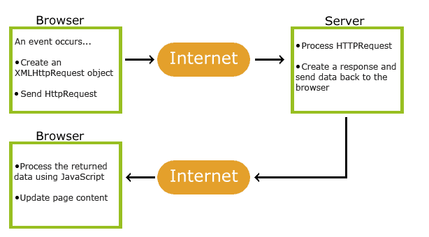
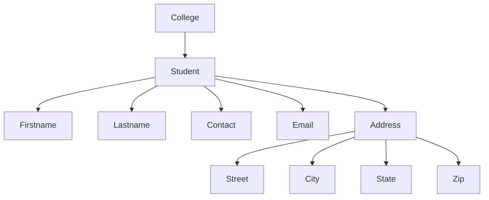
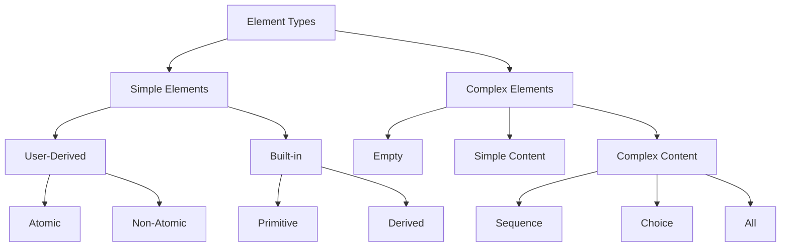

> # AJAX
- AJAX stands for Asynchronous JavaScript and XML.
- AJAX is a technique for creating fast and dynamic web pages.
- AJAX allows web pages to be updated asynchronously by exchanging small amounts of data with the server behind the scenes.
- This means that it is possible to update parts of a web page, without reloading the whole page.
- AJAX is not a programming language, but a technique for using existing standards.

### Working of AJAX
- An event occurs in a web page (for example, a user clicks a button).
- An XMLHttpRequest object is created by JavaScript.
- The XMLHttpRequest object sends the request to the web server.
- The web server processes the request and sends a response back to the webpage.
- The response is processed by JavaScript.
- The web page is updated with the new data without reloading the whole page.
- The user can continue to interact with the web page while the request is being processed in the background.

<div align="center">
  
</div>

### Advantages of AJAX
- *Asynchronous*: AJAX allows for asynchronous communication between the client and server, meaning that the user can continue to interact with the web page while data is being fetched in the background.

- *Speed*: AJAX can significantly speed up web applications by only loading the necessary data instead of reloading the entire page.

- *Interactivity*: AJAX allows for more interactive and dynamic web applications, providing a better user experience.

- *Form Validation*: AJAX can be used for real-time form validation, providing instant feedback to users without the need for page reloads.

- *Bandwidth*: AJAX can reduce bandwidth usage by only sending and receiving the necessary data, rather than reloading the entire page.


### Disadvantages of AJAX
- *Browser Compatibility*: AJAX may not work properly in older browsers, leading to compatibility issues.

- *JavaScript Dependency*: AJAX relies heavily on JavaScript, which may not be enabled in all browsers or devices.

- *Security*: AJAX can introduce security vulnerabilities if not implemented properly, such as cross-site scripting (XSS) attacks.

- *Complexity*: AJAX can add complexity to web applications, making them harder to debug and maintain.

- *SEO*: AJAX can make it difficult for search engines to crawl and index web pages, potentially affecting search engine optimization (SEO).


### Sample Code
```html
<!DOCTYPE html>
<html lang="en">
<head>
    <meta charset="UTF-8">
    <meta name="viewport" content="width=device-width, initial-scale=1.0">
    <title>AJAX</title>
    <script>
        function load(){
            var xhr = new XMLHttpRequest();
            xhr.onload = function(){
                if (xhr.status == 200 && xhr.readyState == 4){
                    document.getElementById("data").innerHTML = xhr.responseText;

                }
            };
            xhr.open("GET", "data.txt", true);
            xhr.send();
        }
    </script>
</head>
<body>
    <button id = "button" onclick = "load()">Load Data</button>
    <p id = "data"></p>
</body>
</html>
```
- In this example, when the button is clicked, an AJAX request is sent to fetch data from `data.txt` file.
- The response is then displayed in the `<p>` element with the id `data` without reloading the entire page.
- The `XMLHttpRequest` object is used to create the AJAX request, and the `onload` event is used to handle the response when it is received.
- The `open` method is used to specify the request type (GET) and the URL of the file to be fetched, and the `send` method is used to send the request to the server.
- The `xhr.status` and `xhr.readyState` properties are used to check if the request was successful and if the response is ready to be processed.
- The `innerHTML` property is used to update the content of the `<p>` element with the response data.
- The `true` parameter in the `open` method indicates that the request should be asynchronous, allowing the user to continue interacting with the web page while the request is being processed.
- The `load` function is called when the button is clicked, triggering the AJAX request to fetch the data from the specified file.

---

> # XML (eXtensible Markup Language)
- XML stands for eXtensible Markup Language.
- XML is a markup language that defines a set of rules for encoding documents in a format that is both human-readable and machine-readable.
- XML is often used to store and transport data, as well as to represent complex data structures.
- XML is not a programming language, but a markup language that uses tags to define elements and attributes.
- XML is designed to be self-descriptive, meaning that the data is structured in a way that makes it easy to understand and interpret.
- XML is often used in web services, data interchange, and configuration files, among other applications.
- XML tags are not predefined, meaning that users can create their own tags to suit their needs.    

## Benefits of XML
- *Self-descriptive*: XML documents are self-descriptive, meaning that the data is structured in a way that makes it easy to understand and interpret.

- *Platform-independent*: XML is platform-independent, meaning that it can be used on any operating system or programming language.

- *Hierarchical structure*: XML documents have a hierarchical structure, making it easy to represent complex data structures.

- *Extensible*: XML is extensible, meaning that new tags and attributes can be added as needed without breaking existing documents.

- *Standardized*: XML is a standardized format, meaning that it is widely supported by many programming languages and tools.


## Applications of XML
- *Data interchange*: XML is often used for data interchange between different systems and applications, as it provides a common format for representing data.

- *Web services*: XML is commonly used in web services to exchange data between different systems over the internet.

- *Configuration files*: XML is often used for configuration files in software applications, as it provides a structured way to represent settings and options.

- *Document storage*: XML is used for storing documents in a structured format, making it easy to search and retrieve information.

- *Data representation*: XML is used for representing complex data structures, such as hierarchical data, in a standardized format.

- *Markup language*: XML is a markup language that uses tags to define elements and attributes, making it easy to represent data in a structured way.

- *Web development*: XML is used in web development for various purposes, such as defining data formats, creating web services, and representing structured data in web applications.

- *Data serialization*: XML is used for serializing data, allowing it to be easily transmitted over networks or stored in files.


---

>[!IMPORTANT]
> ## Structure of XML Document 

### Syntax Rules for Creating XML Document

> Rule 1: All XML documents must have a root element.
- The root element is the top-level element that contains all other elements in the document.
- There can only be one root element in an XML document.
- The root element must be properly closed, meaning that it must have a corresponding closing tag.
- Example:
    ```xml
    <note>
        <to>Tove</to>
        <from>Jani</from>
        <heading>Reminder</heading>
        <body>Don't forget me this weekend!</body>
    </note>
    ```
    - In this example, the `<note>` element is the root element that contains all other elements.
---

> Rule 2: All tags must be closed.
- Tags can be closed in two ways: using a separate closing tag or using a self-closing tag.
- A separate closing tag is used for elements that contain content, while a self-closing tag is used for empty elements.
- Example:
    ```xml
    <note>
        <to>Tove</to>
        <from>Jani</from>
        <heading>Reminder</heading>
        <br />
        <body>Don't forget me this weekend!</body>
    </note>
    ```
    - In this example, the `<to>`, `<from>`, `<heading>`, and `<body>` elements are closed using separate closing tags.
    - A self-closing tag can be used for empty elements, such as `<br />` or ``, which do not have any content.
---

> Rule 3: All tags must be properly nested.
- This means that if an opening tag is encountered, it must be closed before any other tags are closed.
- Example:
    ```xml
    <note>
        <to>Tove</to>
        <from>Jani</from>
        <heading>Reminder</heading>
        <body>Don't forget me this weekend!</body>
    </note>
    ```
    - In this example, the `<note>` element contains the `<to>`, `<from>`, `<heading>`, and `<body>` elements, which are all properly nested within the root element.
    - If the tags were not properly nested, it would result in an error.
---

> Rule 4: Tag names are case-sensitive.
- This means that `<Note>` and `<note>` are considered different tags.
- It is important to use consistent casing for tag names throughout the document to avoid confusion and errors.
- Example:
    ```xml
    <note>
        <to>Tove</to>
        <from>Jani</from>
        <heading>Reminder</heading>
        <body>Don't forget me this weekend!</body>
    </note>
    ```
    - In this example, the tag names are all in lowercase, which is consistent and avoids confusion.
    - If the tag names were mixed case, it could lead to errors when parsing the document.
---

> Rule 5: Tag names cannot contain spaces or special characters.
- Tag names can only contain letters, numbers, hyphens (-), underscores (_), and periods (.).
---

> Rule 6: Attribute values must be enclosed in quotes.
- Attribute values can be enclosed in either single quotes (' ') or double quotes (" ").
- Example:
    ```xml
    <note to="Tove" from="Jani" heading="Reminder">
        <body>Don't forget me this weekend!</body>
    </note>
    ```
    - In this example, the `to`, `from`, and `heading` attributes are enclosed in double quotes.
    - It is important to use consistent quoting throughout the document to avoid confusion and errors.
---


> # XML Elements
- An XML element is a basic building block of an XML document.
- An element consists of a start tag, an end tag, and the content between them.
- Example:
    ```xml
    <note>
        <to>Tove</to>
        <from>Jani</from>
        <heading>Reminder</heading>
        <body>Don't forget me this weekend!</body>
    </note>
    ```
    - In this example, `<note>` is the root element, and `<to>`, `<from>`, `<heading>`, and `<body>` are child elements of the root element.
    - Each element has a start tag (e.g., `<to>`) and an end tag (e.g., `</to>`), and the content is enclosed between the tags.

---

> # XML Attributes
- An XML attribute is a name-value pair that provides additional information about an element.
- Attributes are defined within the start tag of an element and are used to provide additional information about the element.
- Example:
    ```xml
    <note to="Tove" from="Jani" heading="Reminder">
        <body>Don't forget me this weekend!</body>
    </note>
    ```
    - In this example, `to`, `from`, and `heading` are attributes of the `<note>` element, and their values are "Tove", "Jani", and "Reminder", respectively.
- Attributes are always specified in name-value pairs, with the name followed by an equal sign and the value enclosed in quotes.
- Attributes provide additional information about the element and can be used to specify properties or characteristics of the element.
- Attributes are optional, and an element can exist without any attributes.

---

> # XML Declaration
- The XML declaration is an optional statement that defines the version of XML being used and the character encoding of the document.
- It is typically the first line of an XML document and is used to specify the version and encoding of the document.
- Example:
    ```xml
    <?xml version="1.0" encoding="UTF-8"?>
    <note>
        <to>Tove</to>
        <from>Jani</from>
        <heading>Reminder</heading>
        <body>Don't forget me this weekend!</body>
    </note>
    ```
    - In this example, the XML declaration specifies that the document is using version 1.0 of XML and is encoded in UTF-8.
    - The XML declaration is optional, but it is recommended to include it for clarity and compatibility with different XML parsers.
    - The XML declaration is not considered part of the XML document itself and does not affect the structure or content of the document.

---

> # XML Comments
- XML comments are used to add notes or explanations within an XML document without affecting the structure or content of the document.
- Comments are ignored by XML parsers and do not affect the processing of the document.
- Comments are enclosed within `<!--` and `-->` tags.
- Example:
    ```xml
    <?xml version="1.0" encoding="UTF-8"?>
    <!-- This is a comment in XML -->
    <note>
        <to>Tove</to>
        <from>Jani</from>
        <heading>Reminder</heading>
        <body>Don't forget me this weekend!</body>
    </note>
    ```
    - In this example, the comment "This is a comment in XML" is included within the XML document but will be ignored by the XML parser.
    - Do not use comments before the XML declaration, as they will not be recognized as comments and may cause errors.

---

> # XML Tree Structure
- XML documents are structured in a hierarchical tree format, with the root element at the top and child elements nested within it.
- Each element can have child elements, and the structure can be visualized as a tree, with the root element as the trunk and child elements as branches and leaves.
- Example:
    ```xml
    <college>
        <student>
            <firstname>John</firstname>
            <lastname>Doe</lastname>
            <contact> 1234567890</contact>
            <email> john123@gmail.com</email>
            <address>
                <street>123 Main St</street>
                <city>New York</city>
                <state>NY</state>
                <zip>10001</zip>
            </address>
        </student>
    </college>
    ```
    - In this example, the `<college>` element is the root element, and it contains a child element `<student>`, which in turn contains several child elements such as `<firstname>`, `<lastname>`, `<contact>`, `<email>`, and `<address>`.
    - The `<address>` element further contains child elements `<street>`, `<city>`, `<state>`, and `<zip>`, creating a hierarchical structure.
    - This tree structure allows for easy representation and organization of complex data, making it easier to understand and manipulate.
- The tree structure can be visualized as follows:



---

> # XML Namespaces
- XML namespaces are used to avoid naming conflicts between elements and attributes in XML documents.
- Namespaces provide a way to qualify names in XML documents, allowing elements and attributes with the same name to coexist without conflict.
- Namespaces are typically defined using a URI, which can be any valid URI, but it is often a URL that points to a resource that describes the namespace.
- Namespaces are used to differentiate between elements and attributes that may have the same name but belong to different contexts or vocabularies.
- A namespace is defined using the `xmlns` attribute in the start tag of an element.
- The `xmlns` attribute specifies the namespace URI (Uniform Resource Identifier) that identifies the namespace.

- Name Conflict Example:
    ```xml
    <students>
        <student id = "1001">
            <name> Ram </name>
            <age> 20 </age>
        </student>

        <teacher id = "1002">
            <name> Ramesh </name>
            <age> 22 </age>
        </teacher>
    </students>
    ```
    - In this example, the `<name>` element is used for both the `<student>` and `<teacher>` elements, which can lead to confusion and naming conflicts.
    - To avoid this conflict, namespaces can be used to differentiate between the two elements.

- Namespace Example:
    ```xml
    <?xml version = "1.0" encoding = "UTF-8"?>
    <students xmlns:std = "https://example.com/student" xmlns:tc = "https://example.com/teacher">
        <std:student id = "1001">
            <std:name> Ram </std:name>
            <std:age> 20 </std:age>
        </std:student>

        <tc:teacher id = "1002">
            <tc:name> Ramesh </tc:name>
            <tc:age> 22 </tc:age>
        </tc:teacher>
    </students>
    ```
    - In this example, the `xmlns:std` and `xmlns:tc` attributes define two different namespaces for the `<student>` and `<teacher>` elements, respectively.
    - The `std:` and `tc:` prefixes are used to qualify the names of the elements and attributes, allowing them to coexist without conflict.
    - The `std:` prefix is used for elements and attributes in the student namespace, while the `tc:` prefix is used for elements and attributes in the teacher namespace.


---

>[!IMPORTANT]
> # XML vs HTML

| Feature               | XML (eXtensible Markup Language)                          | HTML (HyperText Markup Language)                     |
|-----------------------|----------------------------------------------------------|-----------------------------------------------------|
| **Purpose**           | Designed to store and transport data.                    | Designed to display data and create web pages.      |
| **Tag Definition**    | Tags are not predefined; users can define their own tags.| Tags are predefined and fixed.                     |
| **Structure**         | Strictly structured and case-sensitive.                  | Less strict and not case-sensitive.                |
| **Data Handling**     | Focuses on data storage and transport.                   | Focuses on data presentation.                      |
| **Error Handling**    | Errors are not tolerated; must be well-formed.           | Errors are tolerated; browsers can render faulty HTML. |
| **Attributes**        | Attribute values must be enclosed in quotes.             | Attribute values may or may not be enclosed in quotes. |
| **Namespaces**        | Supports namespaces to avoid naming conflicts.           | Does not support namespaces.                       |
| **Self-closing Tags** | Requires self-closing tags for empty elements.           | Self-closing tags are optional.                    |
| **Use Case**          | Used for data interchange, configuration files, etc.     | Used for creating web pages and user interfaces.   |

---

>[!IMPORTANT]
> # DTD (Document Type Definition)
- DTD is a set of markup declarations that define a document type for an XML document.
- DTD defines the structure and the legal elements and attributes of an XML document.
- DTD can be used to validate the structure of an XML document, ensuring that it conforms to the defined rules and constraints.
- DTD can be defined internally within the XML document or externally in a separate file.
- Syntax:
    ```dtd
    <!DOCTYPE root-name [DTD]>
    ```
- The `<!DOCTYPE>` declaration is used to define the document type and specify the DTD.
- The `root-name` is the name of the root element of the XML document.
- The `DTD` is the set of markup declarations that define the structure and rules for the XML document.
- The DTD can include element declarations, attribute declarations, entity declarations, and notation declarations.
    ```xml
    <!DOCTYPE note [
        <!ELEMENT note (to, from, heading, body)>
        <!ELEMENT to (#PCDATA)>
        <!ELEMENT from (#PCDATA)>
        <!ELEMENT heading (#PCDATA)>
        <!ELEMENT body (#PCDATA)>
    ]>
    ```
    - In this example, the DTD defines a `note` element that contains four child elements: `to`, `from`, `heading`, and `body`. Each of these elements can contain parsed character data (#PCDATA).
    - The DTD specifies the structure of the XML document and ensures that it conforms to the defined rules and constraints.

---

## Types of DTD

**Internal DTD**: 
- Defined within the XML document itself, enclosed within the `<!DOCTYPE>` declaration.
- Example:
    ```xml
    <!DOCTYPE note [
        <!ELEMENT note (to, from, heading, body)>
        <!ELEMENT to (#PCDATA)>
        <!ELEMENT from (#PCDATA)>
        <!ELEMENT heading (#PCDATA)>
        <!ELEMENT body (#PCDATA)>
    ]>
    <note>
        <to>Tove</to>
        <from>Jani</from>
        <heading>Reminder</heading>
        <body>Don't forget me this weekend!</body>
    </note>
    ```
    - In this example, the DTD is defined within the XML document itself, specifying the structure and rules for the `note` element and its child elements.
    - The DTD is enclosed within the `<!DOCTYPE>` declaration, and the XML document follows the defined structure.

---

**External DTD**:
- Defined in a separate file and referenced in the XML document using the `<!DOCTYPE>` declaration.
- Link it to the XML document using the `SYSTEM` or `PUBLIC` identifier.
- Example:
    ```xml
    <!DOCTYPE note SYSTEM "note.dtd">
    <note>
        <to>Tove</to>
        <from>Jani</from>
        <heading>Reminder</heading>
        <body>Don't forget me this weekend!</body>
    </note>
    ```
    - In this example, the DTD is defined in a separate file named `note.dtd`, and the XML document references it using the `SYSTEM` identifier.
    - The DTD file contains the same structure and rules for the `note` element and its child elements as in the internal DTD example.
    - This allows for better organization and reusability of the DTD, especially when multiple XML documents share the same structure and rules.
    - The external DTD file would look like this:
        ```xml
        <!ELEMENT note (to, from, heading, body)>
        <!ELEMENT to (#PCDATA)>
        <!ELEMENT from (#PCDATA)>
        <!ELEMENT heading (#PCDATA)>
        <!ELEMENT body (#PCDATA)>
        ```
        - In this example, the external DTD file defines the same structure and rules for the `note` element and its child elements as in the internal DTD example.
        - The external DTD file can be reused across multiple XML documents, making it easier to maintain and update the structure and rules for the XML documents.
        - The `SYSTEM` identifier indicates that the DTD is located in a separate file, while the `PUBLIC` identifier can be used to reference a publicly available DTD.
        - The `PUBLIC` identifier is used to reference a publicly available DTD, which can be accessed over the internet or a local network.

---

**Combined DTD**:
- A combination of internal and external DTDs, where some declarations are defined within the XML document and others are referenced from an external file.
- Example:
    ```xml
    <!DOCTYPE note SYSTEM "note.dtd" [
        <!ELEMENT note (to, from, heading, body)>
    ]>
    <note>
        <to>Tove</to>
        <from>Jani</from>
        <heading>Reminder</heading>
        <body>Don't forget me this weekend!</body>
    </note>
    ```
    - In this example, the DTD is a combination of internal and external declarations, where the `note` element is defined within the XML document and the other elements are referenced from an external file named `note.dtd`.
    - This allows for flexibility in defining the structure and rules for the XML document, while still maintaining the benefits of using an external DTD for reusability and organization.

---

## DTD Element
- An element declaration defines the structure and content of an XML element.
- Element declarations specify the name of the element, its content model (i.e., what elements or data it can contain), and any attributes it may have.
- Element declarations are defined using the `<!ELEMENT>` declaration in the DTD.
- `Syntax:`
    ```dtd
    <!ELEMENT element-name content-model>
    ```
    - The `element-name` is the name of the element being defined, and the `content-model` specifies what the element can contain.
    - The content model can be one of the following:
        - `#PCDATA`: Parsed character data (text).
        - `EMPTY`: The element is empty and cannot contain any content.
        - `ANY`: The element can contain any content.

### DTD Element Operators

#### Zero or More (`*`)
- Specifies that the element can appear zero or more times.
- Example:
    ```dtd
    <!ELEMENT note (to*)>
    ```
    - The `note` element can contain zero or more `to` elements.
    - Valid XML:
        ```xml
        <note></note>
        <note>
            <to>Tove</to>
            <to>Jani</to>
        </note>
        ```

---

#### One or More (`+`)
- Specifies that the element must appear at least once, but can appear multiple times.
- Example:
    ```dtd
    <!ELEMENT note (to+)>
    ```
    - The `note` element must contain at least one `to` element.
    - Valid XML:
        ```xml
        <note>
            <to>Tove</to>
        </note>
        <note>
            <to>Tove</to>
            <to>Jani</to>
        </note>
        ```

---

#### Mixed Content (`#PCDATA` and Elements)
- Specifies that an element can contain both text and child elements in any order.
- Example:
    ```dtd
    <!ELEMENT note (#PCDATA | to | from)*>
    ```
    - The `note` element can contain text, `to`, and `from` elements in any combination.
    - Valid XML:
        ```xml
        <note>Reminder</note>
        <note>
            <to>Tove</to>
            <from>Jani</from>
            Reminder
        </note>
        ```

---

#### Choices (`|`)
- Specifies a choice between elements, meaning only one of the specified elements can appear.
- Example:
    ```dtd
    <!ELEMENT note (to | from)>
    ```
    - The `note` element can contain either a `to` or a `from` element, but not both.
    - Valid XML:
        ```xml
        <note>
            <to>Tove</to>
        </note>
        <note>
            <from>Jani</from>
        </note>
        ```
    - Invalid XML:
        ```xml
        <note>
            <to>Tove</to>
            <from>Jani</from>
        </note>
        ```
---

#### Subsequence (`,`)
- Specifies that elements must appear in a specific order.
- Example:
    ```dtd
    <!ELEMENT note (to, from)>
    ```
    - The `note` element must contain a `to` element followed by a `from` element.
    - Valid XML:
        ```xml
        <note>
            <to>Tove</to>
            <from>Jani</from>
        </note>
        ```
    - Invalid XML:
        ```xml
        <note>
            <from>Jani</from>
            <to>Tove</to>
        </note>
        ```

These operators provide flexibility in defining the structure and content of XML elements, allowing for precise control over the data model.

---

## DTD Attributes
- An attribute declaration defines the attributes that an XML element can have.
- Attribute declarations specify the name of the attribute, its data type, and any default values or constraints.
- Attribute declarations are defined using the `<!ATTLIST>` declaration in the DTD.
- Syntax:
    ```dtd
    <!ATTLIST element-name attribute-name attribute-type default-value>
    ```
    - The `element-name` is the name of the element to which the attribute belongs, the `attribute-name` is the name of the attribute, and the `attribute-type` specifies the data type of the attribute.
    - The `default-value` specifies the default value of the attribute if it is not specified in the XML document.

### DTD Attribute Types

- `CDATA`: Character data (text).
- `ID`: Unique identifier for the element.
- `IDREF`: Reference to another element with an ID attribute.
- `NMTOKEN`: Name token (a valid XML name).
- `NMTOKENS`: A list of name tokens separated by whitespace.


### DTD Attribute Default Values

- `#REQUIRED`: The attribute must be specified in the XML document.
- `#IMPLIED`: The attribute is optional and may or may not be specified.
- `#FIXED`: The attribute has a fixed value that cannot be changed.
- A default value: The attribute has a default value that will be used if it is not specified in the XML document.

- Example:
    ```dtd
    <!ELEMENT note (to, from, heading, body)>
    <!ATTLIST note id ID #REQUIRED>
    <!ATTLIST note type (personal | work) "personal">
    <!ATTLIST note date CDATA #IMPLIED>
    ```
    - In this example, the `note` element has three attributes: `id`, `type`, and `date`.
    - The `id` attribute is of type `ID` and is required, meaning it must be specified in the XML document.
    - The `type` attribute is of type `(personal | work)`, meaning it can only have one of the two specified values, and its default value is "personal".
    - The `date` attribute is of type `CDATA` and is optional, meaning it may or may not be specified in the XML document.

---

>[!IMPORTANT]
> # Conversion of XML to DTD
To convert an XML document to a DTD, follow these steps:

1. **Identify the Root Element**:
    - Determine the root element of the XML document, which is the top-level element containing all other elements.

2. **Analyze Child Elements and Relationships**:
    - Identify all child elements and their relationships, such as parent-child or sibling relationships.

3. **Define Element Declarations**:
    - For each element, define its structure using the `<!ELEMENT>` declaration.
    - Specify the content model (e.g., `#PCDATA`, child elements, or a combination).

4. **Define Attribute Declarations**:
    - For each element, define its attributes using the `<!ATTLIST>` declaration.
    - Specify the attribute name, type (e.g., `CDATA`, `ID`), and default value or constraints.

5. **Create the DTD**:
    - Use the `<!DOCTYPE>` declaration to include the element and attribute declarations.
    - The DTD can be internal (within the XML document) or external (in a separate file).

6. **Validate the XML Document**:
    - Use an XML parser or validator to ensure the XML document conforms to the defined DTD structure and rules.

#### Example:
Given the following XML document:
```xml
<?xml version = "1.0" encoding = "UTF-8" ?>
<students>
    <student id = "1001">
        <name> Ram </name>
        <age> 20 </age>
        <address>
            <city> Kathmandu </city>
            <zipcode> A003 </zipcode>
        </address>
    </student>

    <student id = "1002">
        <name> Ramesh </name>
        <age> 22 </age>
        <address>
            <city> Bhaktapur </city>
            <zipcode> A004 </zipcode>
        </address>
    </student>
</students>

```

The corresponding DTD would be:
```xml
<!DOCTYPE students [
    <!ELEMENT students (student+)>
    <!ELEMENT student (name, age, address)>
    <!ATTLIST student id CDATA #REQUIRED>
    <!ELEMENT name (#PCDATA)>
    <!ELEMENT age (#PCDATA)>
    <!ELEMENT address (city, zipcode)>
    <!ELEMENT city (#PCDATA)>
    <!ELEMENT zipcode (#PCDATA)>
]>
```
- In this example:
    - The root element is `students`, which contains one or more `student` elements.
    - Each `student` element contains `name`, `age`, and `address` elements.
    - The `student` element has an attribute `id` of type `CDATA`, which is required.
    - The `address` element contains `city` and `zipcode` elements, both of which contain parsed character data (#PCDATA).
- The DTD defines the structure and rules for the XML document, ensuring that it conforms to the defined schema.


By following these steps, you can accurately define the structure and rules of an XML document in a DTD.

---

>[!IMPORTANT]
> # XML Schema (XSD)
- It is also known as XML Schema Definition (XSD).
- XML Schema is defined using the `XSD` (XML Schema Definition) language, which is a W3C standard for defining XML schemas.
- XSD is a more powerful and flexible alternative to DTD for defining the structure and constraints of XML documents.
- XSD is written in XML itself and provides a way to define the elements, attributes, data types, and relationships in an XML document.
- XSD allows for more complex data types, such as lists, unions, and custom data types, and provides better support for namespaces.
- XSD is more expressive and can enforce data types, patterns, and constraints on the content of XML documents.
- XSD is widely used in web services, data interchange, and other applications where XML is used as a data format. 
- Example:
```xml
<?xml version = "1.0" encoding = "UTF-8"?>
<xs:schema xmlns:xs = "http://www.w3.org/2001/XMLSchema">
    <xs:element name = "students">
        <xs:complexType>
            <xs:sequence>
                <xs:element name = "student">
                    <xs:complexType>
                        <xs:sequence>
                            <xs:element name = "name" type = "xs:string"/>
                            <xs:element name = "age" type = "xs:integer"/>
                            <xs:element name = "address">
                                <xs:complexType>
                                    <xs:sequence>
                                        <xs:element name = "city" type = "xs:string"/>
                                        <xs:element name = "zipcode" type = "xs:string"/>
                                    </xs:sequence>
                                </xs:complexType>
                            </xs:element>
                        </xs:sequence>
                        <xs:attribute name = "id" type = "xs:string" use = "required"/>
                    </xs:complexType> 
                </xs:element>
            </xs:sequence>
        </xs:complexType>
    </xs:element>
</xs:schema>
```

- In this example, the `students` element is defined as a complex type that contains a sequence of `student` elements.
- Each `student` element contains a sequence of `name`, `age`, and `address` elements, where `address` is also defined as a complex type with a sequence of `city` and `zipcode` elements.
- The `student` element has an attribute `id` of type `xs:string`, which is required.
- The `xs:` prefix indicates that these elements and types are defined in the XML Schema namespace.
- The `xs:schema` element is the root element of the XSD document, and it defines the schema for the XML document.
- The `xs:element` elements define the elements in the XML document, and the `xs:complexType` elements define the structure of complex elements.
- The `xs:sequence` elements define the order of child elements, and the `xs:attribute` element defines the attributes of the elements.
- The `xs:string` and `xs:integer` types are built-in data types in XSD, and they specify the data types of the elements.

---

### XSD Elements


---

## XSD Element Declaration
- An element declaration defines the structure and content of an XML element in an XSD.
- Element declarations specify the name of the element, its data type, and any constraints or attributes associated with it.
- 2 types of element declarations:

    **Simple Element Declaration**:
    - Defines an element that contains only text or character data.
    - It does not have any child elements or attributes.
    - Example:
    ```xml
    <xs:element name="element-name" type="xs:string"/>
    <xs:element name="element-name" type="xs:integer"/>
    ```
    - In this example, the `element-name` element is defined as a simple element of type `xs:string` or `xs:integer`, meaning it can contain text or integer data.
    - The `xs:string` and `xs:integer` types are built-in data types in XSD.

    - The `xs:` prefix indicates that these types are defined in the XSD namespace.

    **Complex Element Declaration**:
    - Defines an element that can contain child elements and attributes.
    - It can have a complex structure with nested elements and attributes.
    - Example:
    ```xml
    <xs:element name="element-name">
        <xs:complexType>
            <xs:sequence>
                <xs:element name="child-element" type="xs:string"/>
                <xs:element name="child-element" type="xs:integer"/>
            </xs:sequence>
        </xs:complexType>
    </xs:element>
    ```
    - In this example, the `element-name` element is defined as a complex element that contains a sequence of child elements (`child-element`) and an attribute (`attribute-name`).
    - The child elements can be of type `xs:string` or `xs:integer`, and the attribute can be of type `xs:string`.
    - The `xs:complexType` element defines the structure of the complex element, and the `xs:sequence` element specifies the order of the child elements.
---

### Create Named Types
- Named types are user-defined data types that can be reused in multiple element declarations.
- Named types can be defined using the `xs:complexType` or `xs:simpleType` elements in XML Schema.
- Named types allow for better organization and reusability of data types in XML Schema.
- Named types can be defined as complex types or simple types, depending on the structure and content of the data.
- Named types can be used to define complex structures, such as sequences, choices, and attributes, and can also include constraints and restrictions on the data.
- Named types can be referenced in element declarations using the `type` attribute.
- Example:
    ```xml
    <xs:complexType name="PersonType">
        <xs:sequence>
            <xs:element name="name" type="xs:string"/>
            <xs:element name="age" type="xs:integer"/>
        </xs:sequence>
    </xs:complexType>
    <xs:element name="person" type="PersonType"/>
    ```
    - In this example, the `PersonType` named type is defined as a complex type that contains a sequence of child elements (`name` and `age`).
    - The `person` element is then defined using the `PersonType` named type, allowing it to inherit the structure and constraints defined in the named type.
    - Named types can be reused in multiple element declarations, making it easier to maintain and update the structure and constraints of the XML Schema.

---

## Restriction Base in XSD

### Restriction Base
- Restriction in XML Schema is used to define constraints on the values or structure of an element or attribute.
- It allows you to restrict the content of a simple or complex type by specifying rules such as patterns, ranges, or enumerations.
- Restriction is defined using the `<xs:restriction>` element.

### Data Types for Restriction
Restrictions can be applied to various data types in XML Schema, including:

1. **String-based Types**:
    - `xs:string`: Restrict the length, pattern, or allowed values.
    - Example:
      ```xml
      <xs:element name="username">
            <xs:simpleType>
                 <xs:restriction base="xs:string">
                      <xs:maxLength value="15"/>
                      <xs:pattern value="[A-Za-z0-9]*"/>
                 </xs:restriction>
            </xs:simpleType>
      </xs:element>
      ```
      - Restricts `username` to alphanumeric characters with a maximum length of 15.

2. **Numeric Types**:
    - `xs:integer`, `xs:decimal`, `xs:float`, etc.: Restrict ranges or specific values.
    - Example:
      ```xml
      <xs:element name="age">
            <xs:simpleType>
                 <xs:restriction base="xs:integer">
                      <xs:minInclusive value="18"/>
                      <xs:maxInclusive value="60"/>
                 </xs:restriction>
            </xs:simpleType>
      </xs:element>
      ```
      - Restricts `age` to integer values between 18 and 60.

3. **Date and Time Types**:
    - `xs:date`, `xs:time`, `xs:dateTime`: Restrict ranges or formats.
    - Example:
      ```xml
      <xs:element name="startDate">
            <xs:simpleType>
                 <xs:restriction base="xs:date">
                      <xs:minInclusive value="2023-01-01"/>
                      <xs:maxInclusive value="2023-12-31"/>
                 </xs:restriction>
            </xs:simpleType>
      </xs:element>
      ```
      - Restricts `startDate` to dates within the year 2023.

4. **Enumerations**:
    - Restrict values to a predefined set of options.
    - Example:
      ```xml
      <xs:element name="gender">
            <xs:simpleType>
                 <xs:restriction base="xs:string">
                      <xs:enumeration value="Male"/>
                      <xs:enumeration value="Female"/>
                      <xs:enumeration value="Other"/>
                 </xs:restriction>
            </xs:simpleType>
      </xs:element>
      ```
      - Restricts `gender` to "Male", "Female", or "Other".

5. **Boolean Type**:
    - `xs:boolean`: Restrict values to `true` or `false`.
    - Example:
      ```xml
      <xs:element name="isActive" type="xs:boolean"/>
      ```
      - Restricts `isActive` to `true` or `false`.

Restrictions provide a powerful way to enforce data integrity and ensure that XML documents conform to specific rules and constraints.


## XSD Attribute Declaration
- An attribute declaration defines the attributes that an XML element can have in an XML Schema.
- Attribute declarations specify the name of the attribute, its data type, and any constraints or default values associated with it.
- Attribute declarations are defined using the `xs:attribute` element in XML Schema.
- Syntax:
    ```xml
    <xs:attribute name="attribute-name" type="xs:string" use="optional|required|prohibited" default="default-value"/>
    ```
    - The `attribute-name` is the name of the attribute, and the `type` specifies the data type of the attribute.
    - The `use` attribute specifies whether the attribute is optional, required, or prohibited.
    - The `default` attribute specifies the default value of the attribute if it is not specified in the XML document.
- Example:
    ```xml
    <xs:element name="note">
        <xs:complexType>
            <xs:sequence>
                <xs:element name="to" type="xs:string"/>
                <xs:element name="from" type="xs:string"/>
                <xs:element name="heading" type="xs:string"/>
                <xs:element name="body" type="xs:string"/>
            </xs:sequence>
            <xs:attribute name="id" type="xs:string" use="required"/>
            <xs:attribute name="type" type="xs:string" default="personal"/>
        </xs:complexType>
    </xs:element>
    ```
    - In this example, the `note` element has two attributes: `id` and `type`.
    - The `id` attribute is of type `xs:string` and is required, meaning it must be specified in the XML document.
    - The `type` attribute is of type `xs:string` and has a default value of "personal", meaning it will be used if it is not specified in the XML document.
    - The `xs:complexType` element defines the structure of the `note` element, and the `xs:sequence` element specifies the order of the child elements.
    - The `xs:attribute` elements define the attributes of the `note` element, specifying their names, types, and constraints.

- Attribute declarations allow for better organization and reusability of attributes in XML Schema, making it easier to maintain and update the structure and constraints of the XML Schema.

---

>[!IMPORTANT]
> # Conversion of XML to XSD
To convert an XML document to an XSD, follow these steps:

1. **Identify the Root Element**:
    - Determine the root element of the XML document, which is the top-level element containing all other elements.

2. **Analyze Child Elements and Relationships**:
    - Identify all child elements and their relationships, such as parent-child or sibling relationships.

3. **Define Element Declarations**:
    - For each element, define its structure using the `<xs:element>` declaration.
    - Specify the data type (e.g., `xs:string`, `xs:integer`) and any constraints.

4. **Define Complex Types**:
    - For elements with child elements, define a complex type using `<xs:complexType>` and `<xs:sequence>`.

5. **Define Attributes**:
    - For each element, define its attributes using the `<xs:attribute>` declaration.
    - Specify the attribute name, type, and constraints (e.g., required, optional).

6. **Create the XSD**:
    - Use the `<xs:schema>` element to include all element and attribute declarations.
    - Ensure the schema is well-formed and follows the XML Schema Definition (XSD) syntax.

7. **Validate the XML Document**:
    - Use an XML parser or validator to ensure the XML document conforms to the defined XSD structure and rules.

#### Example:
Given the following XML document:
```xml
<?xml version="1.0" encoding="UTF-8"?>
<data>
     <name>John Doe</name>
     <address>
          <street>123 Main St</street>
          <city>New York</city>
          <state>NY</state>
          <zip>10001</zip>
     </address>
</data>
```

The corresponding XSD would be:
```xml
<?xml version = "1.0" encoding = "UTF-8"?>
<xs:schema xmlns:xs = "http://www.w3.org/2001/XMLSchema">
    <xs:element name = "students">
        <xs:complexType>
            <xs:sequence>
                <xs:element name = "student">
                    <xs:complexType>
                        <xs:sequence>
                            <xs:element name = "name" type = "xs:string"/>
                            <xs:element name = "age" type = "xs:integer"/>
                            <xs:element name = "address">
                                <xs:complexType>
                                    <xs:sequence>
                                        <xs:element name = "city" type = "xs:string"/>
                                        <xs:element name = "zipcode" type = "xs:string"/>
                                    </xs:sequence>
                                </xs:complexType>
                            </xs:element>
                        </xs:sequence>
                        <xs:attribute name = "id" type = "xs:string" use = "required"/>
                    </xs:complexType> 
                </xs:element>
            </xs:sequence>
        </xs:complexType>
    </xs:element>
</xs:schema>
```

- In this example, the `data` element is defined as a complex type that contains a sequence of child elements (`name` and `address`).
- The `address` element is also defined as a complex type with a sequence of child elements (`street`, `city`, `state`, and `zip`).
- The `name` element is defined as a simple element of type `xs:string`, meaning it can contain text data.
- The `address` element is defined as a complex element that contains a sequence of child elements (`street`, `city`, `state`, and `zip`), each of which is defined as a simple element of type `xs:string`.
- The `xs:complexType` element defines the structure of the complex element, and the `xs:sequence` element specifies the order of the child elements.
- The `xs:attribute` element defines the attributes of the `student` element, specifying their names, types, and constraints.
- The `xs:schema` element is the root element of the XSD document, and it defines the schema for the XML document.
- The `xs:element` elements define the elements in the XML document, and the `xs:complexType` elements define the structure of complex elements.

By following these steps, you can accurately define the structure and rules of an XML document in an XSD.

---

>[!IMPORTANT]
> # XSD vs DTD

| **Feature**         | **XSD (XML Schema Definition)**                                      | **DTD (Document Type Definition)**                     |
|---------------------|---------------------------------------------------------------------|-------------------------------------------------------|
| **Syntax**          | Written in XML syntax, making it easier to read and validate using XML parsers. | Uses its own syntax, which is not XML-based and can be harder to read and validate. |
| **Data Types**      | Supports a wide range of built-in data types (e.g., string, integer, date) and allows for custom data types. | Does not support data types; all data is treated as text. |
| **Namespace Support** | Fully supports XML namespaces, allowing for better handling of naming conflicts. | Does not support namespaces.                          |
| **Extensibility**   | Extensible and allows for creating reusable components like named types and groups. | Limited extensibility and lacks support for reusable components. |
| **Validation**      | Provides more robust validation, including constraints on data types, patterns, and value ranges. | Offers basic validation but lacks support for advanced constraints. |
| **Tool Support**    | Widely supported by modern XML tools and editors.                  | Supported by older tools but less commonly used in modern applications. |
| **Readability**     | Easier to read and understand for those familiar with XML.          | Can be harder to read due to its non-XML syntax.       |
| **Usage**           | Preferred for complex XML documents and modern applications.        | Often used in legacy systems or for simple XML documents. |


---


>[!IMPORTANT]
> # XSLT
- XSLT (eXtensible Stylesheet Language Transformations) is a language used to convert XML documents into other formats like HTML, plain text, or another XML.
- It is part of the XSL family, which also includes tools for formatting XML output.
- XSLT is commonly used in web development and data processing to transform and present XML data in different ways.
- It simplifies working with XML by enabling flexible data manipulation and formatting.

## XSLT Languages
- XSLT is a declarative language, meaning it describes what the output should look like rather than how to achieve it.

- **XSLT**:
    - The core language for transforming XML documents.
    - It defines the rules and templates for transforming XML data into other formats.

- **XPath**:
    - A language used to navigate and query XML documents.
    - It allows you to select nodes and extract data from XML documents.
    - XPath expressions are used within XSLT to specify which parts of the XML document to transform.

- **XSQuery**:
    - A query language for XML data.
    - It allows you to extract and manipulate XML data using a syntax similar to SQL.
    - XQuery can be used in conjunction with XSLT for more complex data retrieval and transformation tasks.

---


## XSLT <xsl:stylesheet> Element
- The `<xsl:stylesheet>` element is the root element of an XSLT document.
- It defines the XSLT stylesheet and contains all the transformation rules and templates.
- The `<xsl:stylesheet>` element must have the `xmlns:xsl` attribute to declare the XSLT namespace.
- The `version` attribute specifies the version of XSLT being used (e.g., "1.0" or "2.0").
- Syntax:
```xml
<xsl:stylesheet version="1.0" xmlns:xsl="http://www.w3.org/1999/XSL/Transform">
    <!-- Transformation rules go here -->
</xsl:stylesheet>
```

---

## XSLT <xsl:template> Element
- The `<xsl:template>` element defines a template for matching and transforming XML nodes.
- It specifies how to process specific nodes in the XML document based on their structure and content.
- The `match` attribute specifies the XPath expression that identifies the nodes to be processed by this template.
- The content of the `<xsl:template>` element defines the transformation rules for the matched nodes.
- Syntax:
```xml
<xsl:template match="xpath-expression">
    <!-- Transformation rules go here -->
</xsl:template>
```

---

## XSLT <xsl:value-of> Element
- The `<xsl:value-of>` element is used to extract the value of a selected node and output it as text.
- It retrieves the text content of the specified node and inserts it into the output document.
- The `select` attribute specifies the XPath expression that identifies the node whose value should be extracted.
- Syntax:
```xml
<xsl:value-of select="xpath-expression"/>
```

---

## XSLT <xsl:for-each> Element
- The `<xsl:for-each>` element is used to iterate over a set of nodes in the XML document.
- It allows you to apply a template or transformation to each node in the selected set.
- The `select` attribute specifies the XPath expression that identifies the nodes to be processed in the loop.
- The content of the `<xsl:for-each>` element defines the transformation rules for each node in the loop.
- Syntax:
```xml
<xsl:for-each select="xpath-expression">
    <!-- Transformation rules for each node go here -->
</xsl:for-each>
```

---

## XSLT <xsl:if> Element
- The `<xsl:if>` element is used to conditionally apply a transformation based on a specified condition.
- It allows you to include or exclude content in the output document based on the evaluation of an XPath expression.
- The `test` attribute specifies the XPath expression that defines the condition to be evaluated.
- If the condition evaluates to true, the content inside the `<xsl:if>` element is processed and included in the output document.
- Syntax:
```xml
<xsl:if test="xpath-expression">
    <!-- Content to include if the condition is true goes here -->
</xsl:if>
```

---

## XSLT <xsl:choose> Element
- The `<xsl:choose>` element is used to create conditional statements with multiple branches.
- It allows you to specify different actions based on the evaluation of multiple conditions.
- The `<xsl:choose>` element contains one or more `<xsl:when>` elements and an optional `<xsl:otherwise>` element.
- Each `<xsl:when>` element specifies a condition using the `test` attribute, and the content inside it is processed if the condition evaluates to true.
- The `<xsl:otherwise>` element specifies the default action to be taken if none of the `<xsl:when>` conditions are met.
- Syntax:
```xml
<xsl:choose>
    <xsl:when test="condition1">
        <!-- Content to include if condition1 is true goes here -->
    </xsl:when>
    <xsl:when test="condition2">
        <!-- Content to include if condition2 is true goes here -->
    </xsl:when>
    <xsl:otherwise>
        <!-- Default content if none of the conditions are true goes here -->
    </xsl:otherwise>
</xsl:choose>
```

---

## XSLT <xsl:attribute> Element
- The `<xsl:attribute>` element is used to create an attribute in the output document.
- It allows you to specify the name and value of the attribute based on the content of the XML document or other transformations.
- The `name` attribute specifies the name of the attribute to be created, and the content inside the `<xsl:attribute>` element defines the value of the attribute.
- The `<xsl:attribute>` element is typically used within an `<xsl:element>` element to create attributes for the generated elements.
- Syntax:
```xml
<xsl:element name="element-name">
    <xsl:attribute name="attribute-name">attribute-value</xsl:attribute>
    <!-- Other content goes here -->
</xsl:element>
```

---

## Conversion of XML to XSLT
To convert an XML document to an XSLT, follow these steps:

- **Identify the Root Element**:
    - Determine the root element of the XML document, which is the top-level element containing all other elements.

- **Analyze Child Elements and Relationships**:
    - Identify all child elements and their relationships, such as parent-child or sibling relationships.

- **Define Stylesheet**:
    - Create an XSLT stylesheet using the `<xsl:stylesheet>` element.
    - Specify the version of XSLT being used (e.g., "1.0") and include the necessary namespaces.

- **Define Output Method**:
    - Use the `<xsl:output>` element to specify the desired output format (e.g., HTML, XML, text).
    - Define the encoding and other output properties as needed.

- **Define Templates**:
    - Create templates for each element or structure in the XML document using the `<xsl:template>` element.
    - Use the `match` attribute to specify which nodes the template applies to.


- **Define Transformation Rules**:
    - Inside each template, define the transformation rules using XSLT elements like `<xsl:value-of>`, `<xsl:for-each>`, and `<xsl:if>`.
    - Use XPath expressions to select and manipulate the data from the XML document.

- **Define Output Structure**:
    - Specify the desired output structure using XSLT elements like `<xsl:element>`, `<xsl:text>`, and `<xsl:attribute>`.
    - Create the necessary HTML or XML structure based on the transformation rules defined in the templates.

- **Validate the XSLT**:
    - Use an XSLT processor or validator to ensure the XSLT document is well-formed and valid.
    - Test the transformation by applying the XSLT to the XML document and checking the output.

- **Example**:
Given the following XML document:
```xml
<students>
    <student id = "1001">
        <name> Ram </name>
        <age> 20 </age>
        <address>
            <city> Kathmandu </city>
            <zipcode> A003 </zipcode>
        </address>
    </student>

    <student id = "1002">
        <name> Ramesh </name>
        <age> 22 </age>
        <address>
            <city> Bhaktapur </city>
            <zipcode> A004 </zipcode>
        </address>
    </student>
</students>
```

The corresponding XSLT would be:

```xml
<?xml version = "1.0" encoding = "UTF-8"?>
<xsl:stylesheet xmlns:xsl = "http://www.w3.org/1999/XSL/Transform">
<xsl:output method = "html"/>
<xsl:template match = "/">
    <html>
        <head>
            <title> Student Details</title>
        </head>
        <body>
            <h1> Students </h1>
            <table border = "1">
                <tr>
                    <td>ID</td>
                    <td>Name</td>
                    <td>Age</td>
                    <td>City</td>
                    <td>Zipcode</td>
                </tr>
            
                <xsl:for-each select = "students/student">
                    <tr>
                        <td><xsl:value-of select = "@id"/></td>
                        <td><xsl:value-of select = "student/name"/></td>
                        <td><xsl:value-of select = "student/age"/></td>
                        <td><xsl:value-of select = "address/city"/></td>
                        <td><xsl:value-of select = "address/zipcode"/></td> 
                    </tr>
                </xsl:for-each>
            </table>
        </body>
    </html>
</xsl:template>
</xsl:stylesheet>
```

- In this example, the XSLT stylesheet defines a transformation that generates an HTML table displaying the student details.
- The `<xsl:stylesheet>` element is the root element of the XSLT document, and it includes the necessary namespaces.
- The `<xsl:output>` element specifies the output method as HTML.
- The `<xsl:template>` element defines a template that matches the root node (`/`) of the XML document.
- Inside the template, an HTML structure is created with a table to display the student details.
- The `<xsl:for-each>` element iterates over each `student` element in the XML document, and the `<xsl:value-of>` elements extract the values of the `id`, `name`, `age`, `city`, and `zipcode` elements.
- The `@id` syntax is used to access the attribute value of the `student` element.
- The output will be an HTML document with a table displaying the student details, including their ID, name, age, city, and zipcode.


---

> # XQuery
- XQuery is a W3C standard query language for XML data.
- It enables querying, transforming, and generating XML documents.
- Similar to SQL but tailored for XML structures.
- Supports XPath for navigating and selecting XML nodes.
- Widely used in databases, web services, and data integration.

### Use of XQuery
- XQuery is used to query and process XML data.
- It helps extract, transform, and retrieve data from XML documents.
- Commonly used in web services, databases, and data integration.
- Ideal for handling large XML data and complex transformations.
- A powerful tool for developers working with XML systems.

---

### XQuery Syntax
- XQuery syntax is similar to SQL but designed for XML data.
- It uses expressions, functions, and operators to manipulate XML data.
- Example:
    ```xquery
    let $doc := doc("example.xml")
    for $item in $doc//item
    return
        <result>
            <name>{ $item/name/text() }</name>
            <price>{ $item/price/text() }</price>
        </result>
    ```
    - In this example, the `let` statement binds the XML document to the variable `$doc`, and the `for` loop iterates over each `item` element in the document.
    - The `return` statement constructs a new XML element `<result>` for each `item`, extracting the `name` and `price` values from the original document.
    - The curly braces `{}` are used to insert values from the XML document into the new XML structure.
    - The output will be a new XML document containing the extracted `name` and `price` values for each `item` in the original document.

---


### Advantages of XQuery

- **Powerful Query Language**: XQuery is specifically designed for querying XML data, making it more efficient than other query languages for XML documents.

- **Flexibility**: XQuery allows for complex queries and transformations, enabling developers to extract and manipulate data in various ways.

- **Integration with XPath**: XQuery is built on top of XPath, allowing for seamless navigation and selection of XML nodes.

- **Support for XML Standards**: XQuery is a W3C standard, ensuring compatibility and interoperability with other XML technologies.

- **Data Transformation**: XQuery can be used to transform XML data into different formats, making it suitable for data integration and processing tasks.

- **Support for Functions**: XQuery supports user-defined functions, allowing developers to create reusable code for common tasks.

---

> # XPath
- XPath is a language to navigate and query XML documents.
- It helps select nodes, attributes, and values using a path-like syntax.
- XPath is used in XSLT and XQuery to access and manipulate XML data.
- It is widely used in web development and data processing.
- XPath is a W3C standard supported by most XML tools.
- It enables efficient queries and transformations on XML data.
- Commonly paired with XSLT and XQuery for XML operations.

### XPath Syntax
- XPath helps find data in XML using a path-like syntax.
- It locates nodes in the XML tree structure.
- Absolute paths start from the root, while relative paths start from the current node.
- Example of an absolute XPath expression:
    ```xpath
    /bookstore/book/title
    ```
    - This expression selects the `title` element of all `book` elements under the `bookstore` root element.
- Example of a relative XPath expression:
    ```xpath
    book/title
    ```
    - This expression selects the `title` element of all `book` elements under the current context node.

---


> # Examples:

### XML with Internal DTD
```xml
<?xml version = "1.0" encoding = "UTF-8" ?>
<!DOCTYPE students [
    <!ELEMENT students (student+)>
    <!ELEMENT student (name, age, address)>
    <!ATTLIST student id CDATA #REQUIRED>
    <!ELEMENT name (#PCDATA)>
    <!ELEMENT age (#PCDATA)>
    <!ELEMENT address (city, zipcode)>
    <!ELEMENT city (#PCDATA)>
    <!ELEMENT zipcode (#PCDATA)>
]>

<students>
    <student id = "1001">
        <name> Ram </name>
        <age> 20 </age>
        <address>
            <city> Kathmandu </city>
            <zipcode> A003 </zipcode>
        </address>
    </student>

    <student id = "1002">
        <name> Ramesh </name>
        <age> 22 </age>
        <address>
            <city> Bhaktapur </city>
            <zipcode> A004 </zipcode>
        </address>
    </student>
</students>
```

---

### XML with External DTD
```xml
<?xml version = "1.0" encoding = "UTF-8" ?>
<students>
    <student id = "1001">
        <name> Ram </name>
        <age> 20 </age>
        <address>
            <city> Kathmandu </city>
            <zipcode> A003 </zipcode>
        </address>
    </student>

    <student id = "1002">
        <name> Ramesh </name>
        <age> 22 </age>
        <address>
            <city> Bhaktapur </city>
            <zipcode> A004 </zipcode>
        </address>
    </student>
</students>

```

#### note.dtd
```dtd
<!DOCTYPE students [
    <!ELEMENT students (student+)>
    <!ELEMENT student (name, age, address)>
    <!ATTLIST student id CDATA #REQUIRED>
    <!ELEMENT name (#PCDATA)>
    <!ELEMENT age (#PCDATA)>
    <!ELEMENT address (city, zipcode)>
    <!ELEMENT city (#PCDATA)>
    <!ELEMENT zipcode (#PCDATA)>
]>
```

---

### XQuery Example
```xquery
let $doc := doc("example.xml")
for $item in $doc//item
return
    <result>
        <name>{ $item/name/text() }</name>
        <price>{ $item/price/text() }</price>
    </result>
```

---

### XPath Example
```xpath
/bookstore/book/title
```

---

### Conversion of XML to DDT  
- `XML`:  
    ```xml
    <?xml version="1.0" encoding="UTF-8"?>
    <students>
        <student id = "1001">
            <name> Ram </name>
            <age> 20 </age>
            <address>
                <city> Kathmandu </city>
                <zipcode> A003 </zipcode>
            </address>
        </student>

        <student id = "1002">
            <name> Ramesh </name>
            <age> 22 </age>
            <address>
                <city> Bhaktapur </city>
                <zipcode> A004 </zipcode>
            </address>
        </student>
    </students>
    ```

- `DTD`:
    ```dtd
    <!DOCTYPE students [
        <!ELEMENT students (student+)>
        <!ELEMENT student (name, age, address)>
        <!ATTLIST student id CDATA #REQUIRED>
        <!ELEMENT name (#PCDATA)>
        <!ELEMENT age (#PCDATA)>
        <!ELEMENT address (city, zipcode)>
        <!ELEMENT city (#PCDATA)>
        <!ELEMENT zipcode (#PCDATA)>
    ]>
    ```

---

### Conversion of XML to XSD

- `XML`:
    ```xml
    <students>
        <student id = "1001">
            <name> Ram </name>
            <age> 20 </age>
            <address>
                <city> Kathmandu </city>
                <zipcode> A003 </zipcode>
            </address>
        </student>

        <student id = "1002">
            <name> Ramesh </name>
            <age> 22 </age>
            <address>
                <city> Bhaktapur </city>
                <zipcode> A004 </zipcode>
            </address>
        </student>
    </students>
    ```

- `XSD`:
    ```xml
    <?xml version = "1.0" encoding = "UTF-8"?>
    <xs:schema xmlns:xs = "http://www.w3.org/2001/XMLSchema">
        <xs:element name = "students">
            <xs:complexType>
                <xs:sequence>
                    <xs:element name = "student">
                        <xs:complexType>
                            <xs:sequence>
                                <xs:element name = "name" type = "xs:string"/>
                                <xs:element name = "age" type = "xs:integer"/>
                                <xs:element name = "address">
                                    <xs:complexType>
                                        <xs:sequence>
                                            <xs:element name = "city" type = "xs:string"/>
                                            <xs:element name = "zipcode" type = "xs:string"/>
                                        </xs:sequence>
                                    </xs:complexType>
                                </xs:element>
                            </xs:sequence>
                            <xs:attribute name = "id" type = "xs:string" use = "required"/>
                        </xs:complexType> 
                    </xs:element>
                </xs:sequence>
            </xs:complexType>
        </xs:element>
    </xs:schema>
    ```

---

### Conversion of XML to XSLT

- `XML`:
    ```xml
    <students>
        <student id = "1001">
            <name> Ram </name>
            <age> 20 </age>
            <address>
                <city> Kathmandu </city>
                <zipcode> A003 </zipcode>
            </address>
        </student>

        <student id = "1002">
            <name> Ramesh </name>
            <age> 22 </age>
            <address>
                <city> Bhaktapur </city>
                <zipcode> A004 </zipcode>
            </address>
        </student>
    </students>
    ```

- `XSLT`:
    ```xml
    <?xml version = "1.0" encoding = "UTF-8"?>
    <xsl:stylesheet xmlns:xsl = "http://www.w3.org/1999/XSL/Transform">
    <xsl:output method = "html"/>
    <xsl:template match = "/">
        <html>
            <head>
                <title> Student Details</title>
            </head>
            <body>
                <h1> Students </h1>
                <table border = "1">
                    <tr>
                        <td>ID</td>
                        <td>Name</td>
                        <td>Age</td>
                        <td>City</td>
                        <td>Zipcode</td>
                    </tr>
                
                    <xsl:for-each select = "students/student">
                        <tr>
                            <td><xsl:value-of select = "@id"/></td>
                            <td><xsl:value-of select = "student/name"/></td>
                            <td><xsl:value-of select = "student/age"/></td>
                            <td><xsl:value-of select = "address/city"/></td>
                            <td><xsl:value-of select = "address/zipcode"/></td> 
                        </tr>
                    </xsl:for-each>
                </table>
            </body>
        </html>
    </xsl:template>
    </xsl:stylesheet>
    ```

---

### Namespace in XML
- `Conflict`:
    ```xml
    <?xml version = "1.0" encoding = "UTF-8"?>
    <students>
        <student id = "1001">
            <name> Ram </name>
            <age> 20 </age>
        </student>

        <teacher id = "1002">
            <name> Ramesh </name>
            <age> 22 </age>
        </teacher>
    </students>
    ```


- `Resolved`:
    ```xml
    <?xml version = "1.0" encoding = "UTF-8"?>
    <students xmlns:std = "https://example.com/student" xmlns:tc = "https://example.com/teacher">
        <std:student id = "1001">
            <std:name> Ram </std:name>
            <std:age> 20 </std:age>
        </std:student>

        <tc:teacher id = "1002">
            <tc:name> Ramesh </tc:name>
            <tc:age> 22 </tc:age>
        </tc:teacher>
    </students>
    ```

---


### XSD Validation
- `XML`:
    ```xml
    <?xml version = "1.0" encoding = "UTF-8"?>
    <person>
        <name> Ram </name>
        <age> 40 </age>
        <pincode> 1001 </pincode>
    </person>
    ```

- `XSD Validation`:
    ```xml
    <?xml version = "1.0" encoding = "UTF-8"?>
    <xs:schema xmlns:xs = "http://www.w3.org/2001/XMLSchema">

    <xs:element name = "person">
        <xs:complexType>
            <xs:sequence>
                <xs:element name = "name">
                    <xs:simpleType>
                        <xs:restriction base = "xs:string">
                            <xs:enumeration value = "Ram"/>
                            <xs:enumeration value = "Shyam"/>
                        </xs:restriction>
                    </xs:simpleType>
                </xs:element>
            
                <xs:element name = "age">
                    <xs:simpleType>
                        <xs:restriction base ="xs:integer">
                            <xs:minExclusive value = "10"/>
                            <xs:maxExclusive value = "20"/>
                        </xs:restriction>
                    </xs:simpleType>
                </xs:element>

                <xs:element name = "pincode">
                    <xs:simpleType>
                        <xs:restriction base = "xs:integer">
                            <xs:pattern value="\d{3}"/>
                        </xs:restriction>
                    </xs:simpleType>
                </xs:element>

            </xs:sequence>
        </xs:complexType>
    </xs:element> 
    </xs:schema>
    ```

---


