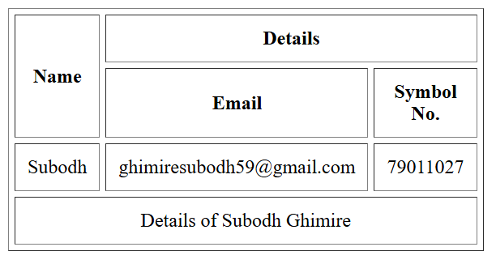
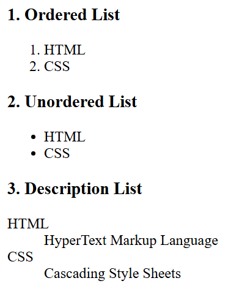
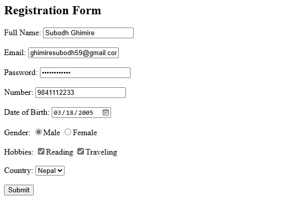
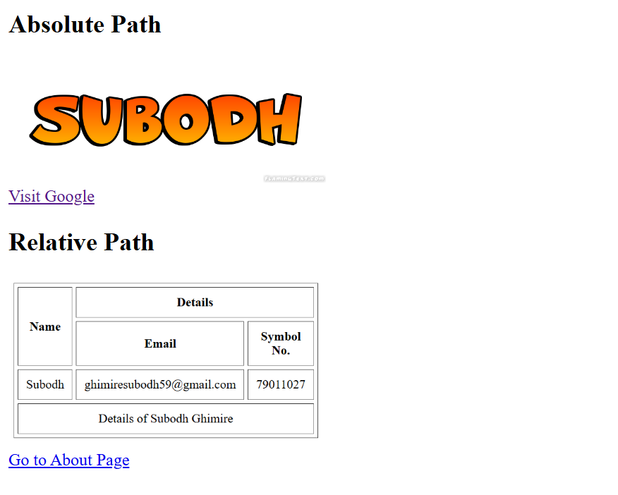

# 1. Create an HTML table showcasing the use of different attributes.

```html
<!DOCTYPE html>
<html>
<head>
    <title>HTML Table with Attributes</title>
</head>
<body>
    <table border = "1" cellpadding = "10" cellspacing = "5" width = "200" height = "200" style = "text-align: center;">
        <thead>
            <tr>
                <th rowspan = "2">Name</th>
                <th colspan = "2">Details</th>
            </tr>
            <tr>
                <th>Email</th>
                <th>Symbol No.</th>
            </tr>
        </thead>
        <tbody>
            <tr>
                <td>Subodh</td>
                <td>ghimiresubodh59@gmail.com</td>
                <td>79011027</td>
            </tr>
        </tbody>
        <tfoot>
            <tr>
                <td colspan="3">Details of Subodh Ghimire</td>
            </tr>
        </tfoot>
    </table>
</body>
</html>
```

<div align="center">
  
</div>

---

# 2. What are lists? Show the application of lists in HTML.

Lists in HTML are used to group related items together. There are three types of lists in HTML:
1. **Ordered List**: Displays items in a numbered format.
2. **Unordered List**: Displays items with bullet points.
3. **Description List**: Displays items with a term and its description.

Here is an example of each type of list in HTML:

```html
<!DOCTYPE html>
<html>
<head>
    <title>HTML Lists</title>
</head>
<body>
    <h3>1. Ordered List</h2>
    <ol>
        <li> HTML </li>
        <li> CSS </li>
    </ol>

    <h3>2. Unordered List</h2>
    <ul>
        <li> HTML </li>
        <li> CSS </li>
    </ul>

    <h3>3. Description List</h2>
    <dl>
        <dt>HTML</dt>
        <dd>HyperText Markup Language</dd>

        <dt>CSS</dt>
        <dd>Cascading Style Sheets</dd>
    </dl>
</body>
</html>
```

<div align="center">
  
</div>

---

# 3. Create a form that has various input fields.

A form in HTML is used to collect user input. It can contain various types of input fields such as text boxes, radio buttons, checkboxes, and submit buttons.

Here is an example of a form with different input fields:

```html
<!DOCTYPE html>
<html>
<head>
    <title>HTML Form</title>
</head>
<body>
    <h2>Registration Form</h2>
    <form action="/submit" method="post">

        <label>Full Name:</label>
        <input type="text" name="fullname"required><br><br>

        <label>Email:</label>
        <input type="email" name="email"><br><br>

        <label>Password:</label>
        <input type="password" name="password" required><br><br>

        <label> Number: </label>
        <input type="number" name="number" required><br><br>

        <label> Date of Birth: </label>
        <input type="date" name="dob" required><br><br>

        <label> Gender: </label>
        <input type = "radio" name = "gender" value = "Male">Male
        <input type = "radio" name = "gender" value = "Female">Female <br><br>        

        <label>Hobbies:</label>
        <input type="checkbox" name="hobbies" value="Reading">Reading
        <input type="checkbox" name="hobbies" value="Traveling">Traveling<br><br>

        <label>Country:</label>
        <select name="country">
            <option value="Nepal">Nepal</option>
            <option value="USA">USA</option>
            <option value="UK">UK</option>
        </select><br><br>

        <button type="submit">Submit</button>
    </form>
</body> 
</html>
```

<div align="center">
  
</div>

---

# 4. What is absolute and relative path reference? How can we insert images and links in an HTML page? 

Paths are used to link to resources such as images, stylesheets, and other web pages. There are two types of paths:
1. **Absolute Path**: This is a complete URL that points to a resource on the web. It includes the protocol domain name, and the path to the resource.

2. **Relative Path**: This is a path that is relative to the current page's location. It does not include the domain name and is used to link to resources within the same website.

To insert images and links using absolute and relative paths, you can use the `` tag for images and the `<a>` tag for links.
```html
<!DOCTYPE html>
<html>
<head>
    <title>Absolute and Relative Paths</title>
</head>
<body>
    <h2>Absolute Path</h2>
    <br>
    <a href="https://google.com">Visit Google</a>

    <h2>Relative Path</h2>
    <br>
    <a href="about.html">Go to About Page</a>
</body>
</html>
```

<div align="center">
  
</div>

---


