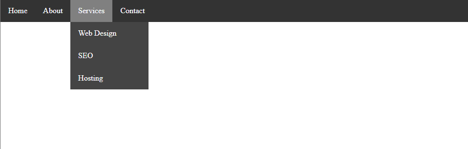

# 1. What are stylesheets? How to use CSS internally and externally?
Stylesheets define a web page's appearance and layout using CSS rules, separating design from HTML content for easier maintenance. CSS can be used:

1. **Internally**: Via a `<style>` tag in the `<head`>` for page-specific styles.
2. **Externally**: Via a `<link>` tag to a separate CSS file for reusable styles across multiple pages.

```html
<!DOCTYPE html>
<html>
<head>
    <title>Internal CSS Example</title>
    <style>
        body {
            background-color: lightblue;
        }
        h1 {
            color: navy;
            font-family: Arial;
        }
    </style>
</head>
<body>
    <h1>Welcome to My Website</h1>
    <p>This is an example of internal CSS.</p>
</body>
</html>
```

<div align="center">
    
</div>

```html
<!DOCTYPE html>
<html>
<head>
    <title>External CSS Example</title>
    <link rel="stylesheet" type="text/css" href="styles.css">
</head>
<body>
    <h1>Welcome to My Website</h1>
    <p>This is an example of external CSS.</p>
</body>
</html>
```

```css
/* styles.css */
body {
    background-color: lightcoral;
    }
h1 {
    color: gray;
    font-family: Courier New;
}
```

<div align="center">
    
</div>

---

# 2. Create a simple division template containing a header, footer, and main content area using HTML and CSS.

```html
<!DOCTYPE html>
<html>
<head>
    <title>Simple Division Template</title>
    <style>
        body {
            font-family: Arial;
            margin: 0;
        }
        header {
            background-color: gray;
            text-align: center;
            color: white;
            padding: 1em 0;
        }
        main {
            padding: 20px;
        }
        footer {
            background-color: #333;
            text-align: center;
            color: white;
            padding: 10px 0;
            position: relative;
            width: 100%;
        }
        .container {
            max-width: 1200px;
            margin: 0 auto;
        }
        .content {
            background-color: #f4f4f4;
            padding: 20px;
        }
    </style>
</head>
<body>
    <header>
        <h1>Header</h1>
    </header>
    <main class="container">
        <div class="content">
            <h2>Main Content Area</h2>
            <p>This website belongs to Subodh Ghimire.</p>
        </div>
    </main>
    <footer>
        <p>&copy; 2023 Subodh Ghimire. All rights reserved.</p>
    </footer>
</body>
</html>
```

<div align="center">
    
</div>

---

# 3. Create a CSS floating template with 5 rows, where the number of columns increases in each row.

```html
<!DOCTYPE html>
<html>
<head>
    <title>CSS Box Model</title>
    <style>
        * {margin:0; padding:0; box-sizing:border-box;}
        .container {width:400px; margin:50px auto;}
        .box {float:left; height:100px; border: 1px solid black;}
        .row1 .box {width:100%;}
        .row2 .box {width:50%;}
        .row3 .box {width:33.33%;}
        .row4 .box {width:25%;}
        .row5 .box {width:20%;}
    </style>
</head>
<body>
<div class="container">
    <div class="row row1">
        <div class="box"></div>
    </div>
    <div class="row row2">
        <div class="box"></div>
        <div class="box"></div>
    </div>
    <div class="row row3">
        <div class="box"></div>
        <div class="box"></div>
        <div class="box"></div>
    </div>
    <div class="row row4">
        <div class="box"></div>
        <div class="box"></div>
        <div class="box"></div>
        <div class="box"></div>
    </div>
    <div class="row row5">
        <div class="box"></div>
        <div class="box"></div>
        <div class="box"></div>
        <div class="box"></div>
        <div class="box"></div>
    </div>
</div>
</body>
</html>
```

<div align="center">
    
</div>

---

# 4. Create a navigation bar using CSS with either lists or tables and show the hover effect.

```html
<!DOCTYPE html>
<html>
<head>
    <title>Navbar with List</title>
    <style>
        * {
            margin: 0 ;
            padding: 0 ;
            box-sizing: border-box;
        }
        ul {
            background: #333;
            list-style: none;
            display: flex;
        }
        ul > li {
            position: relative;
        }
        ul li a {
            display: block;
            color: white;
            padding: 14px 16px;
            text-decoration: none;
        }
        ul li a:hover {
            background: gray;
        }
    </style>
</head>
<body>
    <ul>
        <li><a href="#">Home</a></li>
        <li><a href="#">About</a></li>
        <li><a href="#">Services</a></li>
        <li><a href="#">Contact</a></li>
    </ul>
</body>
</html>

```

<div align="center">
    
</div>

---

# 5. Create a dropdown menu in the navigation bar from the previous question.

```html
<!DOCTYPE html>
<html>
<head>
    <title>Navbar with Dropdown</title>
    <style>
        * {
            margin: 0;
            padding: 0;
            box-sizing: border-box;
        }
        ul {
            background: #333;
            list-style: none;
            display: flex;
        }
        ul > li {
            position: relative;
        }
        ul li a {
            display: block;
            color: white;
            padding: 14px 16px;
            text-decoration: none;
        }
        ul li a:hover {
            background: gray;
        }

        /* Dropdown menu */
        ul li ul {
            position: absolute;
            top: 100%;
            left: 0;
            background: #444;
            min-width: 160px;
            display: none;
            z-index: 1000; 
        }
        ul li:hover ul {
            display: block;
        }
        ul li ul li {
            float: none;
        }
        ul li ul li a:hover {
            background: #666;
        }
  </style>
</head>
<body>
    <ul>
        <li><a href="#">Home</a></li>
        <li><a href="#">About</a></li>
        <li>
            <a href="#">Services</a>
            <ul>
                <li><a href="#">Web Design</a></li>
                <li><a href="#">SEO</a></li>
                <li><a href="#">Hosting</a></li>
            </ul>
        </li>
        <li><a href="#">Contact</a></li>
    </ul>
</body>
</html>
```

<div align="center">
    
</div>

---

# 6. What is CSS position? Illustrate relative and absolute positioning with examples.
The `position` property in CSS controls how an element is placed on the page. It affects layout and stacking order. Main types:
1. **Static**: Default; elements follow normal flow.
2. **Relative**: Offset from normal position.
3. **Absolute**: Positioned to nearest non-static ancestor.
4. **Fixed**: Stays fixed to viewport on scroll.
5. **Sticky**: Switches from relative to fixed based on scroll.

```html
<!DOCTYPE html>
<html>
<head>
    <title>CSS Positioning Example</title>
    <style>
        .container {
            position: relative;
            width: 400px;
            height: 300px;
            margin: 20px;
            background-color: lightblue;
        }
        .relative-box {
            position: relative;
            top: 40px;
            left: 40px;
            width: 150px;
            height: 150px;
            background-color: gray;
        }
        .absolute-box {
            position: absolute;
            top: 80px;
            left: 80px;
            width: 150px;
            height: 150px;
            background-color: lightgreen;
        }
    </style>
</head>
<body>
    <h1>CSS Positioning </h1>
    <div class="container">
        <div class="relative-box">Relative</div>
        <div class="absolute-box">Absolute</div>
    </div>
</body>
</html>
```

<div align="center">
    
</div>

---

# 7. What is media query? Show its use in flex-box and grid layout.
Media queries let you apply CSS rules based on device features like screen width, making layouts responsive. They are commonly used with flexbox and grid to adapt designs for different devices.

```html
<!DOCTYPE html>
<html>
<head>
    <title> Media Queries </title>
    <style>
        /* Flexbox Layout */
        .flex{
            display: flex;
            gap: 10px;
            margin-bottom: 20px;
        }
        .flex-item {
            background: lightcoral;
            padding: 15px;
            flex: 1;
            text-align: center;
        }

        /* Grid Layout */
        .grid{
            display: grid;
            grid-template-columns: repeat(3, 1fr);
            gap: 10px;
        }
        .grid-item {
            background: lightblue;
            padding: 15px;
            text-align: center;
        }

        /* Media Query */
        @media (max-width: 600px) {
            .flex { flex-direction: column; }
            .grid{ grid-template-columns: 1fr; }
        }
    </style>
</head>
<body>
    <h3>Flexbox Layout</h3>
    <div class="flex">
        <div class="flex-item">Flex 1</div>
        <div class="flex-item">Flex 2</div>
        <div class="flex-item">Flex 3</div>
    </div>

    <h3>Grid Layout</h3>
    <div class="grid">
        <div class="grid-item">Grid 1</div>
        <div class="grid-item">Grid 2</div>
        <div class="grid-item">Grid 3</div>
    </div>
</body>
</html>
```

<div align="center">
    
</div>

<div align="center">
    
</div>

<div align="center">
    
</div>

---


