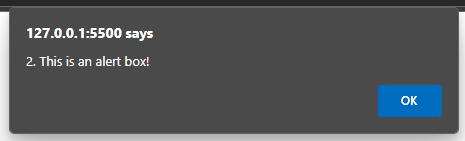
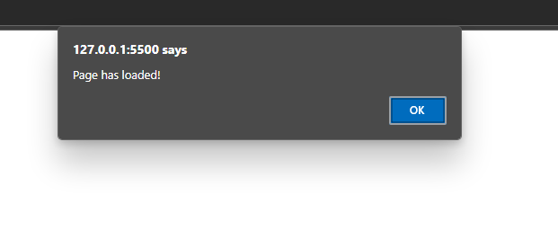

# 1. What is Javascript? How can we generate output in it?
JavaScript is a high-level, dynamic, and interpreted programming language that is widely used for creating interactive and dynamic content on web pages.
JavaScript can generate output in several ways, including:
1. **Console Output**: Using `console.log()` to print messages to the browser's console.
2. **Alert Boxes**: Using `alert()` to display a simple dialog box.
3. **Document Output**: Using `document.write()` to write content directly to the HTML document.
4. **Dynamic HTML Manipulation**: Using methods like `innerHTML` to change the content of HTML elements dynamically.

```html
<!DOCTYPE html>
<html>
<head>
    <title>JavaScript Output Example</title>
</head>
<body>
    <h1>JavaScript Output Methods</h1>
    <div id="output"></div>

    <script>
        // Console output
        console.log("1. This is a console log message.");

        // Alert box
        alert("2. This is an alert box message.");

        // Document output
        document.write("3. Added this text using document.write()");

        // Dynamic HTML manipulation
        document.getElementById("output").innerHTML = "4. This text is added dynamically using innerHTML.";
    </script>
</body>
</html>
```

<div align="center">
  
</div>

<div align="center">
  
</div>

<div align="center">
  
</div>

---

# 2. Create a simple calculator using JavaScript.

```html
<!DOCTYPE html>
<html>
<head>
    <title>Simple Calculator</title>
</head>
<body>
    <h3>Simple Calculator</h3>
    <input id="num1" placeholder="First number">
    <button onclick="calc('+')">+</button>
    <button onclick="calc('-')">-</button>
    <button onclick="calc('*')">*</button>
    <button onclick="calc('/')">/</button>
    <input id="num2" placeholder="Second number">
    <p id="result"></p>

    <script>
        function calc(op) {
            const a = parseFloat(document.getElementById('num1').value);
            const b = parseFloat(document.getElementById('num2').value);
            let res = op == '+' ? a + b : op == '-' ? a - b : op == '*' ? a * b : a / b;
            document.getElementById('result').innerText = a + ' ' + op + ' ' + b + ' = ' + res;
        }
    </script>
</body>
</html>

```
<div align="center">
  
</div>

---

# 3. Provide examples of javascript conditional statements.

```html
<!DOCTYPE html>
<html>
<head>
    <title>JavaScript Conditionals</title>
</head>
<body>
    <h3>JavaScript Conditionals</h3>
    <input type="number" id="numInput" placeholder="Enter a number" />
    <button onclick="check()">Check</button>
    <p id="output"></p>

    <script>
        function check(){
            const num = document.getElementById("numInput").value;
            let message;

            // If-Else Statement
            if (num > 0) message = "The number is positive.";
            else if (num < 0) message = "The number is negative.";
            else message = "The number is zero.";

            // Switch Statement
            switch (true) {
                case (num % 2 === 0):
                    message += " It is an even number.";
                    break;
                case (num % 2 !== 0):
                    message += " It is an odd number.";
                    break;
            }
            document.getElementById("output").innerText = message;
        }
    </script>
</body>
</html>
```

<div align="center">
  
</div>

---

# 4. Illustrate the use of loops in JavaScript with examples.

```html
<!DOCTYPE html>
<html>
<head>
    <title>JavaScript Loops</title>
</head>
<body>
    <script>
         // For loop
        for (let i = 1; i <= 3; i++) {
            console.log("For Loop: " + i);
        }

        // While loop
        let j = 1;
        while (j <= 3) {
            console.log("While Loop: " + j);
            j++;
        }

        // Do-while loop
        let k = 1;
        do {
            console.log("Do-While Loop: " + k);
            k++;
        } while (k <= 3);

        // Nested loop
        console.log("\nNested Loop (3x3 pattern):");
        for (let row = 1; row <= 3; row++) {
            let line = "";
            for (let col = 1; col <= 3; col++) {
                line += `(${row},${col}) `;
            }
            console.log(line);
        }
    </script>
</body>
</html>
```

<div align="center">
  
</div>

---

# 5. Show the use of events in JavaScript with examples.

```html
<!DOCTYPE html>
<html>
<head>
    <title>JavaScript Events</title>
    <style>
        #eventBox {
            width: 200px;
            height: 100px;
            background-color: lightgray;
            text-align: center;
            line-height: 100px;
            border: 2px solid black;
        }
    </style>
</head>
<body>
    <h3>JavaScript Events</h3>
    <div id="eventBox">Hover or Click Me!</div>
    <script>
        // onload event
        window.addEventListener("load", () => {
            alert("Page has loaded!");
        });

        const box = document.getElementById("eventBox");

        // onclick event
        box.addEventListener("click", () => {
            box.innerText = "Box Clicked!";
            box.style.backgroundColor = "lightblue";
        });

        // onmouseover event
        box.addEventListener("mouseover", () => {
            box.innerText = "Mouse Over!";
            box.style.backgroundColor = "lightcoral";
        });
    </script>
</body>
</html>
```

<div align="center">
  
</div>

<div align="center">
  
</div>

<div align="center">
  
</div>

---


# 6. Show the use of setTimeout and setInterval in JavaScript with examples.

```html
<!DOCTYPE html>
<html>
<head>
  <title>setTimeout & setInterval</title>
</head>
<body>
  <h3>Timer</h3>
  <button onclick="start()">Start Interval</button>
  <button onclick="stop()">Stop Interval</button>
  <button onclick="show()">Show Timeout</button>
  <div id="display">0 sec</div>

  <script>
    let count = 0, id;
    function start() {
      id = setInterval(() => document.getElementById('display').innerHTML = ++count + ' sec', 1000);
    }
    function stopInterval() {
      clearInterval(id);
      document.getElementById('display').innerHTML = 'Stopped at ' + count + ' sec';
    }
    function show() {
      setTimeout(() => document.getElementById('display').innerHTML = '3 seconds passed!', 3000);
    }
  </script>
</body>
</html>
```
<div align="center">
  
</div>

<div align="center">
  
</div>

---

# 7. Use date object to create a simple digital clock.

```html
<!DOCTYPE html>
<html>
<head>
    <title>Digital Clock</title>
    <style>
        #clock {
            font-size: 2em;
            font-family: 'Digital-7';
        }
    </style>
</head>
<body>
    <h3>Digital Clock</h3>
    <div id="clock"></div>

    <script>
        function updateClock() {
            const now = new Date();
            const h = String(now.getHours()).padStart(2, '0');
            const m = String(now.getMinutes()).padStart(2, '0');
            const s = String(now.getSeconds()).padStart(2, '0');
            document.getElementById('clock').innerText = `${h}:${m}:${s}`;
        }

        setInterval(updateClock, 1000);
        updateClock(); 
    </script>
</body>
</html>
```

<div align="center">
  
</div>

---

# 8. What is Regular Expression? Show its use  validating form data.

Regular expressions (regex) are sequences of characters that form a search pattern, primarily used for string matching and manipulation. They are commonly used in programming for tasks such as validating input, searching, and replacing text.
In this example, we will create a simple HTML form that validates a user's name and email using regular expressions.

```html
<!DOCTYPE html>
<html>
<head>
  <title>Regex Validation</title>
</head>
<body>
  <h3>Regular Expression Validation</h3>
  <form id="myForm">
    Name: <input type="text" id="name" required><br><br>
    Email: <input type="text" id="email" required><br><br>
    <button type="submit">Submit</button>
  </form>

  <script>
    document.getElementById('myForm').onsubmit = e => {
      e.preventDefault();
      const name = nameInput.value.trim();
      const email = emailInput.value.trim();
      const nameRegex = /^[a-zA-Z\s]+$/;
      const emailRegex = /^[a-zA-Z0-9._%+-]+@[a-zA-Z0-9.-]+\.[a-zA-Z]{2,}$/;

      if (!nameRegex.test(name)) return alert("Invalid name. Only letters and spaces allowed.");
      if (!emailRegex.test(email)) return alert("Invalid email format.");
      alert("Form submitted successfully!");
    };

    const nameInput = document.getElementById('name');
    const emailInput = document.getElementById('email');
  </script>
</body>
</html>
```

<div align="center">
  
</div>

<div align="center">
  
</div>


