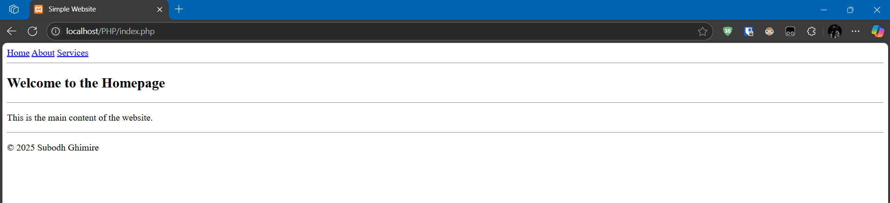
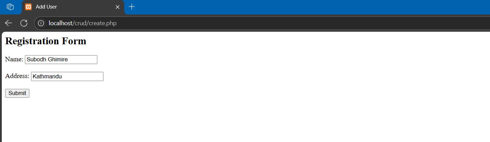
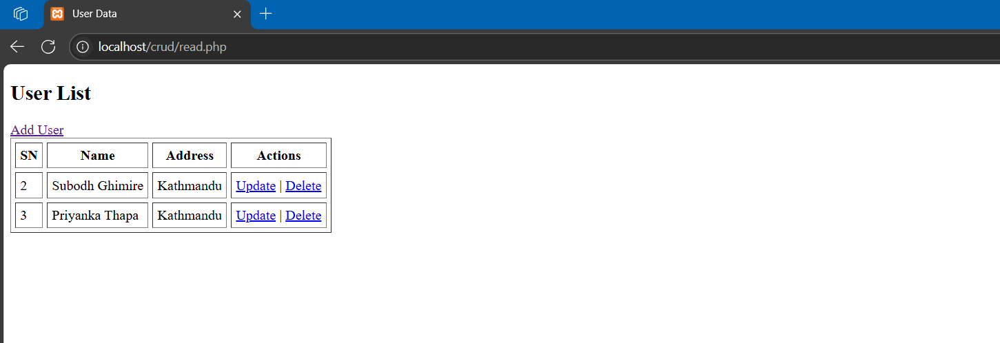
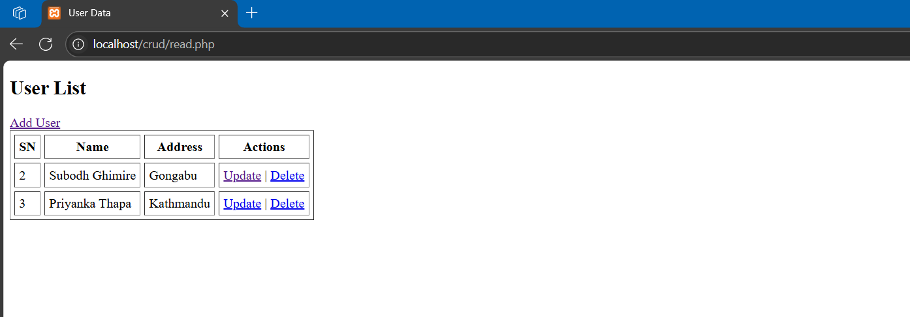
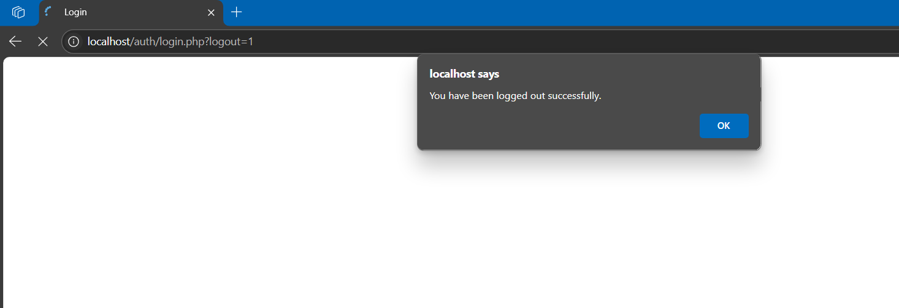

# 1. How to declare variables and print statements in PHP?

PHP variables are declared using the `$` symbol followed by the variable name. To print statements, you can use `echo` or `print`. Here's an example:

```php
<?php
$name  = "Subodh";
$roll = 79011027;

echo "My name is $name and my roll number is $roll.";
?>
```

---


# 2. Use GET and POST methods in PHP to collect form data.

```php
<?php
$getMessage = "";
$postMessage = "";

// Process GET
if (isset($_GET['username'])) {
    $getMessage = "Username via GET: " . htmlspecialchars($_GET['username']) . "<br>";
}

// Process POST
if ($_SERVER["REQUEST_METHOD"] == "POST" && isset($_POST['password'])) {
    $postMessage = "Password via POST: " . htmlspecialchars($_POST['password']) . "<br>";
}
?>
```
```html
<html>
<head>
    <title>GET and POST Form</title>
</head>
<body>
    <h3>GET Method Form</h3>
    <form method="GET" action="">
        Username: <input type="text" name="username" required><br>
        <input type="submit" value="Submit (GET)">
    </form>

    <h3>POST Method Form</h3>
    <form method="POST" action="">
        Password: <input type="password" name="password" required><br>
        <input type="submit" value="Submit (POST)">
    </form>
    <div style="margin-top: 20px; color: green;">
        <?php
        echo $getMessage;
        echo $postMessage;
        ?>
    </div>
</body>
</html>
```

<div align="center">
    
</div>

---

# 3. Use include and require statements to design a simple website.

> header.php
```html
<!DOCTYPE html>
<html>
<head>
    <title>Simple Website</title>
</head>
<body>
```

> nav.php
```html
<nav>
    <a href = "#">Home</a>
    <a href = "#">About</a>
    <a href = "#">Services</a>
</nav>
<hr>
```


> content.php
```html
<hr>
<p>This is the main content of the website.</p>
```

>footer.php
```html
<hr>
<footer>
    <p>&copy; 2025 Subodh Ghimire</p>
</footer>
</body>
</html>
```

> index.php
```php
<?php
require 'header.php';  
include 'nav.php';   
?>
<h2> Welcome to the Homepage</h2>
<?php 
include 'content.php'; 
include 'footer.php'; 
?>
```

<div align="center">
    
</div>

---

# 4. Create a connection with the DBMS and create a database.

```php
<?php
$hostname = "localhost";  
$username = "root";      
$password = "";         
$dbname = "web"; 

// Create connection
$conn = mysqli_connect($hostname, $username, $password, $dbname);

// Check connection
if (!$conn){
    die("Connection failed: " . mysqli_connect_error());
}s

// Create database
$sql = "CREATE DATABASE IF NOT EXISTS web";

if (mysqli_query($conn, $sql)){
    echo "Database Created Successfully";
} else{
    echo "Error creating Database";
}

// Close connection
mysqli_close($conn);
?>
```

---

# 5. Design a CRUD system.

> db.php
```php
<?php
    $host = "localhost";
    $username = "root";
    $password = "";
    $db = "crud";

    $conn=mysqli_connect($host, $username, $password, $db);
    if (!$conn) {
        die("Connection failed: " . mysqli_connect_error());
    }

    $sql = "CREATE TABLE IF NOT EXISTS user (
        id INT(11) AUTO_INCREMENT PRIMARY KEY,
        name VARCHAR(50) NOT NULL,
        address VARCHAR(100) NOT NULL
    )";
    if (!mysqli_query($conn, $sql)) {
        die("Error creating table");
    }

?>
```

> Create.php

```php
<?php
include 'db.php';

// Check if the form is submitted
if (isset($_POST["submit"])) { 
    $name = $_POST["name"];
    $address = $_POST["address"];

    $sql = "INSERT INTO user(name, address) VALUES ('$name', '$address')";
    if (mysqli_query($conn, $sql)) {
        echo "New record created successfully";
    } else {
        echo "Error creating record.";
    }
}
?>
<head>
    <title> Add User</title>
</head>
<body>
    <h2> Registration Form</h2>
    <form method="POST" action="">
        Name: <input type="text" name="name" required><br><br>
        Address: <input type="text" name="address" required><br><br>
        <input type="submit" name="submit" value="Submit">
    </form>
</body>
</html>
```

> Read.php

```php
<?php
include 'db.php';
$result = mysqli_query($conn, "SELECT * FROM user");
?>

<!DOCTYPE html>
<html>
<head>
    <title>User Data</title>
</head>
<body>
    <h2>User List</h2>
    <a href="create.php">Add User</a>
    <table border="1" cellpadding="5" cellspacing = "5">
        <tr>
            <th>SN</th>
            <th>Name</th>
            <th>Address</th>
            <th>Actions</th>
        </tr>
        <?php
        while ($row = mysqli_fetch_assoc($result)) {
            echo "<tr>
                <td>{$row['id']}</td>
                <td>{$row['name']}</td>
                <td>{$row['address']}</td>
                <td>
                    <a href='update.php?updateid={$row['id']}'>Update</a> | 
                    <a href='delete.php?deleteid={$row['id']}'>Delete</a>
                </td>
            </tr>";
        }
        ?>
    </table>
</body>
</html>
```

> Update.php

```php
<?php
include 'db.php';
$id = $_GET['updateid'];

$result = mysqli_query($conn, "SELECT * FROM user WHERE id=$id");
$row = mysqli_fetch_assoc($result);

if (isset($_POST['update'])) {
    $name = $_POST['name'];
    $address = $_POST['address'];

    $sql = "UPDATE user SET name='$name', address='$address' WHERE id=$id";
    if (mysqli_query($conn, $sql)) {
        header("Location: read.php");
        exit();
    } else {
        die(mysqli_error($conn));
    }
}
?>
<html>
<head>
    <title>Update User</title>
</head>
<body>
    <h2>Update User</h2>
    <form method="POST">
        Name: <input type="text" name="name" value="<?= $row['name'] ?>" required><br>
        Address: <input type="text" name="address" value="<?= $row['address'] ?>" required><br>
        <input type="submit" name="update" value="Update">
    </form>
</body>
</html>
```

> Delete.php

```php
<?php
include 'db.php';
if(isset($_GET['deleteid'])){
    $id=$_GET['deleteid'];

    $sql="DELETE from user where id=$id";
    $result=mysqli_query($conn,$sql);
    if($result){
        
        header('location:read.php');
    }else{
        die(mysqli_error($conn));
    }
}
?>
```

### Add user
<div align="center">
    
</div>

### Display user
<div align="center">
    
</div>

### Update user
<div align="center">
    
</div>

<div align="center">
    
</div>

### Delete user
<div align="center">
    
</div>

---


# 6. Show the use of session variables to create a login authentication system.

> db.php
```php
<?php
    $host = "localhost";
    $username = "root";
    $password = "";
    $db = "auth";

    $conn=mysqli_connect($host, $username, $password, $db);
    if (!$conn) {
        die("Connection failed: " . mysqli_connect_error());
    }

    $sql = "CREATE TABLE IF NOT EXISTS user (
        id INT(11) AUTO_INCREMENT PRIMARY KEY,
        username VARCHAR(50) NOT NULL,
        password VARCHAR(255) NOT NULL
    )";

    // Insert a sample user if the table is empty
    $result = mysqli_query($conn, "SELECT * FROM user");
    if (mysqli_num_rows($result) == 0) {
        $sample_username = 'subodh';
        $sample_password = '79011027';
        $insert_sql = "INSERT INTO user (username, password) VALUES ('$sample_username', '$sample_password')";
        if (!mysqli_query($conn, $insert_sql)) {
            die("Error inserting sample user");
        }
    }
?>
```

> login.php
```php
<?php
session_start();
include 'db.php';

if ($_SERVER["REQUEST_METHOD"] == "POST") {
    $username = $_POST['username'];
    $password = $_POST['password'];

    // Check if user exists
    $sql = "SELECT * FROM user WHERE username='$username' AND password='$password'";
    $result = mysqli_query($conn, $sql);

    if (mysqli_num_rows($result) > 0) {
        $_SESSION['username'] = $username;
        header("Location: logged.php"); 
        exit();
    } else {
        echo "<script>alert('Invalid username or password');</script>";
    }
}
?>
<html>
<head>
    <title>Login</title>
</head>
<body>
    <?php
    if (isset($_GET['logout']) && $_GET['logout'] == 1) {
        echo "<script>alert('You have been logged out successfully.');</script>";
    }
    ?>
    <h2>Login</h2>
    <form method="POST" action="">
        Username: <input type="text" name="username" required><br><br>
        Password: <input type="password" name="password" required><br><br>
        <input type="submit" value="Login">
    </form>
</body>
</html>
```

> logged.php
```php
<?php
session_start();
if (!isset($_SESSION['username'])) {
    header("Location: login.php"); 
    exit();
}
?>
<html>
<head>
    <title>Logged In</title>
</head>
<body>
    <h2>Welcome, <?php echo $_SESSION['username']; ?>!</h2>
    <p>You are logged in.</p>
    <a href="logout.php">Logout</a>
</body>
</html>
```

> logout.php
```php
<?php
session_start();
session_unset();  
session_destroy();  
header("Location: login.php?logout=1");
?>
```


<div align="center">
    
</div>

<div align="center">
    
</div>

<div align="center">
    
</div>

---