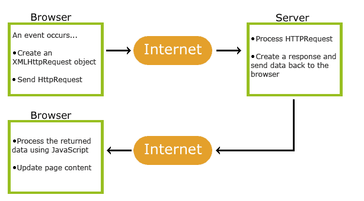
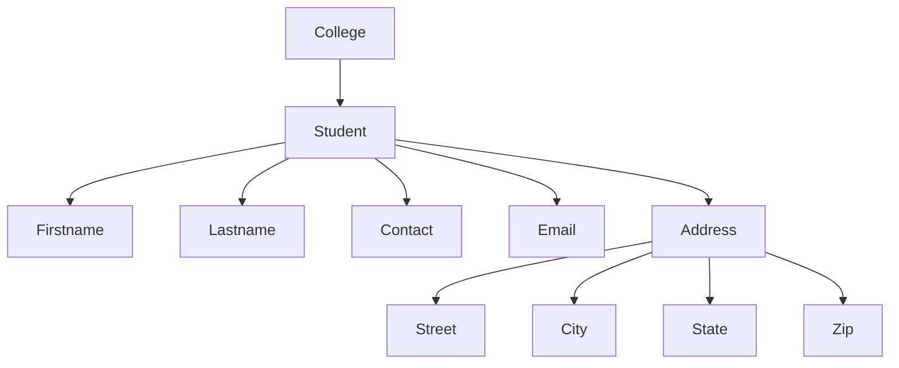

# AJAX
- AJAX stands for Asynchronous JavaScript and XML.
- AJAX is a technique for creating fast and dynamic web pages.
- AJAX allows web pages to be updated asynchronously by exchanging small amounts of data with the server behind the scenes.
- This means that it is possible to update parts of a web page, without reloading the whole page.
- AJAX is not a programming language, but a technique for using existing standards.

## Working of AJAX
- An event occurs in a web page (for example, a user clicks a button).
- An XMLHttpRequest object is created by JavaScript.
- The XMLHttpRequest object sends the request to the web server.
- The web server processes the request and sends a response back to the webpage.
- The response is processed by JavaScript.
- The web page is updated with the new data without reloading the whole page.
- The user can continue to interact with the web page while the request is being processed in the background.

<div align="center">
  
</div>

## Advantages of AJAX
- *Asynchronous*: AJAX allows for asynchronous communication between the client and server, meaning that the user can continue to interact with the web page while data is being fetched in the background.

- *Speed*: AJAX can significantly speed up web applications by only loading the necessary data instead of reloading the entire page.

- *Interactivity*: AJAX allows for more interactive and dynamic web applications, providing a better user experience.

- *Form Validation*: AJAX can be used for real-time form validation, providing instant feedback to users without the need for page reloads.

- *Bandwidth*: AJAX can reduce bandwidth usage by only sending and receiving the necessary data, rather than reloading the entire page.


## Disadvantages of AJAX
- *Browser Compatibility*: AJAX may not work properly in older browsers, leading to compatibility issues.

- *JavaScript Dependency*: AJAX relies heavily on JavaScript, which may not be enabled in all browsers or devices.

- *Security*: AJAX can introduce security vulnerabilities if not implemented properly, such as cross-site scripting (XSS) attacks.

- *Complexity*: AJAX can add complexity to web applications, making them harder to debug and maintain.

- *SEO*: AJAX can make it difficult for search engines to crawl and index web pages, potentially affecting search engine optimization (SEO).


## Sample Code
```html
<!DOCTYPE html>
<html>
<head>
    <title>AJAX Example</title>
    <script>
        function loadData() {
            var xhr = new XMLHttpRequest();
            xhr.onreadystatechange = function() {
                if (xhr.readyState == 4 && xhr.status == 200) {
                    document.getElementById("data").innerHTML = xhr.responseText;
                }
            };
            xhr.open("GET", "data.txt", true);
            xhr.send();
        }
    </script>
</head>
<body>
    <h1>AJAX Example</h1>
    <button onclick="loadData()">Load Data</button>
    <div id="data"></div>
</body>
</html>
```
- In this example, when the user clicks the "Load Data" button, an AJAX request is sent to fetch data from "data.txt".
- The response is then displayed in the "data" div without reloading the entire page.
- This demonstrates how AJAX can be used to create a more dynamic and interactive web experience.
- The XMLHttpRequest object is used to send and receive data asynchronously, allowing the user to continue interacting with the page while the request is being processed.
- The `onreadystatechange` event is used to check the status of the request and update the page when the response is received.
- The `open` method is used to specify the request type (GET) and the URL of the resource to be fetched, while the `send` method is used to send the request to the server.
- The `readyState` property indicates the current state of the request, and the `status` property indicates the HTTP status code of the response.
- When the request is complete (readyState 4) and successful (status 200), the response text is inserted into the "data" div using `innerHTML`.
- This allows for a seamless user experience, as the data is loaded and displayed without any page reloads or interruptions.

---

# XML (eXtensible Markup Language)
- XML stands for eXtensible Markup Language.
- XML is a markup language that defines a set of rules for encoding documents in a format that is both human-readable and machine-readable.
- XML is often used to store and transport data, as well as to represent complex data structures.
- XML is not a programming language, but a markup language that uses tags to define elements and attributes.
- XML is designed to be self-descriptive, meaning that the data is structured in a way that makes it easy to understand and interpret.
- XML is often used in web services, data interchange, and configuration files, among other applications.
- XML tags are not predefined, meaning that users can create their own tags to suit their needs.    

## Benefits of XML
- *Self-descriptive*: XML documents are self-descriptive, meaning that the data is structured in a way that makes it easy to understand and interpret.

- *Platform-independent*: XML is platform-independent, meaning that it can be used on any operating system or programming language.

- *Hierarchical structure*: XML documents have a hierarchical structure, making it easy to represent complex data structures.

- *Extensible*: XML is extensible, meaning that new tags and attributes can be added as needed without breaking existing documents.

- *Standardized*: XML is a standardized format, meaning that it is widely supported by many programming languages and tools.


## Applications of XML
- *Data interchange*: XML is often used for data interchange between different systems and applications, as it provides a common format for representing data.

- *Web services*: XML is commonly used in web services to exchange data between different systems over the internet.

- *Configuration files*: XML is often used for configuration files in software applications, as it provides a structured way to represent settings and options.

- *Document storage*: XML is used for storing documents in a structured format, making it easy to search and retrieve information.

- *Data representation*: XML is used for representing complex data structures, such as hierarchical data, in a standardized format.

- *Markup language*: XML is a markup language that uses tags to define elements and attributes, making it easy to represent data in a structured way.

- *Web development*: XML is used in web development for various purposes, such as defining data formats, creating web services, and representing structured data in web applications.

- *Data serialization*: XML is used for serializing data, allowing it to be easily transmitted over networks or stored in files.


---
**Important Topics:**
## Structure of XML Document 

#### Syntax Rules for Creating XML Document

> Rule 1: All XML documents must have a root element.
- The root element is the top-level element that contains all other elements in the document.
- There can only be one root element in an XML document.
- The root element must be properly closed, meaning that it must have a corresponding closing tag.
- Example:
```xml
<note>
    <to>Tove</to>
    <from>Jani</from>
    <heading>Reminder</heading>
    <body>Don't forget me this weekend!</body>
</note>
```
- In this example, the `<note>` element is the root element that contains all other elements.
---

> Rule 2: All tags must be closed.
- Tags can be closed in two ways: using a separate closing tag or using a self-closing tag.
- A separate closing tag is used for elements that contain content, while a self-closing tag is used for empty elements.
- Example:
```xml
<note>
    <to>Tove</to>
    <from>Jani</from>
    <heading>Reminder</heading>
    <br />
    <body>Don't forget me this weekend!</body>
</note>
```
- In this example, the `<to>`, `<from>`, `<heading>`, and `<body>` elements are closed using separate closing tags.
- A self-closing tag can be used for empty elements, such as `<br />` or ``, which do not have any content.
---

> Rule 3: All tags must be properly nested.
- This means that if an opening tag is encountered, it must be closed before any other tags are closed.
- Example:
```xml
<note>
    <to>Tove</to>
    <from>Jani</from>
    <heading>Reminder</heading>
    <body>Don't forget me this weekend!</body>
</note>
```
- In this example, the `<note>` element contains the `<to>`, `<from>`, `<heading>`, and `<body>` elements, which are all properly nested within the root element.
- If the tags were not properly nested, it would result in an error.
---

> Rule 4: Tag names are case-sensitive.
- This means that `<Note>` and `<note>` are considered different tags.
- It is important to use consistent casing for tag names throughout the document to avoid confusion and errors.
- Example:
```xml
<note>
    <to>Tove</to>
    <from>Jani</from>
    <heading>Reminder</heading>
    <body>Don't forget me this weekend!</body>
</note>
```
- In this example, the tag names are all in lowercase, which is consistent and avoids confusion.
- If the tag names were mixed case, it could lead to errors when parsing the document.
---

> Rule 5: Tag names cannot contain spaces or special characters.
- Tag names can only contain letters, numbers, hyphens (-), underscores (_), and periods (.).
---

> Rule 6: Attribute values must be enclosed in quotes.
- Attribute values can be enclosed in either single quotes (' ') or double quotes (" ").
- Example:
```xml
<note to="Tove" from="Jani" heading="Reminder">
    <body>Don't forget me this weekend!</body>
</note>
```
- In this example, the `to`, `from`, and `heading` attributes are enclosed in double quotes.
- It is important to use consistent quoting throughout the document to avoid confusion and errors.
---


### XML Elements
- An XML element is a basic building block of an XML document.
- An element consists of a start tag, an end tag, and the content between them.
- Example:
```xml
<note>
    <to>Tove</to>
    <from>Jani</from>
    <heading>Reminder</heading>
    <body>Don't forget me this weekend!</body>
</note>
```
- In this example, `<note>` is the root element, and `<to>`, `<from>`, `<heading>`, and `<body>` are child elements of the root element.
- Each element has a start tag (e.g., `<to>`) and an end tag (e.g., `</to>`), and the content is enclosed between the tags.
---

### XML Attributes
- An XML attribute is a name-value pair that provides additional information about an element.
- Attributes are defined within the start tag of an element and are used to provide additional information about the element.
- Example:
```xml
<note to="Tove" from="Jani" heading="Reminder">
    <body>Don't forget me this weekend!</body>
</note>
```
- In this example, `to`, `from`, and `heading` are attributes of the `<note>` element, and their values are "Tove", "Jani", and "Reminder", respectively.
- Attributes are always specified in name-value pairs, with the name followed by an equal sign and the value enclosed in quotes.
- Attributes provide additional information about the element and can be used to specify properties or characteristics of the element.
- Attributes are optional, and an element can exist without any attributes.
---

### XML Declaration
- The XML declaration is an optional statement that defines the version of XML being used and the character encoding of the document.
- It is typically the first line of an XML document and is used to specify the version and encoding of the document.
- Example:
```xml
<?xml version="1.0" encoding="UTF-8"?>
<note>
    <to>Tove</to>
    <from>Jani</from>
    <heading>Reminder</heading>
    <body>Don't forget me this weekend!</body>
</note>
```
- In this example, the XML declaration specifies that the document is using version 1.0 of XML and is encoded in UTF-8.
- The XML declaration is optional, but it is recommended to include it for clarity and compatibility with different XML parsers.
- The XML declaration is not considered part of the XML document itself and does not affect the structure or content of the document.
---

### XML Comments
- XML comments are used to add notes or explanations within an XML document without affecting the structure or content of the document.
- Comments are ignored by XML parsers and do not affect the processing of the document.
- Comments are enclosed within `<!--` and `-->` tags.
- Example:
```xml
<?xml version="1.0" encoding="UTF-8"?>
<!-- This is a comment in XML -->
<note>
    <to>Tove</to>
    <from>Jani</from>
    <heading>Reminder</heading>
    <body>Don't forget me this weekend!</body>
</note>
```
- In this example, the comment "This is a comment in XML" is included within the XML document but will be ignored by the XML parser.
- Do not use comments before the XML declaration, as they will not be recognized as comments and may cause errors.
---

### XML Tree Structure
- XML documents are structured in a hierarchical tree format, with the root element at the top and child elements nested within it.
- Each element can have child elements, and the structure can be visualized as a tree, with the root element as the trunk and child elements as branches and leaves.
- Example:
```xml
<college>
    <student>
        <firstname>John</firstname>
        <lastname>Doe</lastname>
        <contact> 1234567890</contact>
        <email> john123@gmail.com</email>
        <address>
            <street>123 Main St</street>
            <city>New York</city>
            <state>NY</state>
            <zip>10001</zip>
        </address>
    </student>
</college>
```
- In this example, the `<college>` element is the root element, and it contains a child element `<student>`, which in turn contains several child elements such as `<firstname>`, `<lastname>`, `<contact>`, `<email>`, and `<address>`.
- The `<address>` element further contains child elements `<street>`, `<city>`, `<state>`, and `<zip>`, creating a hierarchical structure.
- This tree structure allows for easy representation and organization of complex data, making it easier to understand and manipulate.
- The tree structure can be visualized as follows:


---

### XML Namespaces (2079 QN. )
- XML namespaces are used to avoid naming conflicts between elements and attributes in XML documents.
- Namespaces provide a way to qualify names in XML documents, allowing elements and attributes with the same name to coexist without conflict.
- Namespaces are typically defined using a URI, which can be any valid URI, but it is often a URL that points to a resource that describes the namespace.
- Namespaces are used to differentiate between elements and attributes that may have the same name but belong to different contexts or vocabularies.
- A namespace is defined using the `xmlns` attribute in the start tag of an element.
- The `xmlns` attribute specifies the namespace URI (Uniform Resource Identifier) that identifies the namespace.

- Name Conflict Example:
```xml
<student>
    <result>
        <name>John</name>
        <cgpa>3.5</cgpa>
    </result>
    <cv>
        <name>Jane</name>
        <cgpa>3.8</cgpa>
    </cv>
</student>
```

- In this example, both the `<student>` and `<cv>` elements have child elements with the same name (`<name>` and `<cgpa>`), which can lead to confusion and conflicts.
- To avoid this, namespaces can be used to qualify the names of the elements and attributes.

- Namespace Example:
```xml
<student xmlns:stu="http://example.com/student"     
         xmlns:cv="http://example.com/cv">
    <stu:result>
        <stu:name>John</stu:name>
        <stu:cgpa>3.5</stu:cgpa>
    </stu:result>

    <cv:cv>
        <cv:name>Jane</cv:name>
        <cv:cgpa>3.8</cv:cgpa>
    </cv:cv>
</student>
```
- In this example, the `xmlns:stu` and `xmlns:cv` attributes define two different namespaces for the `<result>` and `<cv>` elements, respectively.
- The `stu:` and `cv:` prefixes are used to qualify the names of the elements and attributes, allowing them to coexist without conflict.
---

## Differences Between XML and HTML

| Feature               | XML (eXtensible Markup Language)                          | HTML (HyperText Markup Language)                     |
|-----------------------|----------------------------------------------------------|-----------------------------------------------------|
| **Purpose**           | Designed to store and transport data.                    | Designed to display data and create web pages.      |
| **Tag Definition**    | Tags are not predefined; users can define their own tags.| Tags are predefined and fixed.                     |
| **Structure**         | Strictly structured and case-sensitive.                  | Less strict and not case-sensitive.                |
| **Data Handling**     | Focuses on data storage and transport.                   | Focuses on data presentation.                      |
| **Error Handling**    | Errors are not tolerated; must be well-formed.           | Errors are tolerated; browsers can render faulty HTML. |
| **Attributes**        | Attribute values must be enclosed in quotes.             | Attribute values may or may not be enclosed in quotes. |
| **Namespaces**        | Supports namespaces to avoid naming conflicts.           | Does not support namespaces.                       |
| **Self-closing Tags** | Requires self-closing tags for empty elements.           | Self-closing tags are optional.                    |
| **Use Case**          | Used for data interchange, configuration files, etc.     | Used for creating web pages and user interfaces.   |

---

## DTD (Document Type Definition)
- DTD is a set of markup declarations that define a document type for an XML document.
- DTD defines the structure and the legal elements and attributes of an XML document.
- DTD can be used to validate the structure of an XML document, ensuring that it conforms to the defined rules and constraints.
- DTD can be defined internally within the XML document or externally in a separate file.

Syntax:
```dtd
<!DOCTYPE root-name [DTD]>
```
- The `<!DOCTYPE>` declaration is used to define the document type and specify the DTD.
- The `root-name` is the name of the root element of the XML document.
- The `DTD` is the set of markup declarations that define the structure and rules for the XML document.
```
